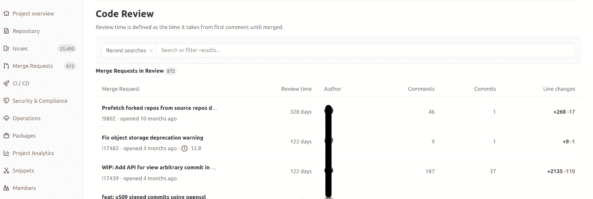

# Code Review Analytics

> 原文：[https://s0docs0gitlab0com.icopy.site/ee/user/analytics/code_review_analytics.html](https://s0docs0gitlab0com.icopy.site/ee/user/analytics/code_review_analytics.html)

*   [Overview](#overview)
*   [Use cases](#use-cases)
*   [Permissions](#permissions)

# Code Review Analytics

[Introduced](https://gitlab.com/gitlab-org/gitlab/-/issues/38062) in [GitLab Starter](https://about.gitlab.com/pricing/) 12.7.

通过 Code Review Analytics，可以轻松地查看打开的合并请求中运行时间最长的审查，从而使您可以对单个合并请求采取措施，并缩短总体周期.

**注意：**最初，不会显示任何数据. 用户在打开的合并请求中发表评论时，将填充数据.

## Overview

Code Review Analytics 显示一个打开的合并请求表，该请求至少具有一个非作者注释. 审阅时间从提交第一个非作者评论的时间开始计算. 合并请求的代码审阅时间自动标识为自第一个非作者评论以来的时间.

要访问 Code Review Analytics，请从您项目的菜单中转到 **项目分析>代码审查** .

*   该表格按评论时长排序，可帮助您快速找到运行时间最长的评论，这可能需要干预或分解成较小的部分.
*   您可以按里程碑和标签过滤 MR 列表.
*   用于显示作者，批准者，评论数和行更改（-/ +）数的列.

## Use cases

此功能专为[开发团队负责](https://about.gitlab.com/handbook/marketing/product-marketing/roles-personas/#delaney-development-team-lead)人和其他想了解广泛的代码审查动态并确定模式以对其进行解释的人员而设计.

您可以使用 Code Review Analytics 通过代码审查来揭露团队的独特挑战，并确定可能会大大加快开发周期的改进.

在以下情况下可以使用代码审查分析：

*   您的团队同意代码审查进度太慢.
*   [价值流分析功能](value_stream_analytics.html)表明，审核是您团队最耗时的步骤.

您可以使用 Code Review Analytics 查看当前运行最慢的工作类型，并分析它们之间的模式和趋势. 例如：

*   很多评论或承诺？ 也许代码太复杂了.
*   涉及特定作者吗？ 也许需要更多的培训.
*   评论和批准者很少？ 也许您的团队人手不足.

## Permissions

*   在[简化版或青铜级](https://about.gitlab.com/pricing/)上.
*   由具有 Reporter 访问权限及以上权限的用户组成.