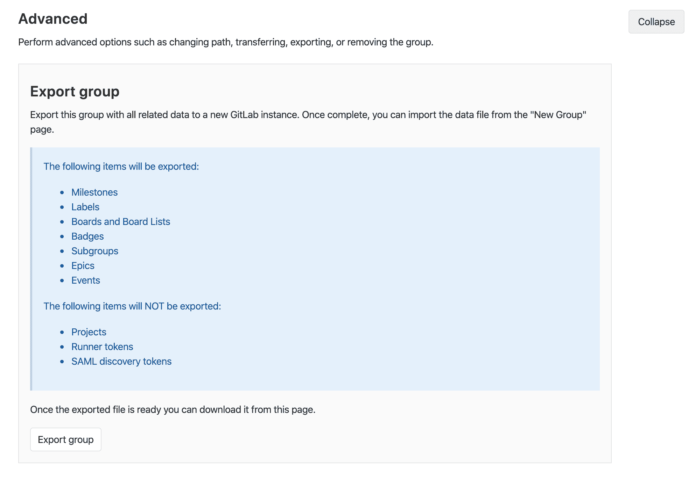
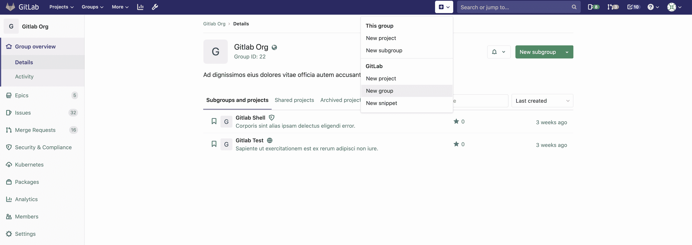
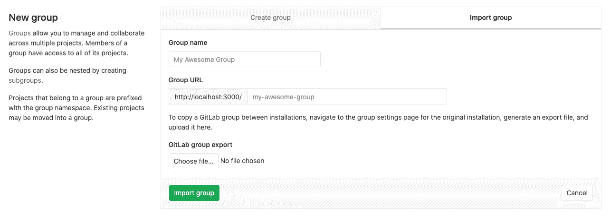

# Group Import/Export

> 原文：[https://s0docs0gitlab0com.icopy.site/ee/user/group/settings/import_export.html](https://s0docs0gitlab0com.icopy.site/ee/user/group/settings/import_export.html)

*   [Important Notes](#important-notes)
    *   [Exported Contents](#exported-contents)
*   [Exporting a Group](#exporting-a-group)
    *   [Between CE and EE](#between-ce-and-ee)
*   [Importing the group](#importing-the-group)
*   [Version history](#version-history)
*   [Rate Limits](#rate-limits)

# Group Import/Export

版本历史

*   在 GitLab 13.0 中作为实验功能[引入](https://gitlab.com/groups/gitlab-org/-/epics/2888) . 在将来的版本中可能会更改.

可以将在任何 GitLab 实例或 GitLab.com 上运行的现有组及其所有相关数据导出，并移至新的 GitLab 实例.

如果启用了组导入选项，则会显示**GitLab 导入/导出**按钮.

也可以看看：

*   [Group Import/Export API](../../../api/group_import_export.html)
*   [Project Import/Export](../../project/settings/import_export.html)
*   [Project Import/Export API](../../../api/project_import_export.html)

要启用 GitLab 导入/导出：

1.  导航 **管理区>** **设置>可见性和访问控制** .
2.  滚动到**导入源**
3.  启用所需的**导入源**

## Important Notes

请注意以下几点：

*   导出存储在一个临时[共享目录中](../../../development/shared_files.html) ，并由特定工作人员每 24 小时删除一次.
*   要保留导入项目中的组级关系，请首先运行"组导入/导出"，以允许将项目导入所需的组结构中.
*   除非导入到父组，否则将为导入的组提供`private`可见性级别.
*   如果导入父组，则除非另有限制，否则子组将继承相同级别的可见性.
*   若要保留成员列表及其对导入组的各自权限，请查看这些组中的用户. 在导入所需的组之前，请确保这些用户存在.

### Exported Contents

将导出以下项目：

*   Milestones
*   Labels
*   董事会和董事会名单
*   Badges
*   子组（包括所有上述数据）
*   Epics
*   Events

以下项目将不会导出：

*   Projects
*   跑步者令牌
*   SAML 发现令牌

**注意：**有关在组导出中[`import_export.yml`](https://gitlab.com/gitlab-org/gitlab/blob/master/lib/gitlab/import_export/group/import_export.yml)的特定数据的更多详细信息，请参阅[`import_export.yml`](https://gitlab.com/gitlab-org/gitlab/blob/master/lib/gitlab/import_export/group/import_export.yml)文件.

## Exporting a Group

1.  导航到您的论坛的主页.

2.  请点击 侧栏中的**设置** .

3.  在" **高级"**部分中，单击" **导出组"**按钮.

    

4.  生成导出后，您应该会收到一封电子邮件，其中包含指向压缩的 tar 存档中[导出内容](#exported-contents)的链接，其中的内容为 JSON 格式.

5.  或者，您可以返回项目设置，然后点击**下载导出**从那里下载文件，或者点击**重新**生成导出来生成一个新文件.

**注意：**可以由管理员设置最大导入文件大小，默认为 50MB. 作为管理员，您可以修改最大导入文件大小. 为此，请在" [应用程序设置" API](../../../api/settings.html#change-application-settings)或" [管理界面"中](../../admin_area/settings/account_and_limit_settings.html)使用`max_import_size`选项.

### Between CE and EE

您可以将组从[Community Edition](https://about.gitlab.com/install/ce-or-ee/)导出[到 Enterprise Edition](https://about.gitlab.com/install/ce-or-ee/) ，反之亦然.

如果要将组从企业版导出到社区版，则可能会丢失仅保留在企业版中的数据. 有关更多信息，请参阅[从 EE 降级为 CE](../../../README.html) .

## Importing the group

1.  通过顶部导航栏中的`+`按钮或现有组页面上的" **新建子组"**按钮导航到" **新建**组"页面.

    

2.  在"新建组"页面上，选择" **导入组"**选项卡.

    

3.  输入您的群组名称.

4.  接受或修改关联的组 URL.

5.  Click **选择文件**

6.  在" [导出组"](#exporting-a-group)部分中选择您导出的文件.

7.  单击**导入组**开始导入. 您新导入的组页面将很快出现.

## Version history

GitLab 可以导入从其他 GitLab 部署导出的捆绑软件. 此功能仅限于之前的两个 GitLab [次要](../../../policy/maintenance.html#versioning)发行版，这与我们的[安全发布](../../../policy/maintenance.html#security-releases)流程类似.

例如：

| 当前版本 | 可以导入从 |
| --- | --- |
| 13.0 | 13.0, 12.10, 12.9 |
| 13.1 | 13.1, 13.0, 12.10 |

## Rate Limits

为了避免滥用，用户的速率仅限于：

| 请求类型 | Limit |
| --- | --- |
| Export | 每 5 分钟 30 个小组 |
| 下载导出 | 每 10 分钟每组 10 次下载 |
| Import | 每 5 分钟 30 个小组 |