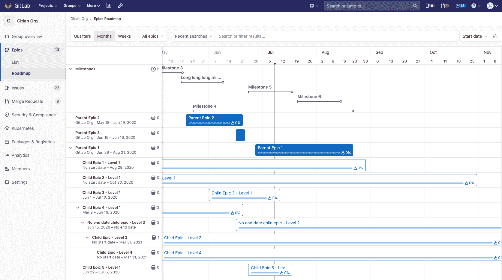
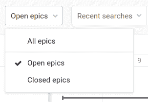

# Roadmap

> 原文：[https://s0docs0gitlab0com.icopy.site/ee/user/group/roadmap/](https://s0docs0gitlab0com.icopy.site/ee/user/group/roadmap/)

*   [Timeline duration](#timeline-duration)
    *   [Quarters](#quarters)
    *   [Months](#months)
    *   [Weeks](#weeks)
*   [Roadmap timeline bar](#roadmap-timeline-bar)

# Roadmap

版本历史

*   在[GitLab Ultimate](https://about.gitlab.com/pricing/) 10.5 中引入.
*   在[GitLab 12.9 中](https://gitlab.com/gitlab-org/gitlab/-/issues/198062) ，路线图已移至高级层.
*   在[GitLab 12.9](https://gitlab.com/gitlab-org/gitlab/-/issues/5164)及更高版本中，史诗条显示史诗的标题，进度和完成的重量百分比.
*   里程碑出现在[GitLab 12.10](https://gitlab.com/gitlab-org/gitlab/-/issues/6802)及更高版本的路线图中.
*   在[GitLab 13.0 中](https://gitlab.com/gitlab-org/gitlab/-/merge_requests/29641)删除的路线图中可见的里程碑的功能标志.
*   在[GitLab 13.2](https://gitlab.com/gitlab-org/gitlab/-/issues/214375)和更高版本中，该路线图还显示了组中项目的里程碑.
*   在[GitLab 13.2](https://gitlab.com/gitlab-org/gitlab/-/issues/212494)和更高版本中，里程碑栏可以折叠和展开.

可以以时间轴（即甘特图）的形式显示包含开始日期或截止日期的组中的史诗和里程碑. "路线图"页面显示了一个组，一个子组或一个组中的一个项目的史诗和里程碑.

在史诗栏上，您可以看到每个史诗的标题，进度和完成的重量百分比. 当您将鼠标悬停在史诗栏上时，将显示一个弹出框，其中包含史诗的标题，开始日期，到期日和完成的权重.

您可以展开包含子级史诗的史诗，以在路线图中显示其子级史诗. 您可以单击人字形（ ）旁边的史诗标题，以展开和折叠子史诗.

在里程碑栏的顶部，您可以看到其标题. 当您将鼠标悬停在里程碑栏或标题上时，将显示一个带有其标题，开始日期和截止日期的弹出窗口. 您也可以点击 V 形符号（ ）旁边的" **里程碑"**标题以切换里程碑栏的列表.

下拉菜单允许您仅显示打开或关闭的史诗. 默认情况下，显示所有史诗.

您可以通过以下方式在"路线图"视图中对史诗进行排序：

*   创建日期
*   最近更新时间
*   开始日期
*   截止日期

每个选项都包含一个按钮，可在**升序**和**降序**之间切换排序顺序. 浏览史诗（包括[史诗列表视图）](../epics/index.html)时，排序选项和顺序仍然存在.

路线图也可以[在史诗内部可视化](../epics/index.html#roadmap-in-epics) .

## Timeline duration

版本历史

*   在[GitLab Ultimate](https://about.gitlab.com/pricing/) 11.0 中引入.
*   在[GitLab 12.9 中](https://gitlab.com/gitlab-org/gitlab/-/issues/198062) ，时间轴已移至高级层.

路线图支持以下日期范围：

*   Quarters
*   月（默认）
*   Weeks

### Quarters

在" **季度"**预设中，路线图显示史诗和里程碑，其开始或到期日期**在**过去的季度，当前季度和接下来的四个季度**之内**或**经过**过去的季度，当前季度和接下来的四个季度，其中**今天**由时间轴中的垂直红线显示. 时间轴标题上季度名称下方的子标题代表季度的月份.

### Months

在" **月份"**预设中，路线图显示史诗和里程碑，这些史诗和里程碑的开始或到期日期**在**过去一个月，当前月份以及接下来的五个月**之内**或**经历**过去或六个月，其中**今天**由时间轴中的垂直红线显示. 时间轴标题上月份名称下方的子标题表示一周中开始日期（星期日）的日期. 默认情况下选择此预设.

### Weeks

在" **周"**预设中，路线图显示史诗和里程碑，这些史诗和里程碑的开始日期或到期日期**在**过去一周，当前星期和接下来的四个星期**之内**或**经过**过去一周，当前星期和接下来的四个星期，其中**今天**由时间轴中的垂直红线显示. 时间轴标题上星期名称下方的子标题代表星期几.

## Roadmap timeline bar

时间线栏根据史诗或里程碑的开始日期和到期日期指示其大概位置.