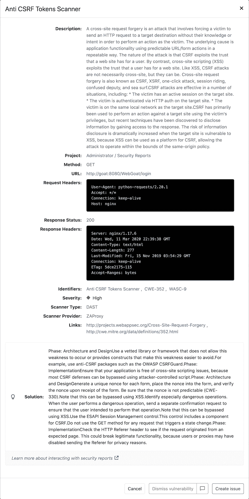
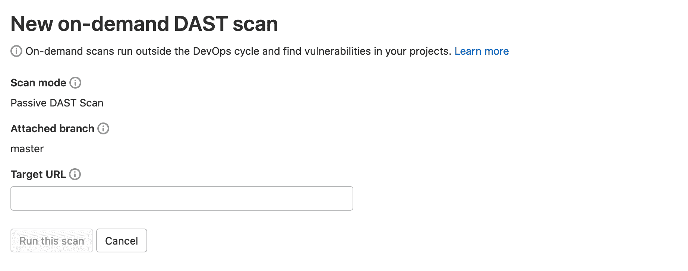

# Dynamic Application Security Testing (DAST)

> 原文：[https://s0docs0gitlab0com.icopy.site/ee/user/application_security/dast/](https://s0docs0gitlab0com.icopy.site/ee/user/application_security/dast/)

*   [Overview](#overview)
*   [Use cases](#use-cases)
*   [Requirements](#requirements)
*   [Configuration](#configuration)
    *   [When DAST scans run](#when-dast-scans-run)
    *   [Hide sensitive information](#hide-sensitive-information)
    *   [Authentication](#authentication)
    *   [Full scan](#full-scan)
        *   [Domain validation](#domain-validation)
            *   [Ruby on Rails](#ruby-on-rails)
            *   [Django](#django)
            *   [Node (with Express)](#node-with-express)
            *   [Domain validation header via a proxy](#domain-validation-header-via-a-proxy)
    *   [API scan](#api-scan)
        *   [Specification format](#specification-format)
        *   [Import API specification from a URL](#import-api-specification-from-a-url)
        *   [Import API specification from a file](#import-api-specification-from-a-file)
        *   [Full scan](#full-scan-1)
        *   [Host override](#host-override)
        *   [Authentication using headers](#authentication-using-headers)
    *   [Customizing the DAST settings](#customizing-the-dast-settings)
    *   [Available variables](#available-variables)
    *   [DAST command-line options](#dast-command-line-options)
    *   [Custom ZAProxy configuration](#custom-zaproxy-configuration)
    *   [Cloning the project’s repository](#cloning-the-projects-repository)
    *   [Debugging DAST jobs](#debugging-dast-jobs)
*   [Running DAST in an offline environment](#running-dast-in-an-offline-environment)
    *   [Requirements for offline DAST support](#requirements-for-offline-dast-support)
    *   [Make GitLab DAST analyzer images available inside your Docker registry](#make-gitlab-dast-analyzer-images-available-inside-your-docker-registry)
    *   [Set DAST CI job variables to use local DAST analyzers](#set-dast-ci-job-variables-to-use-local-dast-analyzers)
*   [On-Demand Scans](#on-demand-scans)
    *   [Enable or disable On-Demand Scans](#enable-or-disable-on-demand-scans)
*   [Reports](#reports)
    *   [List of URLs scanned](#list-of-urls-scanned)
    *   [JSON](#json)
    *   [Other formats](#other-formats)
*   [Security Dashboard](#security-dashboard)
*   [Bleeding-edge vulnerability definitions](#bleeding-edge-vulnerability-definitions)
*   [Interacting with the vulnerabilities](#interacting-with-the-vulnerabilities)
*   [Vulnerabilities database update](#vulnerabilities-database-update)
*   [Optimizing DAST](#optimizing-dast)
*   [Troubleshooting](#troubleshooting)
    *   [Running out of memory](#running-out-of-memory)

# Dynamic Application Security Testing (DAST)[](#dynamic-application-security-testing-dast-ultimate "Permalink")

[Introduced](https://gitlab.com/gitlab-org/gitlab/-/issues/4348) in [GitLab Ultimate](https://about.gitlab.com/pricing/) 10.4.

**注意：**白皮书["应用程序安全性发生](https://about.gitlab.com/resources/whitepaper-seismic-shift-application-security/)了[地震变化"](https://about.gitlab.com/resources/whitepaper-seismic-shift-application-security/)说明**了前 6 种攻击中有 4 种是基于应用程序的** . 下载它以了解如何保护您的组织.

对代码运行[静态检查](../sast/index.html)是检测可能使代码安全性受到威胁的漏洞的第一步. 但是，一旦部署，您的应用程序将面临一类新的可能的攻击，例如跨站点脚本或损坏的身份验证缺陷. 这是动态应用程序安全性测试（DAST）实施的地方.

## Overview[](#overview "Permalink")

如果您使用的是[GitLab CI / CD](../../../ci/README.html) ，则可以使用动态应用程序安全性测试（DAST）分析运行中的 Web 应用程序是否存在已知漏洞. 您可以通过在现有`.gitlab-ci.yml`文件中[包含 CI 作业](#configuration) ，或通过隐式使用[Auto DevOps](../../../topics/autodevops/index.html)提供的[Auto](../../../topics/autodevops/index.html) [DAST](../../../topics/autodevops/stages.html#auto-dast-ultimate)来利用[DAST](../../../topics/autodevops/stages.html#auto-dast-ultimate) .

GitLab 检查 DAST 报告，比较发现的源分支和目标分支之间的漏洞，并显示有关合并请求的信息.

**注意：**此比较逻辑仅使用针对目标分支的基本提交执行的最新管道. 在任何其他提交上运行管道对合并请求没有影响.

[](img/dast_v13_2.png)

通过单击检测到的链接漏洞之一，您可以查看详细信息和受影响的 URL.

[](img/dast_single_v13_0.png)

[动态应用程序安全测试（DAST）](https://en.wikipedia.org/wiki/Dynamic_Application_Security_Testing)使用流行的开源工具[OWASP Zed Attack Proxy](https://www.zaproxy.org/)对运行中的 Web 应用程序执行分析.

默认情况下，DAST 执行[ZAP 基准扫描](https://www.zaproxy.org/docs/docker/baseline-scan/)并仅执行被动扫描. 它不会主动攻击您的应用程序. 但是，可以将 DAST [配置](#full-scan)为还执行*主动扫描* ：攻击您的应用程序并生成更广泛的安全报告. 与[Review Apps](../../../ci/review_apps/index.html)结合使用可能非常有用.

**注意：**管道可能包含多个作业，包括 SAST 和 DAST 扫描. 如果任何作业由于任何原因未能完成，则安全信息中心将不会显示 DAST 扫描仪输出. 例如，如果 DAST 作业完成但 SAST 作业失败，则安全性仪表板将不会显示 DAST 结果. 分析器将在失败时输出[退出代码](../../../development/integrations/secure.html#exit-code) .

## Use cases[](#use-cases "Permalink")

它可以帮助您在开发和测试应用程序时自动查找正在运行的 Web 应用程序中的安全漏洞.

## Requirements[](#requirements "Permalink")

要运行 DAST 作业，您需要具有[`docker` executor 的](https://s0docs0gitlab0com.icopy.site/runner/executors/docker.html) GitLab Runner.

## Configuration[](#configuration "Permalink")

对于 GitLab 11.9 和更高版本，要启用 DAST，您必须[包含](../../../ci/yaml/README.html#includetemplate) [`DAST.gitlab-ci.yml`模板](https://gitlab.com/gitlab-org/gitlab/blob/master/lib/gitlab/ci/templates/Security/DAST.gitlab-ci.yml) ，该[模板](https://gitlab.com/gitlab-org/gitlab/blob/master/lib/gitlab/ci/templates/Security/DAST.gitlab-ci.yml)作为 GitLab 安装的一部分提供. 对于 11.9 之前的 GitLab 版本，您可以复制和使用该模板中定义的作业.

将以下内容添加到您的`.gitlab-ci.yml`文件中：

```
include:
  - template: DAST.gitlab-ci.yml

variables:
  DAST_WEBSITE: https://example.com 
```

有两种方法来定义要由 DAST 扫描的 URL：

1.  设置`DAST_WEBSITE` [变量](../../../ci/yaml/README.html#variables) .

2.  将其添加到项目根目录的`environment_url.txt`文件中. 这非常适合在动态环境中进行测试. 为了针对在 GitLab CI / CD 管道中动态创建的应用程序运行 DAST，请让该应用程序将其域保留在`environment_url.txt`文件中，然后 DAST 自动解析该文件以找到其扫描目标. 您可以在我们的 Auto DevOps CI YAML 中看到一个[示例](https://gitlab.com/gitlab-org/gitlab/blob/master/lib/gitlab/ci/templates/Jobs/Deploy.gitlab-ci.yml) .

如果同时设置了两个值，则`DAST_WEBSITE`值优先.

随附的模板会在 CI / CD 管道中创建`dast`工作，并扫描项目的源代码中可能存在的漏洞.

结果将保存为[DAST 报告工件](../../../ci/pipelines/job_artifacts.html#artifactsreportsdast-ultimate) ，您可以稍后下载和分析. 由于实施限制，我们始终采用最新的 DAST 工件. 在后台， [GitLab DAST Docker 映像](https://gitlab.com/gitlab-org/security-products/dast)用于在指定的 URL 上运行测试并扫描它是否存在漏洞.

默认情况下，DAST 模板将使用 DAST Docker 映像的最新主版本. 使用`DAST_VERSION`变量，您可以选择 DAST 更新的方式：

*   通过固定到主要版本（例如`1` ）自动更新具有新功能和修复程序的 DAST.
*   仅通过固定到次要版本（例如`1.6` ）来更新修补程序.
*   通过固定到特定版本（例如`1.6.4` ）来防止所有更新.

在" [发行"](https://gitlab.com/gitlab-org/security-products/dast/-/releases)页面上找到最新的 DAST 版本.

### When DAST scans run[](#when-dast-scans-run "Permalink")

使用`DAST.gitlab-ci.yml`模板时， `dast`作业最后运行，如下例所示. 为确保 DAST 正在扫描最新代码，您的 CI 管道应在`dast`作业之前的`dast`作业`dast`更改部署到 Web 服务器.

```
stages:
  - build
  - test
  - deploy
  - dast 
```

请注意，如果您将管道配置为在每次运行中都部署到同一 Web 服务器，则在另一个管道仍在运行时运行管道可能会导致争用情况，其中一个管道会覆盖另一个管道的代码. 在 DAST 扫描期间，应从更改中排除要扫描的站点. 对该站点的唯一更改应来自 DAST 扫描仪. 请注意，在扫描过程中，用户，计划任务，数据库更改，代码更改，其他管道或其他扫描程序对站点所做的任何更改都可能导致结果不准确.

### Hide sensitive information[](#hide-sensitive-information "Permalink")

在 GitLab 13.1 中[引入](https://gitlab.com/gitlab-org/gitlab/-/issues/36332) .

HTTP 请求和响应标头可能包含敏感信息，包括 cookie 和授权凭证. 默认情况下，以下标头被屏蔽：

*   `Authorization`.
*   `Proxy-Authorization`.
*   `Set-Cookie` （仅值）.
*   `Cookie` (values only).

使用[`DAST_MASK_HTTP_HEADERS`变量](#available-variables) ，可以列出要屏蔽其值的标头. 有关如何屏蔽标题的详细信息，请参阅" [自定义 DAST 设置"](#customizing-the-dast-settings) .

### Authentication[](#authentication "Permalink")

在执行 DAST 检查之前，还可以对用户进行身份验证.

创建掩码变量以传递 DAST 将使用的凭据. 要为用户名和密码创建掩码变量，请参阅[在 UI 中创建自定义变量](../../../ci/variables/README.html#create-a-custom-variable-in-the-ui) . 请注意，username 变量的密钥必须为`DAST_USERNAME` ，而 password 变量的密钥必须为`DAST_PASSWORD` .

与认证扫描相关的其他变量是：

```
include:
  - template: DAST.gitlab-ci.yml

variables:
  DAST_WEBSITE: https://example.com
  DAST_AUTH_URL: https://example.com/sign-in
  DAST_USERNAME_FIELD: session[user] # the name of username field at the sign-in HTML form
  DAST_PASSWORD_FIELD: session[password] # the name of password field at the sign-in HTML form
  DAST_AUTH_EXCLUDE_URLS: http://example.com/sign-out,http://example.com/sign-out-2 # optional, URLs to skip during the authenticated scan; comma-separated, no spaces in between 
```

结果将保存为[DAST 报告工件](../../../ci/pipelines/job_artifacts.html#artifactsreportsdast-ultimate) ，您以后可以下载和分析. 由于实施限制，我们始终采用最新的 DAST 工件.

**危险：** **切勿**对生产服务器运行经过身份验证的扫描. 运行经过身份验证的扫描时，它可以执行经过身份验证的用户可以执行的*任何*功能. 这包括修改和删除数据，提交表单以及跟随链接之类的操作. 仅对测试服务器运行经过身份验证的扫描.

### Full scan[](#full-scan "Permalink")

可以将 DAST 配置为执行[ZAP 全面扫描](https://github.com/zaproxy/zaproxy/wiki/ZAP-Full-Scan) ，其中包括针对同一目标网站的被动扫描和主动扫描：

```
include:
  - template: DAST.gitlab-ci.yml

variables:
  DAST_FULL_SCAN_ENABLED: "true" 
```

#### Domain validation[](#domain-validation "Permalink")

DAST 作业可以在任何地方运行，这意味着您可能会意外击中实时 Web 服务器并可能损坏它们. 您甚至可以减少生产环境. 因此，您应该使用域验证.

默认情况下，不需要域验证. 通过将[环境变量](#available-variables) `DAST_FULL_SCAN_DOMAIN_VALIDATION_REQUIRED`设置为`"true"`可能需要它.

```
include:
  - template: DAST.gitlab-ci.yml

variables:
  DAST_FULL_SCAN_ENABLED: "true"
  DAST_FULL_SCAN_DOMAIN_VALIDATION_REQUIRED: "true" 
```

由于 ZAP 全面扫描会主动攻击目标应用程序，因此 DAST 会事先向目标（通常在`DAST_WEBSITE`或`environment_url.txt`定义）发送 ping 命令.

*   如果`DAST_FULL_SCAN_DOMAIN_VALIDATION_REQUIRED`为`false`或未设置，则将继续进行扫描，除非对 ping 的响应包含值为`deny`的`Gitlab-DAST-Permission`标头.
*   如果`DAST_FULL_SCAN_DOMAIN_VALIDATION_REQUIRED`是`true` ，则扫描将退出除非对 ping 响应包括一个`Gitlab-DAST-Permission`用的头值`allow` .

以下是在 Rails，Django 和 Node（使用 Express）中向响应添加`Gitlab-DAST-Permission`标头的一些示例.

##### Ruby on Rails[](#ruby-on-rails "Permalink")

这是[在 Ruby on Rails 中](https://guides.rubyonrails.org/action_controller_overview.html#setting-custom-headers)添加[自定义标头的方法](https://guides.rubyonrails.org/action_controller_overview.html#setting-custom-headers) ：

```
class DastWebsiteTargetController < ActionController::Base
  def dast_website_target
    response.headers['Gitlab-DAST-Permission'] = 'allow'

    head :ok
  end
end 
```

##### Django[](#django "Permalink")

Here’s how you would add a [custom header in Django](https://docs.djangoproject.com/en/2.2/ref/request-response/#setting-header-fields):

```
class DastWebsiteTargetView(View):
    def head(self, *args, **kwargs):
      response = HttpResponse()
      response['Gitlab-Dast-Permission'] = 'allow'

      return response 
```

##### Node (with Express)[](#node-with-express "Permalink")

这是[在 Node（使用 Express）中](http://expressjs0com.icopy.site/en/5x/api.html)添加[自定义标头的方法](http://expressjs0com.icopy.site/en/5x/api.html) ：

```
app.get('/dast-website-target', function(req, res) {
  res.append('Gitlab-DAST-Permission', 'allow')
  res.send('Respond to DAST ping')
}) 
```

##### Domain validation header via a proxy[](#domain-validation-header-via-a-proxy "Permalink")

也可以通过代理添加`Gitlab-DAST-Permission`标头.

###### NGINX[](#nginx "Permalink")

以下配置允许 NGINX 充当反向代理并添加`Gitlab-DAST-Permission` [标头](http://nginx0org.icopy.site/en/docs/http/ngx_http_headers_module.html) ：

```
# default.conf
server {
    listen 80;
    server_name localhost;

    location / {
        proxy_pass http://test-application;
        add_header Gitlab-DAST-Permission allow;
    }
} 
```

###### Apache[](#apache "Permalink")

Apache 还可以用作[反向代理，](https://httpd.apache.org/docs/2.4/mod/mod_proxy.html)以添加`Gitlab-DAST-Permission` [标头](https://httpd.apache.org/docs/current/mod/mod_headers.html) .

为此， `httpd.conf`添加到`httpd.conf` ：

```
# httpd.conf
LoadModule proxy_module modules/mod_proxy.so
LoadModule proxy_connect_module modules/mod_proxy_connect.so
LoadModule proxy_http_module modules/mod_proxy_http.so

<VirtualHost *:80>
  ProxyPass "/" "http://test-application.com/"
  ProxyPassReverse "/" "http://test-application.com/"
  Header set Gitlab-DAST-Permission "allow"
</VirtualHost> 
```

[此代码段](https://gitlab.com/gitlab-org/security-products/dast/snippets/1894732)包含完整的`httpd.conf`文件，该文件配置为充当远程代理并添加`Gitlab-DAST-Permission`标头.

### API scan[](#api-scan "Permalink")

[Introduced](https://gitlab.com/gitlab-org/gitlab/-/issues/10928) in [GitLab Ultimate](https://about.gitlab.com/pricing/) 12.10.

使用 API​​规范作为扫描目标是一种为 URL 注入用于扫描 API 的有用方法. API 扫描中的漏洞规则与普通网站扫描中的漏洞规则不同.

#### Specification format[](#specification-format "Permalink")

API 扫描支持 OpenAPI V2 和 OpenAPI V3 规范. 您可以使用`JSON`或`YAML`定义这些规范.

#### Import API specification from a URL[](#import-api-specification-from-a-url "Permalink")

如果可以通过 URL 访问 API 规范，则可以直接将该 URL 作为目标传递. 该规范不必与要测试的 API 托管在同一主机上.

```
include:
  - template: DAST.gitlab-ci.yml

variables:
  DAST_API_SPECIFICATION: http://my.api/api-specification.yml 
```

#### Import API specification from a file[](#import-api-specification-from-a-file "Permalink")

如果您的存储库中有 API 规范，则可以直接提供规范的文件名作为目标. 规范文件应位于`/zap/wrk`目录中.

```
dast:
  script:
    - mkdir -p /zap/wrk
    - cp api-specification.yml /zap/wrk/api-specification.yml
    - /analyze -t $DAST_WEBSITE
  variables:
    GIT_STRATEGY: fetch
    DAST_API_SPECIFICATION: api-specification.yml 
```

#### Full scan[](#full-scan-1 "Permalink")

API 扫描支持完全扫描，可以使用`DAST_FULL_SCAN_ENABLED`环境变量来启用它. 完整的 API 扫描不支持域验证.

#### Host override[](#host-override "Permalink")

规范通常定义一个主机，其中包含一个域名和一个端口. 引用的主机可能与 API 的审阅实例的主机不同. 这可能导致导入不正确的 URL，或对不正确的主机进行扫描. 使用`DAST_API_HOST_OVERRIDE`环境变量来覆盖这些值.

例如，对于包含以下内容的 OpenAPI V3 规范：

```
servers:
  - url: https://api.host.com 
```

如果 API 的测试版本在`https://api-test.host.com`上运行，则可以使用以下 DAST 配置：

```
include:
  - template: DAST.gitlab-ci.yml

variables:
  DAST_API_SPECIFICATION: http://api-test.host.com/api-specification.yml
  DAST_API_HOST_OVERRIDE: api-test.host.com 
```

请注意， `DAST_API_HOST_OVERRIDE`仅适用于 URL 导入的规范.

#### Authentication using headers[](#authentication-using-headers "Permalink")

请求标头中的令牌通常用作验证 API 请求的方式. 您可以通过使用`DAST_REQUEST_HEADERS`环境变量来实现. 标头适用于 DAST 提出的每个请求.

```
include:
  - template: DAST.gitlab-ci.yml

variables:
  DAST_API_SPECIFICATION: http://api-test.api.com/api-specification.yml
  DAST_REQUEST_HEADERS: "Authorization:  Bearer  my.token" 
```

### Customizing the DAST settings[](#customizing-the-dast-settings "Permalink")

**弃用：**从 GitLab 13.0 开始，不再支持[`only`和`except`](../../../ci/yaml/README.html#onlyexcept-basic)的使用. 覆盖模板时，必须使用[`rules`](../../../ci/yaml/README.html#rules) .

可以使用`.gitlab-ci.yml`的[`variables`](../../../ci/yaml/README.html#variables)参数通过环境变量更改 DAST 设置. 这些变量记录在[可用变量中](#available-variables) .

例如：

```
include:
  - template: DAST.gitlab-ci.yml

variables:
  DAST_WEBSITE: https://example.com
  DAST_SPIDER_MINS: 120 
```

因为模板是[在](../../../ci/yaml/README.html#include)管道配置[之前评估](../../../ci/yaml/README.html#include)的，所以最后提到的变量将具有优先权.

### Available variables[](#available-variables "Permalink")

可以使用环境变量[配置](#customizing-the-dast-settings) DAST.

| 环境变量 | Type | Description |
| --- | --- | --- |
| `SECURE_ANALYZERS_PREFIX` | URL | 设置用于下载分析器的 Docker 注册表基地址. |
| `DAST_WEBSITE` | URL | 要扫描的网站的 URL. 如果省略，则必须指定`DAST_API_SPECIFICATION` . |
| `DAST_API_SPECIFICATION` | 网址或字符串 | 要导入的 API 规范. 该规范可以托管在 URL 或`/zap/wrk`目录中存在的文件的名称中. 如果省略，则必须指定`DAST_WEBSITE` . |
| `DAST_AUTH_URL` | URL | 目标网站上包含登录 HTML 表单的页面的 URL. `DAST_USERNAME`和`DAST_PASSWORD`将与登录表单一起提交，以创建经过身份验证的扫描. API 扫描不支持. |
| `DAST_USERNAME` | string | 网站中要验证的用户名. |
| `DAST_PASSWORD` | string | 网站中要验证的密码. |
| `DAST_USERNAME_FIELD` | string | 登录 HTML 表单中的用户名字段名称. |
| `DAST_PASSWORD_FIELD` | string | 登录 HTML 表单中的密码字段名称. |
| `DAST_MASK_HTTP_HEADERS` | string | 要屏蔽的请求和响应头的逗号分隔列表（在 GitLab 13.1 中引入）. 必须包含**所有**要屏蔽的标头. 请参阅[默认情况下被屏蔽的标题列表](#hide-sensitive-information) . |
| `DAST_AUTH_EXCLUDE_URLS` | URLs | 经过身份验证的扫描期间要跳过的 URL； 以逗号分隔，中间没有空格. API 扫描不支持. |
| `DAST_FULL_SCAN_ENABLED` | boolean | 设置为`true`可以运行[ZAP 全面扫描](https://github.com/zaproxy/zaproxy/wiki/ZAP-Full-Scan)而不是[ZAP 基线扫描](https://github.com/zaproxy/zaproxy/wiki/ZAP-Baseline-Scan) . 默认值： `false` |
| `DAST_FULL_SCAN_DOMAIN_VALIDATION_REQUIRED` | boolean | 设置为`true`以在运行 DAST 全面扫描时要求[域验证](#domain-validation) . API 扫描不支持. 默认值： `false` |
| `DAST_AUTO_UPDATE_ADDONS` | boolean | ZAP 附件固定在 DAST Docker 映像中的特定版本. 设置为`true`以在扫描开始时下载最新版本. 默认值： `false` |
| `DAST_API_HOST_OVERRIDE` | string | 用于覆盖 API 规范文件中定义的域. 范例： `example.com:8080` ： `example.com:8080` |
| `DAST_EXCLUDE_RULES` | string | 设置为以逗号分隔的漏洞规则 ID 列表，以将其排除在扫描过程之外. 规则 ID 是数字，可以从 DAST 日志或[ZAP 项目中找到](https://github.com/zaproxy/zaproxy/blob/develop/docs/scanners.md) . 例如， `HTTP Parameter Override`的规则 ID 为`10026` . **注意：**在早期版本的 GitLab 中，已执行排除的规则，但禁止生成它们的警报. 在 GitLab 12.10 中[引入](https://gitlab.com/gitlab-org/gitlab/-/issues/118641) . |
| `DAST_REQUEST_HEADERS` | string | 设置为请求标题名称和值的逗号分隔列表. 标头将添加到 DAST 提出的每个请求中. 例如， `Cache-control: no-cache,User-Agent: DAST/1.0` |
| `DAST_DEBUG` | boolean | 启用调试消息输出. 默认值： `false` |
| `DAST_SPIDER_MINS` | number | 蜘蛛扫描的最大持续时间（以分钟为单位）. 设置为`0`表示无限制. 默认值：一分钟，如果扫描为完全扫描，则为无限. |
| `DAST_HTML_REPORT` | string | 扫描结束时编写的 HTML 报告的文件名. |
| `DAST_MARKDOWN_REPORT` | string | 扫描结束时写入的 Markdown 报告的文件名. |
| `DAST_XML_REPORT` | string | 扫描结束时写入的 XML 报告的文件名. |
| `DAST_INCLUDE_ALPHA_VULNERABILITIES` | boolean | 设置为`true`以包括 alpha 被动和主动扫描规则. 默认值： `false` |
| `DAST_USE_AJAX_SPIDER` | boolean | 设置为`true`可以除传统蜘蛛外还使用 AJAX 蜘蛛，对爬网需要 JavaScript 的站点很有用. 默认值： `false` |
| `DAST_ZAP_CLI_OPTIONS` | string | ZAP 服务器命令行选项. 例如， `-Xmx3072m`将设置 Java 最大内存分配池大小. |
| `DAST_ZAP_LOG_CONFIGURATION` | string | 设置为 ZAP 服务器的其他 log4j 属性的分号分隔列表. 例如， `log4j.logger.org.parosproxy.paros.network.HttpSender=DEBUG;log4j.logger.com.crawljax=DEBUG` |

### DAST command-line options[](#dast-command-line-options "Permalink")

并非所有 DAST 配置都可以通过环境变量获得. 要找出所有可能的选项，请运行以下配置. 可用的命令行选项将被打印到作业日志中：

```
include:
  template: DAST.gitlab-ci.yml

dast:
  script:
    - /analyze --help 
```

然后，您必须覆盖`script`命令以传递适当的参数. 例如，可以使用选项`-D`延迟被动扫描. 以下配置将被动扫描延迟了五分钟：

```
include:
  template: DAST.gitlab-ci.yml

dast:
  script:
    - export DAST_WEBSITE=${DAST_WEBSITE:-$(cat environment_url.txt)}
    - /analyze -D 300 -t $DAST_WEBSITE 
```

### Custom ZAProxy configuration[](#custom-zaproxy-configuration "Permalink")

ZAProxy 服务器包含许多[有用的可配置值](https://gitlab.com/gitlab-org/gitlab/-/issues/36437#note_245801885) . `-config`许多键/值仍未记录，但是有未测试的[可能键](https://gitlab.com/gitlab-org/gitlab/-/issues/36437#note_244981023)列表. 请注意，DAST 不支持这些选项，并且在使用时可能会中断 DAST 扫描. 下面是一个如何使用`TOKEN`重写 Authorization 标头值的示例：

```
include:
  template: DAST.gitlab-ci.yml

variables:
  DAST_ZAP_CLI_OPTIONS: "-config  replacer.full_list(0).description=auth  -config  replacer.full_list(0).enabled=true  -config  replacer.full_list(0).matchtype=REQ_HEADER  -config  replacer.full_list(0).matchstr=Authorization  -config  replacer.full_list(0).regex=false  -config  replacer.full_list(0).replacement=TOKEN" 
```

### Cloning the project’s repository[](#cloning-the-projects-repository "Permalink")

DAST 作业在运行时不需要存在项目的存储库，因此默认情况下[`GIT_STRATEGY`](../../../ci/yaml/README.html#git-strategy)设置为`none` .

### Debugging DAST jobs[](#debugging-dast-jobs "Permalink")

A DAST job has two executing processes:

*   ZAP 服务器.
*   启动，控制和停止 ZAP 服务器的一系列脚本.

可以使用`DAST_DEBUG`环境变量来启用脚本的调试模式. 这在对作业进行故障排除时会有所帮助，并且将输出指示扫描完成百分比的语句. 有关使用变量的详细信息，请参见[覆盖 DAST 模板](#customizing-the-dast-settings) .

可以使用`DAST_ZAP_LOG_CONFIGURATION`环境变量启用 ZAP 服务器的调试模式. 下表概述了可以设置的值的示例，以及它们对记录的输出的影响. 可以指定多个值，以分号分隔.

| 日志配置值 | Effect |
| --- | --- |
| `log4j.rootLogger=DEBUG` | 启用所有调试日志记录语句. |
| `log4j.logger.org.apache.commons.httpclient=DEBUG` | 记录 ZAP 服务器所做的每个 HTTP 请求和响应. |
| `log4j.logger.org.zaproxy.zap.spider.SpiderController=DEBUG` | 在目标的蜘蛛扫描期间找到的日志 URL. |
| `log4j.logger.com.crawljax=DEBUG` | 启用 Ajax Crawler 调试日志记录语句. |
| `log4j.logger.org.parosproxy.paros=DEBUG` | 启用 ZAP 服务器代理调试日志记录语句. |
| `log4j.logger.org.zaproxy.zap=DEBUG` | 启用常规 ZAP 服务器代码的调试日志记录语句. |

## Running DAST in an offline environment[](#running-dast-in-an-offline-environment "Permalink")

对于在通过互联网有限，受限或间歇性访问外部资源的环境中进行自我管理的 GitLab 实例，需要进行一些调整才能成功运行 DAST 作业. 有关更多信息，请参阅[脱机环境](../offline_deployments/index.html) .

### Requirements for offline DAST support[](#requirements-for-offline-dast-support "Permalink")

要在离线环境中使用 DAST，您需要：

*   GitLab 亚军与[`docker`或`kubernetes`执行](#requirements) .
*   带有 DAST [容器映像](https://gitlab.com/gitlab-org/security-products/dast)的本地可用副本的 Docker 容器注册表，可在[DAST 容器注册表中找到](https://gitlab.com/gitlab-org/security-products/dast/container_registry) .

**Note:** GitLab Runner has a [default `pull policy` of `always`](https://s0docs0gitlab0com.icopy.site/runner/executors/docker.html), meaning the Runner tries to pull Docker images from the GitLab container registry even if a local copy is available. GitLab Runner’s [`pull_policy` can be set to `if-not-present`](https://s0docs0gitlab0com.icopy.site/runner/executors/docker.html) in an offline environment if you prefer using only locally available Docker images. However, we recommend keeping the pull policy setting to `always` if not in an offline environment, as this enables the use of updated scanners in your CI/CD pipelines.

### Make GitLab DAST analyzer images available inside your Docker registry[](#make-gitlab-dast-analyzer-images-available-inside-your-docker-registry "Permalink")

对于 DAST，将以下默认 DAST 分析器映像从`registry.gitlab.com`导入到[本地 Docker 容器注册表](../../packages/container_registry/index.html) ：

*   `registry.gitlab.com/gitlab-org/security-products/dast:latest`

The process for importing Docker images into a local offline Docker registry depends on **您的网络安全政策**. Please consult your IT staff to find an accepted and approved process by which external resources can be imported or temporarily accessed. Note that these scanners are [updated periodically](../index.html#maintenance-and-update-of-the-vulnerabilities-database) with new definitions, so consider if you’re able to make periodic updates yourself.

有关将 Docker 映像保存和传输为文件的详细信息，请参阅 Docker 有关[`docker save`](https://s0docs0docker0com.icopy.site/engine/reference/commandline/save/) ， [`docker load`](https://s0docs0docker0com.icopy.site/engine/reference/commandline/load/) ， [`docker export`](https://s0docs0docker0com.icopy.site/engine/reference/commandline/export/)和[`docker import`](https://s0docs0docker0com.icopy.site/engine/reference/commandline/import/)的文档.

### Set DAST CI job variables to use local DAST analyzers[](#set-dast-ci-job-variables-to-use-local-dast-analyzers "Permalink")

将以下配置添加到您的`.gitlab-ci.yml`文件. 您必须替换`image`以引用本地 Docker 容器注册表中托管的 DAST Docker 映像：

```
include:
  - template: DAST.gitlab-ci.yml
dast:
  image: registry.example.com/namespace/dast:latest 
```

DAST 作业现在应该使用 DAST 分析器的本地副本来扫描您的代码并生成安全报告，而无需访问 Internet.

或者，您可以使用变量`SECURE_ANALYZERS_PREFIX`覆盖`dast`映像的基本注册表地址.

## On-Demand Scans[](#on-demand-scans "Permalink")

版本历史

*   在 GitLab 13.2 中[引入](https://gitlab.com/gitlab-org/gitlab/-/issues/218465) .
*   它部署在功能标记后面，默认情况下处于禁用状态.
*   在 GitLab.com 上已禁用.
*   每个项目都可以启用或禁用它.
*   要在 GitLab 自管实例中使用它，请让 GitLab 管理员[启用它](#enable-or-disable-on-demand-scans) .

在 DevOps 生命周期之外，可以根据需要针对目标网站运行被动 DAST 扫描. 这些扫描将始终与项目的默认分支或`master`分支关联，并且结果可以在项目仪表板中看到.

[](img/dast_on_demand_v13_2.png)

### Enable or disable On-Demand Scans[](#enable-or-disable-on-demand-scans "Permalink")

按需扫描正在开发中，尚未准备好用于生产. 它部署在**默认情况下禁用**的功能标志的后面. [有权访问 GitLab Rails 控制台的 GitLab 管理员](../../../administration/feature_flags.html)可以为您的实例启用它. 可以按项目启用或禁用按需扫描

要启用它：

```
# Instance-wide
Feature.enable(:security_on_demand_scans_feature_flag)
# or by project
Feature.enable(:security_on_demand_scans_feature_flag, Project.find(<project id>)) 
```

To disable it:

```
# Instance-wide
Feature.disable(:security_on_demand_scans_feature_flag)
# or by project
Feature.disable(:security_on_demand_scans_feature_flag, Project.find(<project id>)) 
```

## Reports[](#reports "Permalink")

默认情况下，DAST 工具以 JSON 格式输出报告文件. 但是，此工具还可以生成 Markdown，HTML 和 XML 的报告. 有关更多信息，请参阅[DAST 报告](https://gitlab.com/gitlab-org/security-products/security-report-schemas/-/blob/master/dist/dast-report-format.json)的[架构](https://gitlab.com/gitlab-org/security-products/security-report-schemas/-/blob/master/dist/dast-report-format.json) .

### List of URLs scanned[](#list-of-urls-scanned "Permalink")

当 DAST 完成扫描时，合并请求页面将说明扫描的 URL 数量. 单击**查看详细信息**以查看 Web 控制台输出，其中包括扫描的 URL 列表.

[](img/dast_urls_scanned_v12_10.png)

### JSON[](#json "Permalink")

**警告：** JSON 报表工件不是 DAST 的公共 API，并且其格式预计会在将来更改.

DAST 工具始终会发出一个名为`gl-dast-report.json`的 JSON 报告文件，并且可以在[DAST 存储库中](https://gitlab.com/gitlab-org/security-products/dast/-/tree/master/test/end-to-end/expect)找到示例报告.

JSON 报表中有两种数据格式可以并排使用：

*   专有的 ZAP 格式将最终弃用.
*   一种通用格式，将来会成为默认格式.

### Other formats[](#other-formats "Permalink")

还可以用 Markdown，HTML 和 XML 生成报告. 这些可以使用以下配置作为工件发布：

```
include:
  template: DAST.gitlab-ci.yml

dast:
  variables:
    DAST_HTML_REPORT: report.html
    DAST_MARKDOWN_REPORT: report.md
    DAST_XML_REPORT: report.xml
  artifacts:
    paths:
      - $DAST_HTML_REPORT
      - $DAST_MARKDOWN_REPORT
      - $DAST_XML_REPORT
      - gl-dast-report.json 
```

## Security Dashboard[](#security-dashboard "Permalink")

在"安全仪表板"中，您可以概览您的组，项目和管道中的所有安全漏洞. 阅读有关[安全仪表板的](../security_dashboard/index.html)更多[信息](../security_dashboard/index.html) .

## Bleeding-edge vulnerability definitions[](#bleeding-edge-vulnerability-definitions "Permalink")

ZAP 首先在`alpha`类中创建规则. 经过与社区的测试期后，他们被提升为`beta` . 默认情况下，DAST 使用`beta`定义. 要请求`alpha`定义，请使用`DAST_INCLUDE_ALPHA_VULNERABILITIES`环境变量，如以下配置所示：

```
include:
  template: DAST.gitlab-ci.yml

variables:
  DAST_INCLUDE_ALPHA_VULNERABILITIES: true 
```

## Interacting with the vulnerabilities[](#interacting-with-the-vulnerabilities "Permalink")

一旦发现漏洞，便可以与其进行交互. 阅读有关如何[与漏洞](../index.html#interacting-with-the-vulnerabilities)进行[交互的](../index.html#interacting-with-the-vulnerabilities)更多信息.

## Vulnerabilities database update[](#vulnerabilities-database-update "Permalink")

有关漏洞数据库更新的更多信息，请查看[维护表](../index.html#maintenance-and-update-of-the-vulnerabilities-database) .

## Optimizing DAST[](#optimizing-dast "Permalink")

默认情况下，DAST 将下载管道中先前作业定义的所有工件. 如果您的 DAST 作业不依赖`environment_url.txt`来定义被测 URL 或以前的作业中创建的任何其他文件，我们建议您不要下载工件. 为了避免下载工件，请将以下内容添加到您的`gitlab-ci.yml`文件中：

```
dast:  dependencies:  [] 
```

## Troubleshooting[](#troubleshooting "Permalink")

### Running out of memory[](#running-out-of-memory "Permalink")

默认情况下，DAST 依赖的 ZAProxy 被分配的内存总计为主机上总内存的 25％. 由于它在扫描期间将大部分信息保留在内存中，因此 DAST 在扫描大型应用程序时可能会用尽内存. 这将导致以下错误：

```
[zap.out] java.lang.OutOfMemoryError: Java heap space 
```

幸运的是，通过使用`DAST_ZAP_CLI_OPTIONS`环境变量可以直接增加 DAST 可用的内存量：

```
include:
  - template: DAST.gitlab-ci.yml

variables:
  DAST_ZAP_CLI_OPTIONS: "-Xmx3072m" 
```

在此，DAST 被分配了 3072 MB. 将`-Xmx`之后的数字更改为所需的存储量.