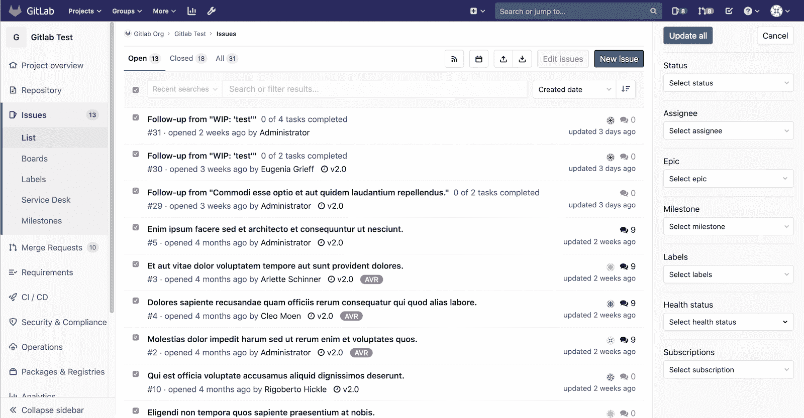

# Bulk editing issues and merge requests at the project level

> 原文：[https://s0docs0gitlab0com.icopy.site/ee/user/project/bulk_editing.html](https://s0docs0gitlab0com.icopy.site/ee/user/project/bulk_editing.html)

*   [Bulk edit issues at the project level](#bulk-edit-issues-at-the-project-level)
*   [Bulk edit merge requests at the project level](#bulk-edit-merge-requests-at-the-project-level)

# Bulk editing issues and merge requests at the project level

**注意：**批量编辑问题，史诗和合并请求在**组级别**也可用. 有关更多详细信息，请参阅[在组级别批量编辑问题，史诗和合并请求](../group/bulk_editing/index.html) .

如果要跨多个问题更新属性或合并请求，则可以通过批量编辑它们，即一起编辑它们来完成.

## Bulk edit issues at the project level

**注意：**您需要具有[Reporter 或更高](../permissions.html)级别的权限才能管理问题.

When bulk editing issues in a project, you can edit the following attributes:

*   状态（打开/关闭）
*   Assignee
*   Epic（在[GitLab Premium](https://about.gitlab.com/pricing/) 13.2 中[引入](https://gitlab.com/gitlab-org/gitlab/-/issues/210470) ）
*   Milestone
*   Labels
*   健康状况（在[GitLab Ultimate](https://about.gitlab.com/pricing/) 13.2 中[引入](https://gitlab.com/gitlab-org/gitlab/-/issues/218395) ）
*   Subscriptions

要同时更新多个项目问题：

1.  在一个项目中，转到 **问题>列表** .
2.  点击**编辑问题** . 屏幕右侧的侧边栏显示，其中包含可编辑的字段.
3.  选中要编辑的每个问题旁边的复选框.
4.  从边栏中选择适当的字段及其值.
5.  Click **全部更新**.

## Bulk edit merge requests at the project level

**注意：**您需要[开发人员或更高](../permissions.html)级别的权限才能管理合并请求.

在项目中批量编辑合并请求时，可以编辑以下属性：

*   状态（打开/关闭）
*   Assignee
*   Milestone
*   Labels
*   Subscriptions

要同时更新多个项目合并请求：

1.  在一个项目中，转到 **合并请求** .
2.  单击**编辑合并请求** . 屏幕右侧的侧边栏显示，其中包含可编辑的字段.
3.  选中要编辑的每个合并请求旁边的复选框.
4.  从边栏中选择适当的字段及其值.
5.  Click **全部更新**.