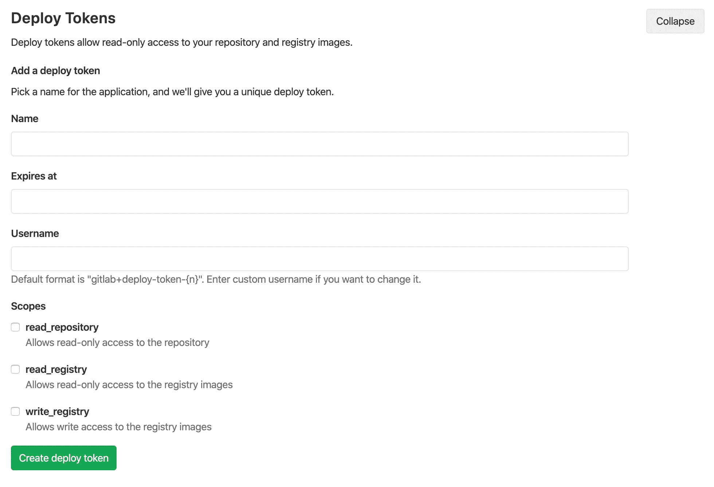

# Deploy Tokens

> 原文：[https://s0docs0gitlab0com.icopy.site/ee/user/project/deploy_tokens/](https://s0docs0gitlab0com.icopy.site/ee/user/project/deploy_tokens/)

*   [Creating a Deploy Token](#creating-a-deploy-token)
*   [Deploy token expiration](#deploy-token-expiration)
*   [Revoking a deploy token](#revoking-a-deploy-token)
*   [Limiting scopes of a deploy token](#limiting-scopes-of-a-deploy-token)
*   [Deploy token custom username](#deploy-token-custom-username)
*   [Usage](#usage)
    *   [Git clone a repository](#git-clone-a-repository)
    *   [Read Container Registry images](#read-container-registry-images)
    *   [Push Container Registry images](#push-container-registry-images)
    *   [Read or pull packages](#read-or-pull-packages)
    *   [Push or upload packages](#push-or-upload-packages)
    *   [Group Deploy Token](#group-deploy-token)
    *   [GitLab Deploy Token](#gitlab-deploy-token)

# Deploy Tokens[](#deploy-tokens "Permalink")

版本历史

*   在 GitLab 10.7 中[引入](https://gitlab.com/gitlab-org/gitlab-foss/-/merge_requests/17894) .
*   从 GitLab 12.9 中的**设置>存储库** [移动](https://gitlab.com/gitlab-org/gitlab/-/issues/199370) .
*   在 GitLab 12.10 中[添加了`write_registry`范围](https://gitlab.com/gitlab-org/gitlab/-/issues/22743) .
*   从 GitLab 12.10.1.中的**"设置">" CI / CD"** [移动](https://gitlab.com/gitlab-org/gitlab/-/merge_requests/29280) .
*   在 GitLab 13.0 中[添加了软件包注册表范围](https://gitlab.com/gitlab-org/gitlab/-/issues/213566) .

部署令牌使您无需用户和密码即可下载（ `git clone` ）或推和拉项目的程序包和容器注册表映像.

部署令牌只能由[维护者](../../permissions.html)管理.

如果有密钥对，则可能要改用[部署密钥](../../../ssh/README.html#deploy-keys) .

## Creating a Deploy Token[](#creating-a-deploy-token "Permalink")

您可以从项目的设置中创建任意数量的部署令牌. 或者，您也可以创建[组范围的部署令牌](#group-deploy-token) .

1.  登录到您的 GitLab 帐户.
2.  转到要为其创建"部署令牌"的项目（或组）.
3.  去 **设置** > **存储库** .
4.  单击" **部署令牌"**部分上的"扩展".
5.  选择令牌的名称，有效期（可选）和用户名（可选）.
6.  选择[所需的范围](#limiting-scopes-of-a-deploy-token) .
7.  单击**创建部署令牌** .
8.  将部署令牌保存在安全的地方. 离开或刷新页面后， **您将无法再次访问它** .

[](img/deploy_tokens.png)

## Deploy token expiration[](#deploy-token-expiration "Permalink")

部署令牌在您定义的日期 UTC 午夜到期.

## Revoking a deploy token[](#revoking-a-deploy-token "Permalink")

您可以随时单击"活动的部署令牌"区域下的相应" **撤消"**按钮来撤消任何部署令牌.

## Limiting scopes of a deploy token[](#limiting-scopes-of-a-deploy-token "Permalink")

可以使用不同的作用域创建部署令牌，这些作用域允许给定令牌可以执行各种操作. 下表介绍了可用的范围以及引入的 GitLab 版本.

| Scope | Description | 在 GitLab 版本中引入 |
| --- | --- | --- |
| `read_repository` | 允许通过`git clone`对存储库进行读取访问 | 10.7 |
| `read_registry` | 如果项目是私有的并且需要授权，则允许对[容器注册表](../../packages/container_registry/index.html)图像的读取访问. | 10.7 |
| `write_registry` | Allows write-access (push) to [container registry](../../packages/container_registry/index.html). | 12.10 |
| `read_package_registry` | 允许对包注册表进行读取访问. | 13.0 |
| `write_package_registry` | 允许对程序包注册表的写访问. | 13.0 |

## Deploy token custom username[](#deploy-token-custom-username "Permalink")

在 GitLab 12.1 中[引入](https://gitlab.com/gitlab-org/gitlab-foss/-/merge_requests/29639) .

默认的用户名格式为`gitlab+deploy-token-#{n}` . 某些工具或平台可能不支持此格式，在这种情况下，您可以指定在创建部署令牌时要使用的自定义用户名.

## Usage[](#usage "Permalink")

### Git clone a repository[](#git-clone-a-repository "Permalink")

要使用部署令牌下载存储库，您只需要：

1.  创建一个以`read_repository`为范围的部署令牌.
2.  记下您的`username`和`token` .
3.  `git clone`使用 Deploy Token `git clone`项目：

    ```
    git clone https://<username>:<deploy_token>@gitlab.example.com/tanuki/awesome_project.git 
    ```

将`<username>`和`<deploy_token>`替换为正确的值.

### Read Container Registry images[](#read-container-registry-images "Permalink")

要读取容器注册表图像，您需要：

1.  使用`read_registry`作为范围创建部署令牌.
2.  记下您的`username`和`token` .
3.  使用部署令牌登录到 GitLab 的 Container Registry：

```
docker login -u <username> -p <deploy_token> registry.example.com 
```

只需将`<username>`和`<deploy_token>`替换为适当的值即可. 然后，您可以简单地从 Container Registry 中提取图像.

### Push Container Registry images[](#push-container-registry-images "Permalink")

在 GitLab 12.10 中[引入](https://gitlab.com/gitlab-org/gitlab/-/issues/22743) .

要推送容器注册表映像，您需要：

1.  创建一个具有`write_registry`作为范围的部署令牌.
2.  记下您的`username`和`token` .
3.  使用部署令牌登录到 GitLab 的 Container Registry：

    ```
    docker login -u <username> -p <deploy_token> registry.example.com 
    ```

只需将`<username>`和`<deploy_token>`替换为适当的值即可. 然后，您可以简单地将图像推送到 Container Registry.

### Read or pull packages[](#read-or-pull-packages "Permalink")

在 GitLab 13.0 中[引入](https://gitlab.com/gitlab-org/gitlab/-/issues/213566) .

要在 GitLab 软件包注册表中提取软件包，您需要：

1.  使用`read_package_registry`作为范围创建一个部署令牌.
2.  记下您的`username`和`token` .
3.  对于[您选择](./../../packages/index.html)的[软件包类型，请](./../../packages/index.html)遵循有关部署令牌的身份验证说明.

### Push or upload packages[](#push-or-upload-packages "Permalink")

在 GitLab 13.0 中[引入](https://gitlab.com/gitlab-org/gitlab/-/issues/213566) .

要在 GitLab 软件包注册表中上传软件包，您需要：

1.  使用`write_package_registry`作为范围创建部署令牌.
2.  记下您的`username`和`token` .
3.  对于[您选择](./../../packages/index.html)的[软件包类型，请](./../../packages/index.html)遵循有关部署令牌的身份验证说明.

### Group Deploy Token[](#group-deploy-token "Permalink")

在 GitLab 12.9 中[引入](https://gitlab.com/gitlab-org/gitlab/-/issues/21765) .

在组级别创建的部署令牌可在属于特定组或其子组之一的所有项目中使用.

有关概述，请参阅" [组部署令牌"](https://youtu.be/8kxTJvaD9ks) .

要使用组部署令牌：

1.  为组[创建](#creating-a-deploy-token)一个部署令牌.
2.  与[克隆存储库](#git-clone-a-repository)时使用项目部署令牌的方式相同.

克隆相关项目的存储库时，应用于组部署令牌的范围（例如`read_repository` ）将一致地应用.

### GitLab Deploy Token[](#gitlab-deploy-token "Permalink")

在 GitLab 10.8 中[引入](https://gitlab.com/gitlab-org/gitlab-foss/-/merge_requests/18414) .

部署令牌是一种特殊情况. 如果用户创建了一个名为`gitlab-deploy-token`的名称，则 Deploy Token 的用户名和令牌将自动作为环境变量暴露给 CI / CD 作业： `CI_DEPLOY_USER`和`CI_DEPLOY_PASSWORD` .

创建令牌后，可以使用以下变量登录到 Container Registry：

```
docker login -u $CI_DEPLOY_USER -p $CI_DEPLOY_PASSWORD $CI_REGISTRY 
```

**注意：**目前尚未为组部署令牌实现`gitlab-deploy-token`部署令牌的特殊处理. 为了使部署令牌可用于 CI / CD 作业，必须在项目级别创建它. 有关详细信息，请参[见此问题](https://gitlab.com/gitlab-org/gitlab/-/issues/214014) .