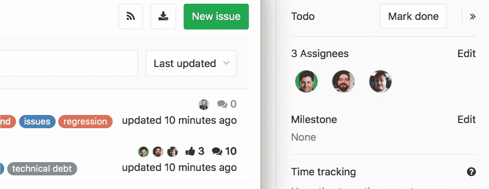
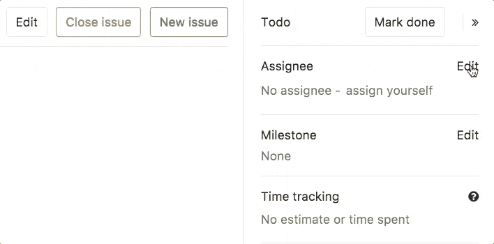

# Multiple Assignees for Issues

> 原文：[https://s0docs0gitlab0com.icopy.site/ee/user/project/issues/multiple_assignees_for_issues.html](https://s0docs0gitlab0com.icopy.site/ee/user/project/issues/multiple_assignees_for_issues.html)

*   [Overview](#overview)
*   [Use cases](#use-cases)
*   [How it works](#how-it-works)

# Multiple Assignees for Issues

[Introduced](https://gitlab.com/gitlab-org/gitlab/-/issues/1904) in [GitLab Starter 9.2](https://about.gitlab.com/releases/2017/05/22/gitlab-9-2-released/#multiple-assignees-for-issues).

## Overview

在拥有问题共享所有权的大型团队中，可能很难跟踪谁正在处理问题，谁已经完成了贡献，谁还没有开始.

在[GitLab 企业版中](https://about.gitlab.com/pricing/) ，您还可以选择一个问题的多个受让人，使其更容易跟踪，并更清楚地由谁负责.

## Use cases

考虑一个由前端开发人员，后端开发人员，UX 设计人员，QA 测试人员和产品经理组成的团队，他们共同努力将创意推向市场.

多个问题分配者可以使协作更加顺畅，并可以清晰显示共享的职责. 在团队的工作流程中将显示所有受让人，并接收通知（就像作为单个受让人一样），从而简化了沟通和所有权.

受让人完成工作后，他们将离开自己，成为受让人，这清楚表明他们的角色已经完成.

## How it works

在未解决的问题中，展开右侧栏，找到受让人条目，然后单击" **编辑"** . 从下拉菜单中，选择要分配问题的用户数.

通过从同一下拉菜单中取消选择受让人可以轻松将其删除.