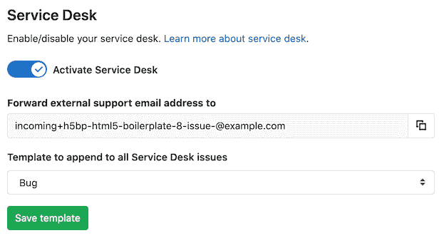
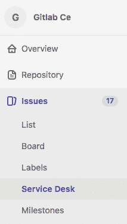
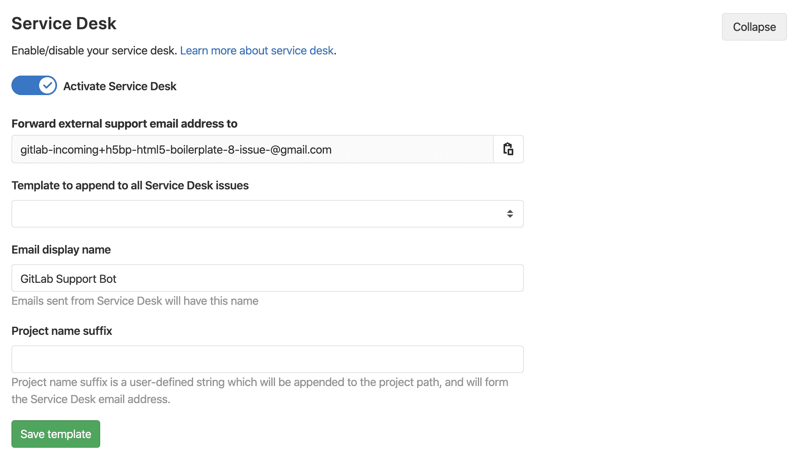
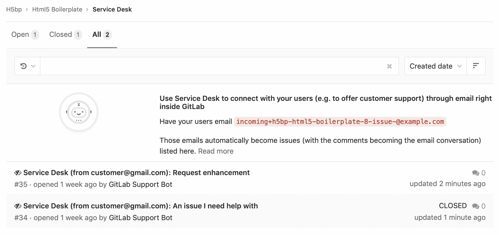
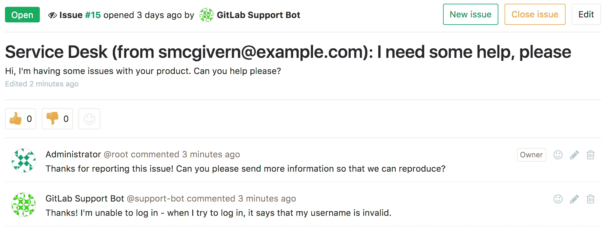

# Service Desk

> 原文：[https://s0docs0gitlab0com.icopy.site/ee/user/project/service_desk.html](https://s0docs0gitlab0com.icopy.site/ee/user/project/service_desk.html)

*   [Overview](#overview)
*   [Use cases](#use-cases)
*   [How it works](#how-it-works)
*   [Configuring Service Desk](#configuring-service-desk)
    *   [Using customized email templates](#using-customized-email-templates)
        *   [Thank you email](#thank-you-email)
        *   [New note email](#new-note-email)
    *   [Using custom email display name](#using-custom-email-display-name)
    *   [Using custom email address](#using-custom-email-address)
        *   [Enable custom email address](#enable-custom-email-address)
*   [Using Service Desk](#using-service-desk)
    *   [As an end user (issue creator)](#as-an-end-user-issue-creator)
    *   [As a responder to the issue](#as-a-responder-to-the-issue)
    *   [Support Bot user](#support-bot-user)

# Service Desk[](#service-desk "Permalink")

Version history

*   [Introduced](https://gitlab.com/gitlab-org/gitlab/-/issues/149) in [GitLab Premium](https://about.gitlab.com/pricing/) 9.1.
*   在 13.0 中[移至](https://gitlab.com/gitlab-org/gitlab/-/issues/214839) [GitLab Starter](https://about.gitlab.com/pricing/) .
*   在 13.2 中[移至](https://gitlab.com/gitlab-org/gitlab/-/issues/215364) [GitLab Core](https://about.gitlab.com/pricing/) .

## Overview[](#overview "Permalink")

Service Desk 是一个模块，可让您的团队直接在 GitLab 内部通过电子邮件与任何外部方联系. 无需外部工具. 在构建软件的过程中进行的持续对话可确保用户反馈直接在需要的地方结束，从而帮助您构建正确的功能来解决用户的实际问题.

借助 Service Desk，您可以为客户提供有效的电子邮件支持，他们现在可以通过电子邮件向您发送错误报告，功能请求或常规反馈，这些问题将作为新问题最终出现在您的 GitLab 项目中. 反过来，您的团队可以直接从项目中做出回应.

由于 Service Desk 直接内置在 GitLab 中，因此消除了多种工具和外部集成的复杂性和低效率，从而大大缩短了从反馈到软件更新的周期时间.

有关概述，请查看[GitLab 服务](https://about.gitlab.com/blog/2017/05/09/demo-service-desk/)台上的视频演示.

## Use cases[](#use-cases "Permalink")

例如，假设您为 iOS 或 Android 开发游戏. 该代码库托管在您的 GitLab 实例中，并通过 GitLab CI / CD 构建和部署.

这是 Service Desk 为您工作的方式：

1.  您向付费客户提供特定于项目的电子邮件地址，他们可以直接从应用程序内向您发送电子邮件.
2.  他们发送的每封电子邮件都会在相应的项目中产生一个问题.
3.  您的团队成员导航到 Service Desk 问题跟踪器，在这里他们可以查看新的支持请求并在内部相关问题中做出响应.
4.  您的团队与客户进行来回沟通以了解请求.
5.  您的团队开始着手实施代码以解决客户的问题.
6.  当您的团队完成实施后，合并请求将合并，问题将自动关闭.
7.  该客户将通过电子邮件成功出席，而无需真正访问您的 GitLab 实例.
8.  您的团队无需离开 GitLab（或设置任何集成）即可跟进客户，从而节省了时间.

## How it works[](#how-it-works "Permalink")

GitLab 服务台是一种简单的方法，使人们无需自己的用户帐户即可在您的 GitLab 实例中创建问题.

它为最终用户提供了一个在项目中创建问题的唯一电子邮件地址，并且可以通过 GitLab 界面或通过电子邮件发送答复. 最终用户将仅通过电子邮件看到该主题.

## Configuring Service Desk[](#configuring-service-desk "Permalink")

**注意：**在 GitLab.com 上启用了 Service Desk. 您可以跳过下面的步骤 1； 您只需要为每个项目启用它.

如果您具有项目维护者访问权限，则可以选择设置服务台. 请按照以下步骤操作：

1.  为 GitLab 实例[设置传入电子邮件](../../administration/incoming_email.html#set-it-up) .
    *   我们建议使用[电子邮件子地址](../../administration/incoming_email.html#email-sub-addressing) ，但在 GitLab 11.7 及更高版本中，您也可以使用[全部接收邮箱](../../administration/incoming_email.html#catch-all-mailbox) .
2.  导航到项目的**"设置">"常规"，**然后找到" **服务台"**部分.
3.  启用**激活服务台**切换. 这显示了一个唯一的电子邮件地址，可将问题发送给项目. 这些问题将是[机密的](issues/confidential_issues.html) ，因此它们仅对项目成员可见. 请注意，在 GitLab 11.7 中，我们更新了生成的电子邮件地址的格式. 仍然支持较旧的格式，但是允许现有的别名或联系人继续工作.

    **危险：**任何人都可以使用此电子邮件地址在此项目上创建问题，无论他们是否有权访问您的 GitLab 实例. 我们建议**将其放在别名后面，**以便可以根据需要进行更改，并在您的 GitLab 实例上**[启用 Akismet](../../integration/akismet.html)**来向该服务添加垃圾邮件检查. 畅通无阻的电子邮件垃圾邮件将导致创建许多垃圾邮件问题.

    如果存储库中有[模板](description_templates.html) ，则可以选择从选择器菜单中选择一个[模板](description_templates.html) ，以将其附加到所有 Service Desk 问题上.

    [](img/service_desk_enabled.png)

现在已为此项目启用 Service Desk！ 您应该能够从项目导航的" **问题"**菜单中访问它.

[](img/service_desk_nav_item.png)

### Using customized email templates[](#using-customized-email-templates "Permalink")

[Introduced](https://gitlab.com/gitlab-org/gitlab/-/issues/2460) in [GitLab Premium](https://about.gitlab.com/pricing/) 12.7.

当用户使用 Service Desk 提交新问题时，或在 Service Desk 问题上创建新便笺时，将向作者发送电子邮件.

这些电子邮件的正文可以使用模板进行自定义. 要创建新的自定义模板，请在存储库的`.gitlab/service_desk_templates/`目录内创建一个新的 Markdown（ `.md` ）文件. 提交并推送到您的默认分支.

#### Thank you email[](#thank-you-email "Permalink")

**谢谢电子邮件**是用户提交问题后发送给用户的电子邮件. 模板的文件名必须为`thank_you.md` . 您可以使用`%{ISSUE_ID}`占位符，它将由电子邮件中的问题 IID 替换；而`%{ISSUE_PATH}`占位符，将由项目路径和问题 IID 替换. 由于服务台问题被创建为机密（只有项目成员才能看到），因此回复电子邮件中没有提供问题链接.

#### New note email[](#new-note-email "Permalink")

**新笔记电子邮件**是当用户提交的问题有新评论时发送给用户的电子邮件. 模板的文件名必须为`new_note.md` . 您可以使用`%{ISSUE_ID}`占位符（将在电子邮件中替换为问题 IID）， `%{ISSUE_PATH}`占位符（将替换为项目路径）以及问题 IID 和`%{NOTE_TEXT}`占位符（将替换为注释文本） .

### Using custom email display name[](#using-custom-email-display-name "Permalink")

在 GitLab 12.8 中[引入](https://gitlab.com/gitlab-org/gitlab/-/issues/7529) .

您可以自定义电子邮件显示名称. 从服务台发送的电子邮件在" `From`标题中将具有此名称. 默认显示名称是`GitLab Support Bot` .

### Using custom email address[](#using-custom-email-address "Permalink")

[Introduced](https://gitlab.com/gitlab-org/gitlab/-/issues/2201) in [GitLab Premium](https://about.gitlab.com/pricing/) 13.0.

**注意：**默认情况下禁用此功能. 有关启用它的步骤，请参阅[启用自定义电子邮件地址](#enable-custom-email-address) .

如果在配置中启用了`service_desk_email`功能标记，则可以通过将电子邮件发送到自定义 Service Desk 电子邮件地址来创建 Service Desk 问题，该电子邮件地址应采用以下格式： `project_contact+%{key}@example.com` .

`%{key}`部分用于查找应在其中创建问题的项目. `%{key}`部分组合了项目的路径和可配置的项目名称后缀： `<project_full_path>-<project_name_suffix>` .

您可以在项目的服务台设置中设置项目名称后缀. 它只能包含小写字母（ `az` ），数字（ `0-9` ）或下划线（ `_` ）.

[](img/service_desk_custom_email_address_v13_0.png)

您可以将以下代码片段添加到您的配置中.

从源安装的示例：

```
service_desk_email:
  enabled: true
  address: "project_contact+%{key}@example.com"
  user: "project_support@example.com"
  password: "[REDACTED]"
  host: "imap.gmail.com"
  port: 993
  ssl: true
  start_tls: false
  log_path: "log/mailroom.log"
  mailbox: "inbox"
  idle_timeout: 60
  expunge_deleted: true 
```

Omnibus GitLab 安装示例：

```
gitlab_rails['service_desk_email_enabled'] = true

gitlab_rails['service_desk_email_address'] = "project_contact+%{key}@gmail.com"

gitlab_rails['service_desk_email_email'] = "project_support@gmail.com"

gitlab_rails['service_desk_email_password'] = "[REDACTED]"

gitlab_rails['service_desk_email_mailbox_name'] = "inbox"

gitlab_rails['service_desk_email_idle_timeout'] = 60

gitlab_rails['service_desk_email_log_file'] = "/var/log/gitlab/mailroom/mail_room_json.log"

gitlab_rails['service_desk_email_host'] = "imap.gmail.com"

gitlab_rails['service_desk_email_port'] = 993

gitlab_rails['service_desk_email_ssl'] = true

gitlab_rails['service_desk_email_start_tls'] = false 
```

在这种情况下，假设`mygroup/myproject`项目 Service Desk 设置的项目名称后缀设置为`support` ，并且用户将电子邮件发送到`project_contact+mygroup-myproject-support@example.com` . 结果，将在`mygroup/myproject`项目中从此电子邮件中创建一个新的 Service Desk 问题.

#### Enable custom email address[](#enable-custom-email-address "Permalink")

默认情况下，此功能附带`service_desk_custom_address`功能标志. 要打开此功能，请要求具有 Rails 控制台访问权限的 GitLab 管理员运行以下命令：

```
Feature.enable(:service_desk_custom_address) 
```

配置选项与配置[传入电子邮件](../../administration/incoming_email.html#set-it-up)相同.

## Using Service Desk[](#using-service-desk "Permalink")

### As an end user (issue creator)[](#as-an-end-user-issue-creator "Permalink")

要创建服务台问题，最终用户无需了解有关 GitLab 实例的任何信息. 他们只是将电子邮件发送到给定的地址，然后收到一封确认回执的电子邮件：

[](img/service_desk_confirmation_email.png)

这也使最终用户可以选择退订.

如果他们不选择退订，那么添加到该问题的任何新评论都将作为电子邮件发送：

[](img/service_desk_reply.png)

他们发送的所有回复都将显示在问题本身中.

### As a responder to the issue[](#as-a-responder-to-the-issue "Permalink")

For responders to the issue, everything works as usual. They will see a familiar looking issue tracker, where they can see issues created via customer support requests and filter and interact with them just like other GitLab issues.

[](img/service_desk_issue_tracker.png)

来自最终用户的消息将显示为来自特殊的支持机器人用户，但是除此之外，您可以像平常一样阅读和编写评论：

[](img/service_desk_thread.png)

注意：

*   项目的可见性（私有，内部，公共）不会影响 Service Desk.
*   项目的路径，包括其组或名称空间，将显示在电子邮件中.

### Support Bot user[](#support-bot-user "Permalink")

在后台，服务台由支持机器人的特殊用户创建问题. 该用户不计入许可证限制数.