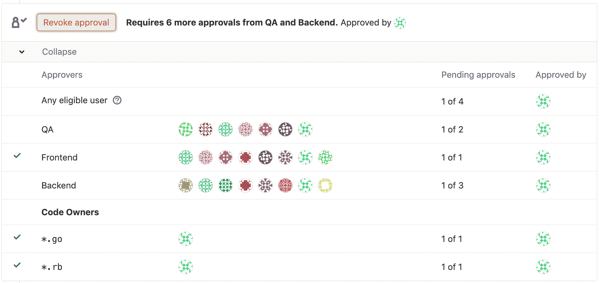
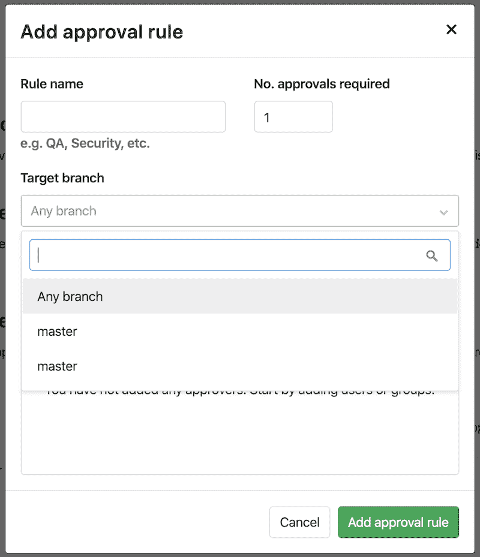

# Merge Request Approvals

> 原文：[https://s0docs0gitlab0com.icopy.site/ee/user/project/merge_requests/merge_request_approvals.html](https://s0docs0gitlab0com.icopy.site/ee/user/project/merge_requests/merge_request_approvals.html)

*   [Optional Approvals](#optional-approvals-core-only)
*   [Required Approvals](#required-approvals-starter)
    *   [Approval Rules](#approval-rules)
        *   [Eligible Approvers](#eligible-approvers)
            *   [Implicit Approvers](#implicit-approvers)
            *   [Code Owners as eligible approvers](#code-owners-as-eligible-approvers)
        *   [Adding / editing a default approval rule](#adding--editing-a-default-approval-rule)
            *   [Editing / overriding approval rules per merge request](#editing--overriding-approval-rules-per-merge-request)
        *   [Multiple approval rules](#multiple-approval-rules-premium)
        *   [Scoped to Protected Branch](#scoped-to-protected-branch-premium)
    *   [Adding or removing an approval](#adding-or-removing-an-approval)
    *   [Merge request approvals project settings](#merge-request-approvals-project-settings)
        *   [Prevent overriding default approvals](#prevent-overriding-default-approvals)
        *   [Resetting approvals on push](#resetting-approvals-on-push)
        *   [Allowing merge request authors to approve their own merge requests](#allowing-merge-request-authors-to-approve-their-own-merge-requests)
        *   [Prevent approval of merge requests by their committers](#prevent-approval-of-merge-requests-by-their-committers)
        *   [Require authentication when approving a merge request](#require-authentication-when-approving-a-merge-request)
    *   [Security approvals in merge requests](#security-approvals-in-merge-requests-ultimate)
    *   [Enabling the new approvals interface](#enabling-the-new-approvals-interface)

# Merge Request Approvals[](#merge-request-approvals "Permalink")

代码审查是每个成功项目的基本实践，一旦合并请求状态良好，就需要您的批准，这是审查过程的重要组成部分，因为它清楚地传达了合并变更的能力.

## Optional Approvals[](#optional-approvals-core-only "Permalink")

在[GitLab Core 13.2 中](https://gitlab.com/gitlab-org/gitlab/-/issues/27426)引入.

具有开发者[权限](../../permissions.html)或更高[权限的](../../permissions.html)任何用户都可以在 GitLab Core 中批准合并请求. 这为审阅者提供了一种一致的机制来提供批准，并使维护者更容易知道何时可以合并更改. Core 中的批准是可选的，并且在没有批准的情况下不会阻止合并请求的合并.

## Required Approvals[](#required-approvals-starter "Permalink")

在[GitLab 企业版 7.12 中](https://about.gitlab.com/releases/2015/06/22/gitlab-7-12-released/#merge-request-approvers-ee-only)引入.

必需的批准通过要求指定的人在可以合并的合并请求之前批准，可以强制执行代码审查.

所需的批准可启用多个用例：

*   强制审查所有合并到存储库中的代码.
*   通过[批准规则](#approval-rules)指定给定提议的代码更改的审核者，以及最少数量的审核者.
*   为所有建议的代码更改指定审阅者的类别，例如后端，前端，质量保证，数据库等.
*   由合并请求中更改的文件确定，自动将[代码所有者](#code-owners-as-eligible-approvers)指定[为合格的批准者](#code-owners-as-eligible-approvers) .
*   在合并可能引入漏洞的代码之前， [需要获得安全团队的批准](#security-approvals-in-merge-requests-ultimate) .

### Approval Rules[](#approval-rules "Permalink")

批准规则定义了合并请求在可以合并之前必须获得多少个批准，以及可选地应该由哪些用户进行批准. 可以定义批准：

*   [As project defaults](#adding--editing-a-default-approval-rule).
*   [Per merge request](#editing--overriding-approval-rules-per-merge-request).

如果未定义批准规则，则任何用户都可以批准合并请求，尽管仍可以在[项目设置中为合并请求批准设置](#merge-request-approvals-project-settings)所需批准者的默认最小数量.

批准规则定义了合并请求在可以合并之前必须获得多少个批准，以及可选地应该由哪些用户进行批准. 可以定义批准：

*   [As project defaults](#adding--editing-a-default-approval-rule).
*   [Per merge request](#editing--overriding-approval-rules-per-merge-request).

如果未定义批准规则，则任何用户都可以批准合并请求，尽管仍可以在[项目设置中为合并请求批准设置](#merge-request-approvals-project-settings)所需批准者的默认最小数量.

#### Eligible Approvers[](#eligible-approvers "Permalink")

以下用户可以批准合并请求：

*   在项目中被添加为批准者的用户，或将请求级别与开发者或更高[权限](../../permissions.html)合并的[用户](../../permissions.html) .
*   由合并请求更改的具有开发人员或更高[权限](../../permissions.html)的文件的[代码所有者](#code-owners-as-eligible-approvers) .

如果单个用户是以下成员的成员，则可以将其添加为项目的批准者：

*   该项目.
*   该项目的直接上级组.
*   可以通过[共享](../members/share_project_with_groups.html)访问项目的组.

也可以将一组用户添加为批准者. 将来，小组批准者可能只[限于对项目具有共享访问权限的小组](https://gitlab.com/gitlab-org/gitlab/-/issues/2048) .

如果将用户添加为个人批准者，并且也是组批准者的一部分，则该用户仅被计数一次. 如果在项目设置上启用了" [**阻止作者批准"**](#allowing-merge-request-authors-to-approve-their-own-merge-requests) （默认情况下启用）和" [**阻止提交者批准"**](#prevent-approval-of-merge-requests-by-their-committers) （默认情况下禁用），则合并请求作者以及已提交合并请求的用户均不算作合格批准者.

##### Implicit Approvers[](#implicit-approvers "Permalink")

如果所需批准的数量大于分配的批准者的数量，则来自其他用户的批准将计入满足要求. 这些将是在项目中具有开发人员[权限](../../permissions.html)或更高[权限的](../../permissions.html)用户，但未在批准规则中明确列出.

##### Code Owners as eligible approvers[](#code-owners-as-eligible-approvers "Permalink")

[Introduced](https://gitlab.com/gitlab-org/gitlab/-/merge_requests/7933) in [GitLab Starter](https://about.gitlab.com/pricing/) 11.5.

如果将[代码所有者](../code_owners.html)添加到存储库中，则相应文件的所有者将与具有 Developer 或更高[权限的](../../permissions.html)成员一起成为合格的批准者.

要启用此合并请求批准规则：

1.  导航到项目的**"设置">"常规"，**然后展开" **合并请求批准"** .
2.  找到**任何合格的用户，**然后选择所需的批准数量.

[](img/mr_approvals_by_code_owners_v12_7.png)

设置后，合并请求只能在您设置的批准数量批准后才能合并. manbetx 客户端打不开将毫无区别地接受来自具有开发者或更高权限的用户以及代码所有者的批准.

或者，您可以**要求** [保护所有者的代码所有者批准](../protected_branches.html#protected-branches-approval-by-code-owners-premium) .

#### Adding / editing a default approval rule[](#adding--editing-a-default-approval-rule "Permalink")

要添加或编辑默认的合并请求批准规则：

1.  导航到您项目的 **设置>常规，**然后展开**合并请求批准** .

2.  单击**添加批准规则** ，或单击**编辑** .
    *   添加或更改**规则名称** .
    *   设置**所需的批准号**所需的批准数量. 最小值是`0` .
    *   （可选）搜索有[资格批准](#eligible-approvers)合并请求的用户或组，然后单击" **添加"**按钮将其添加为批准者. 在搜索字段中键入之前，将根据合并请求更改的文件的先前作者来建议批准者.
    *   （可选）点击 组或用户旁边的" **删除"**按钮可将其从规则中删除.
3.  Click **添加批准规则** or **更新批准规则**.

在更改规则之前创建的任何合并请求都不会更改. 他们将保留原始批准规则，除非手动[覆盖](#editing--overriding-approval-rules-per-merge-request) .

**注意：**如果合并请求的目标是其他项目，例如从分支到上游项目，则默认批准规则将从目标（上游）项目而不是源（叉子）获取.

##### Editing / overriding approval rules per merge request[](#editing--overriding-approval-rules-per-merge-request "Permalink")

在 GitLab 企业版 9.4 中引入.

默认情况下，MR 作者或具有足够[权限](../../permissions.html)的用户可以编辑每个合并请求（MR）中列出的合并请求批准规则. 可以在[合并请求批准设置中](#prevent-overriding-default-approvals)禁用此功能.

一种可能的情况是添加比默认设置中定义更多的批准者.

创建或编辑合并请求时，请找到" **批准规则"**部分，然后按照与[添加/编辑默认批准规则](#adding--editing-a-default-approval-rule)相同的步骤进行操作.

#### Multiple approval rules[](#multiple-approval-rules-premium "Permalink")

[Introduced](https://gitlab.com/gitlab-org/gitlab/-/issues/1979) in [GitLab Premium](https://about.gitlab.com/pricing/) 11.10.

在 GitLab Premium 中，每个合并请求可以有多个批准规则，每个项目可以有多个默认批准规则.

添加或编辑多个默认规则与[添加或编辑单个默认批准规则相同](#adding--editing-a-default-approval-rule) ，不同之处在于，即使已经定义了规则，" **添加批准规则"**按钮仍可用于添加更多规则.

同样，每个合并请求中编辑或覆盖多个批准规则与每个合并请求中[编辑或覆盖批准规则](#editing--overriding-approval-rules-per-merge-request)相同，只是即使已定义一个规则，" **添加批准规则"**按钮仍可用于添加更多规则.

当[合格的批准人](#eligible-approvers)批准合并请求时，它将减少批准人所属的所有规则的剩余批准数.

[](img/approvals_premium_mr_widget_v12_7.png)

#### Scoped to Protected Branch[](#scoped-to-protected-branch-premium "Permalink")

[Introduced](https://gitlab.com/gitlab-org/gitlab/-/issues/460) in [GitLab Premium](https://about.gitlab.com/pricing/) 12.8.

批准规则通常仅与特定分支（例如`master` . 在配置[**默认批准规则时，**](#adding--editing-a-default-approval-rule)可以通过导航到项目的**"设置"** ，展开" **合并请求批准"** ，然后从" **目标"分支**下拉列表中选择" **任何"分支** ，将这些作用域一下子作用于所有受保护的分支.

或者，您可以从" **目标"分支**下拉列表中选择一个非常特定的受保护分支：

[](img/scoped_to_protected_branch_v12_8.png)

要启用此配置，请参阅[代码所有者对受保护分支的批准](../protected_branches.html#protected-branches-approval-by-code-owners-premium) .

### Adding or removing an approval[](#adding-or-removing-an-approval "Permalink")

当[合格的批准者](#eligible-approvers)访问一个开放合并请求时，可能是以下之一：

*   如果所需的批准数目*尚未*满足，他们可以通过点击批准它显示的**批准**按钮.

    [](img/approve.png)

*   如果已经满足所需的批准数量，则他们仍然可以通过单击显示的**"额外批准"**按钮来**批准** .

    [](img/approve_additionally.png)

*   **他们已经批准了此合并请求** ：他们可以删除他们的批准.

    [](img/remove_approval.png)

**注意：**如果在项目设置中启用了" [**阻止作者批准"，**](#allowing-merge-request-authors-to-approve-their-own-merge-requests)则不允许合并请求作者批准自己的合并请求.

满足批准规则后，如果没有其他阻止请求，则可以合并合并请求. 请注意，合并请求仍可能被其他条件阻止，例如合并冲突， [挂起的讨论](../../discussions/index.html#only-allow-merge-requests-to-be-merged-if-all-threads-are-resolved)或[失败的 CI / CD 管道](merge_when_pipeline_succeeds.html) .

### Merge request approvals project settings[](#merge-request-approvals-project-settings "Permalink")

可以通过以下步骤找到合并请求批准的项目设置： **设置>常规**和扩展**合并请求批准** .

#### Prevent overriding default approvals[](#prevent-overriding-default-approvals "Permalink")

默认情况下，用户可以在合并请求中编辑批准规则. 如果禁用，则所有新合并请求的[批准规则](#adding--editing-a-default-approval-rule)将由[默认批准规则](#adding--editing-a-default-approval-rule)确定. 要禁用此功能：

1.  取消选中**可以覆盖每个合并请求所需的批准人和批准**复选框.
2.  Click **保存更改**.

#### Resetting approvals on push[](#resetting-approvals-on-push "Permalink")

当新的提交被推送到合并请求的源分支时，您可以强制删除对合并请求的所有批准. 如果禁用，则即使合并请求中添加了更改，批准也将持续. 要启用此功能：

1.  Check the **将新提交推送到其源分支时，删除合并请求中的所有批准** checkbox.
2.  Click **保存更改**.

**注意：**重新定义来自 UI [的合并请求](fast_forward_merge.html)时，批准不会重置. 但是，如果更改了目标分支，则批准将被重置.

#### Allowing merge request authors to approve their own merge requests[](#allowing-merge-request-authors-to-approve-their-own-merge-requests "Permalink")

[Introduced](https://gitlab.com/gitlab-org/gitlab/-/issues/3349) in [GitLab Starter](https://about.gitlab.com/pricing/) 11.3.

您可以允许合并请求作者自行批准合并请求. 作者也必须包含在批准者列表中，以便能够批准其合并请求. 要启用此功能：

1.  取消选中" **阻止合并请求作者批准合并请求"**复选框，默认情况下启用此复选框.
2.  Click **保存更改**.

#### Prevent approval of merge requests by their committers[](#prevent-approval-of-merge-requests-by-their-committers "Permalink")

[Introduced](https://gitlab.com/gitlab-org/gitlab/-/issues/10441) in [GitLab Starter](https://about.gitlab.com/pricing/) 11.10.

您可以阻止已提交合并请求的用户批准它. 要启用此功能：

1.  选中**阻止提交者批准合并请求**复选框.
2.  Click **保存更改**.

#### Require authentication when approving a merge request[](#require-authentication-when-approving-a-merge-request "Permalink")

[Introduced](https://gitlab.com/gitlab-org/gitlab/-/issues/5981) in [GitLab Starter](https://about.gitlab.com/pricing/) 12.0.

**注意：**要在批准合并请求时要求身份验证，必须在[登录限制](../../admin_area/settings/sign_in_restrictions.html#password-authentication-enabled)下**启用为 Web 界面**启用的**密码身份验证** . 在管理区域中.

您可以强制批准者输入密码以进行身份​​验证，然后再添加批准. 这使电子签名能够获得批准，例如[CFR Part 11](https://www.accessdata.fda.gov/scripts/cdrh/cfdocs/cfcfr/CFRSearch.cfm?CFRPart=11&showFR=1&subpartNode=21:1.0.1.1.8.3)所定义的签名. 要启用此功能：

1.  选中**需要用户密码批准**复选框.
2.  Click **保存更改**.

### Security approvals in merge requests[](#security-approvals-in-merge-requests-ultimate "Permalink")

可以将合并请求批准配置为在合并请求引入漏洞时需要安全团队成员的批准.

有关更多信息，请参见[合并请求中的安全性批准](../../application_security/index.html#security-approvals-in-merge-requests) .

### Enabling the new approvals interface[](#enabling-the-new-approvals-interface "Permalink")

从[GitLab v12.0 开始](https://gitlab.com/gitlab-org/gitlab/-/issues/10685) ，默认情况下会提供更新的批准界面. 在 12.0 之前的版本中，除非启用了`approval_rules`功能标志，否则更新的界面不可用，这可由实例管理员从 Rails 控制台中完成.

使用以下命令来启动 Rails 控制台：

```
# Omnibus GitLab
gitlab-rails console

# Installation from source
cd /home/git/gitlab
sudo -u git -H bin/rails console -e production 
```

然后运行`Feature.enable(:approval_rules)`以启用更新的界面.