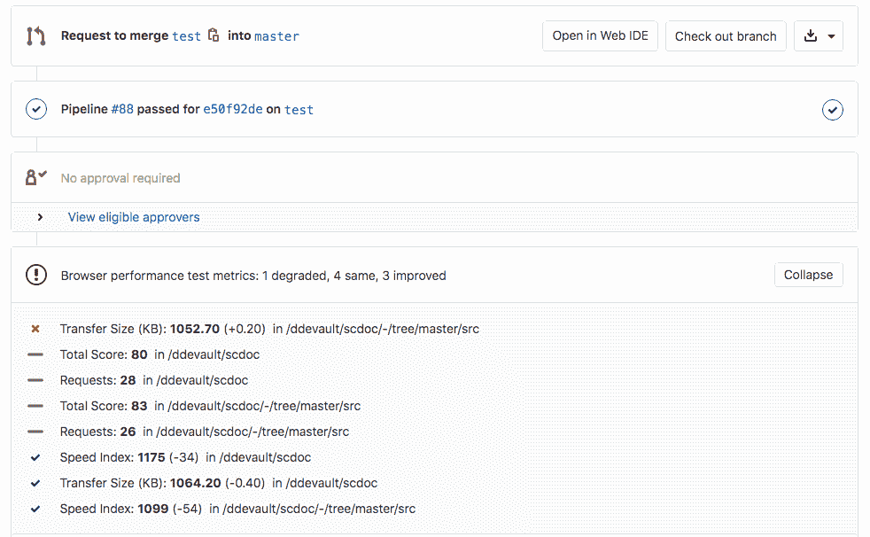

# Browser Performance Testing

> 原文：[https://s0docs0gitlab0com.icopy.site/ee/user/project/merge_requests/browser_performance_testing.html](https://s0docs0gitlab0com.icopy.site/ee/user/project/merge_requests/browser_performance_testing.html)

*   [Overview](#overview)
*   [Use cases](#use-cases)
*   [How browser performance testing works](#how-browser-performance-testing-works)
*   [Configuring Browser Performance Testing](#configuring-browser-performance-testing)
    *   [Configuring degradation threshold](#configuring-degradation-threshold)
    *   [Performance testing on Review Apps](#performance-testing-on-review-apps)
    *   [GitLab versions 12.3 and older](#gitlab-versions-123-and-older)

# Browser Performance Testing[](#browser-performance-testing-premium "Permalink")

[Introduced](https://gitlab.com/gitlab-org/gitlab/-/merge_requests/3507) in [GitLab Premium](https://about.gitlab.com/pricing/) 10.3.

如果您的应用程序提供 Web 界面，并且您正在使用[GitLab CI / CD](../../../ci/README.html) ，则可以快速确定浏览器中待处理代码更改对渲染性能的影响.

## Overview[](#overview "Permalink")

GitLab 使用[Sitespeed.io](https://www.sitespeed.io) （一种免费的开源工具）来测量网站的渲染性能. GitLab 构建的[Sitespeed 插件](https://gitlab.com/gitlab-org/gl-performance)在名为`browser-performance.json`的文件中输出所分析的每个页面的性能得分，该数据可以显示在合并请求中.

## Use cases[](#use-cases "Permalink")

考虑以下工作流程：

1.  营销团队的成员正在尝试通过添加新工具来跟踪参与度.
2.  通过浏览器性能指标，他们可以看到他们的更改如何影响最终用户页面的可用性.
3.  指标显示，更改后，页面的性能得分有所下降.
4.  查看详细报告时，他们看到`<head>`包含了新的 JavaScript 库，这会影响加载页面的速度.
5.  他们向前端开发人员寻求帮助，他们将库设置为异步加载.
6.  前端开发人员批准合并请求，并授权将其部署到生产中.

## How browser performance testing works[](#how-browser-performance-testing-works "Permalink")

首先，在`.gitlab-ci.yml`文件中定义一个生成[浏览器性能报告工件的作业](../../../ci/pipelines/job_artifacts.html#artifactsreportsperformance-premium) . 然后，GitLab 会检查此报告，比较源分支和目标分支之间每一页的关键性能指标，并在合并请求中显示信息.

有关性能作业的示例，请参阅" [配置浏览器性能测试"](#configuring-browser-performance-testing) .

**注意：**如果"浏览器性能"报告没有可比较的数据，例如，当您第一次在`.gitlab-ci.yml`添加"浏览器性能"作业时，"浏览器性能"报告小部件将不会显示. 它必须在目标分支（例如`master` ）上至少运行一次，然后才能在针对该分支的合并请求中显示.

[](img/browser_performance_testing.png)

## Configuring Browser Performance Testing[](#configuring-browser-performance-testing "Permalink")

这个例子显示如何运行[sitespeed.io 容器](https://hub.docker.com/r/sitespeedio/sitespeed.io/)使用 GitLab CI / CD 上的代码和[sitespeed.io](https://www.sitespeed.io)使用泊坞窗功能于泊坞窗.

1.  首先，使用[Docker-in-Docker 构建](../../../ci/docker/using_docker_build.html#use-docker-in-docker-workflow-with-docker-executor)设置 GitLab Runner.
2.  在`.gitlab-ci.yml`文件中，按如下所示配置默认的浏览器性能测试 CI 作业：

    ```
    include:
      template: Verify/Browser-Performance.gitlab-ci.yml

    performance:
      variables:
        URL: https://example.com 
    ```

**注意：**对于 12.4 之前的版本，请参阅[旧版 GitLab](#gitlab-versions-123-and-older)的信息. 如果您正在使用 Kubernetes 集群，请使用[`template: Jobs/Browser-Performance-Testing.gitlab-ci.yml`](https://gitlab.com/gitlab-org/gitlab/blob/master/lib/gitlab/ci/templates/Jobs/Browser-Performance-Testing.gitlab-ci.yml) .

上面的示例在 CI / CD 管道中创建了一个`performance`作业，并针对您在`URL`定义的网页运行 sitespeed.io 以收集关键指标.

该示例使用的 CI / CD 模板自 12.4 起已包含在所有 GitLab 安装中，但不适用于 Kubernetes 集群. 如果您使用的是 GitLab 12.3 或更早版本，则必须[手动添加配置](#gitlab-versions-123-and-older)

该模板将[GitLab 插件用于 sitespeed.io](https://gitlab.com/gitlab-org/gl-performance) ，并将完整的 HTML sitespeed.io 报告保存为" [浏览器性能"报告工件](../../../ci/pipelines/job_artifacts.html#artifactsreportsperformance-premium) ，您可以稍后下载和分析该[工件](../../../ci/pipelines/job_artifacts.html#artifactsreportsperformance-premium) . 此实现始终采用最新的浏览器性能工件. 如果启用了[GitLab Pages，](../pages/index.html)则可以直接在浏览器中查看报告.

您还可以使用环境变量自定义作业：

*   `SITESPEED_IMAGE` ：配置要用于作业的 Docker 映像（默认为`sitespeedio/sitespeed.io` ），而不是映像版本.
*   `SITESPEED_VERSION` ：配置要用于作业的 Docker 映像的版本（默认`13.3.0` ）.
*   `SITESPEED_OPTIONS` ：根据需要配置任何其他 sitespeed.io 选项（默认为`nil` ）. 有关更多详细信息，请参阅[sitespeed.io 文档](https://www.sitespeed.io/documentation/sitespeed.io/configuration/) .

For example, you can override the number of runs sitespeed.io makes on the given URL, and change the version:

```
include:
  template: Verify/Browser-Performance.gitlab-ci.yml

performance:
  variables:
    URL: https://www.sitespeed.io/
    SITESPEED_VERSION: 13.2.0
    SITESPEED_OPTIONS: -n 5 
```

### Configuring degradation threshold[](#configuring-degradation-threshold "Permalink")

在 GitLab 13.0 中[引入](https://gitlab.com/gitlab-org/gitlab/-/issues/27599) .

您可以配置降级警报的敏感度，以避免针对度量指标的小幅下降获得警报. 这是通过设置`DEGRADATION_THRESHOLD`变量来完成的. 在以下示例中，仅当" `Total Score`指标下降 5 分或更多时，才会显示警报：

```
include:
  template: Verify/Browser-Performance.gitlab-ci.yml

performance:
  variables:
    URL: https://example.com
    DEGRADATION_THRESHOLD: 5 
```

`Total Score`指标基于 sitespeed.io 的[教练表现得分](https://www.sitespeed.io/documentation/sitespeed.io/metrics/#performance-score) . 在[教练文档中](https://www.sitespeed.io/documentation/coach/how-to/#what-do-the-coach-do)有更多信息.

### Performance testing on Review Apps[](#performance-testing-on-review-apps "Permalink")

上面的 CI YAML 配置非常适合在静态环境下进行测试，并且可以扩展为动态环境，但是还需要一些额外的步骤：

1.  `performance`作业应在动态环境启动后运行.
2.  在`review`工作中：
    1.  生成带有动态 URL 的 URL 列表文件.
    2.  将文件另存为工件，例如，在作业`script`使用`echo $CI_ENVIRONMENT_URL > environment_url.txt` .
    3.  将列表作为 URL 环境变量（可以是 URL 或包含 URL 的文件）传递给`performance`作业.
3.  现在，您可以针对所需的主机名和路径运行 sitespeed.io 容器.

您的`.gitlab-ci.yml`文件如下所示：

```
stages:
  - deploy
  - performance

include:
  template: Verify/Browser-Performance.gitlab-ci.yml

review:
  stage: deploy
  environment:
    name: review/$CI_COMMIT_REF_SLUG
    url: http://$CI_COMMIT_REF_SLUG.$APPS_DOMAIN
  script:
    - run_deploy_script
    - echo $CI_ENVIRONMENT_URL > environment_url.txt
  artifacts:
    paths:
      - environment_url.txt
  only:
    - branches
  except:
    - master

performance:
  dependencies:
    - review
  variables:
    URL: environment_url.txt 
```

### GitLab versions 12.3 and older[](#gitlab-versions-123-and-older "Permalink")

自推出以来，浏览器性能测试经历了几处更改. 在本节中，我们将详细介绍这些更改以及如何基于 GitLab 版本运行测试：

*   在 GitLab 12.4 中提供[了一个工作模板](https://gitlab.com/gitlab-org/gitlab/blob/master/lib/gitlab/ci/templates/Verify/Browser-Performance.gitlab-ci.yml) .
*   在 13.2 中，使用其他模板变量将该功能从`Performance`重命名为`Browser Performance` . 出于兼容性原因，模板中的作业名称仍然是`performance` ，但可以在以后的迭代中重命名以匹配.
*   对于 11.5 至 12.3，没有可用的模板，必须按以下方式手动定义作业：

```
performance:
  stage: performance
  image: docker:git
  variables:
    URL: https://example.com
    SITESPEED_VERSION: 13.3.0
    SITESPEED_OPTIONS: ''
  services:
    - docker:stable-dind
  script:
    - mkdir gitlab-exporter
    - wget -O ./gitlab-exporter/index.js https://gitlab.com/gitlab-org/gl-performance/raw/master/index.js
    - mkdir sitespeed-results
    - docker run --shm-size=1g --rm -v "$(pwd)":/sitespeed.io sitespeedio/sitespeed.io:$SITESPEED_VERSION --plugins.add ./gitlab-exporter --outputFolder sitespeed-results $URL $SITESPEED_OPTIONS
    - mv sitespeed-results/data/performance.json performance.json
  artifacts:
    paths:
      - performance.json
      - sitespeed-results/
    reports:
      performance: performance.json 
```

*   对于 11.4 和更早版本，应按以下方式定义作业：

```
performance:
  stage: performance
  image: docker:git
  variables:
    URL: https://example.com
  services:
    - docker:stable-dind
  script:
    - mkdir gitlab-exporter
    - wget -O ./gitlab-exporter/index.js https://gitlab.com/gitlab-org/gl-performance/raw/master/index.js
    - mkdir sitespeed-results
    - docker run --shm-size=1g --rm -v "$(pwd)":/sitespeed.io sitespeedio/sitespeed.io:6.3.1 --plugins.add ./gitlab-exporter --outputFolder sitespeed-results $URL
    - mv sitespeed-results/data/performance.json performance.json
  artifacts:
    paths:
      - performance.json
      - sitespeed-results/ 
```

建议升级到最新版本并使用模板，以确保您收到最新更新，包括对 sitespeed.io 版本的更新.