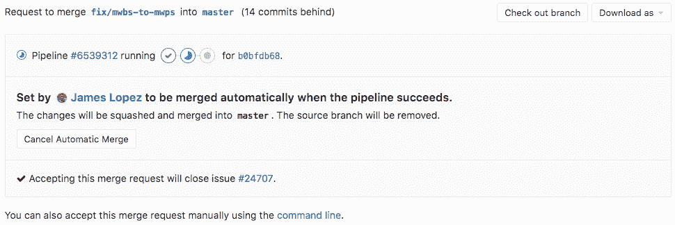

# Merge when pipeline succeeds

> 原文：[https://s0docs0gitlab0com.icopy.site/ee/user/project/merge_requests/merge_when_pipeline_succeeds.html](https://s0docs0gitlab0com.icopy.site/ee/user/project/merge_requests/merge_when_pipeline_succeeds.html)

*   [How it works](#how-it-works)
*   [Only allow merge requests to be merged if the pipeline succeeds](#only-allow-merge-requests-to-be-merged-if-the-pipeline-succeeds)
    *   [Limitations](#limitations)
    *   [Skipped pipelines](#skipped-pipelines)
*   [From the command line](#from-the-command-line)

# Merge when pipeline succeeds[](#merge-when-pipeline-succeeds "Permalink")

在查看看起来准备合并但仍在运行管道的合并请求时，可以将其设置为在管道成功时自动合并. 这样，您不必等待管道完成，而不必记住手动合并请求.

[](img/merge_when_pipeline_succeeds_enable.png)

## How it works[](#how-it-works "Permalink")

当您单击"管道成功时合并"时，合并请求的状态将更新以显示即将进行的合并. 如果您不能等待管道成功，则可以**立即**在主按钮右侧的下拉菜单中选择" **合并"** .

合并请求的作者和具有开发人员权限的项目成员可以在管道完成之前的任何时间取消自动合并.

[](img/merge_when_pipeline_succeeds_status.png)

管道成功后，合并请求将自动合并. 当管道失败时，作者有机会重试任何失败的作业，或推送新的提交以修复失败.

重试作业并第二次尝试成功后，合并请求将自动合并. 当使用新提交更新合并请求时，自动合并将被取消以允许查看新更改.

## Only allow merge requests to be merged if the pipeline succeeds[](#only-allow-merge-requests-to-be-merged-if-the-pipeline-succeeds "Permalink")

如果合并请求的管道未成功或存在要解析的线程，则可以阻止合并请求. 这对两个都适用：

*   GitLab CI / CD 管道
*   管道从[外部 CI 集成](../integrations/overview.html#integrations-listing)运行

因此， [禁用 GitLab CI / CD 管道](../../../ci/enable_or_disable_ci.html)不会禁用此功能，因为可以将外部 CI 提供程序的管道与该功能一起使用. 要启用它，您必须：

1.  导航到项目的**"设置">"常规"**页面.
2.  展开**合并请求**部分.
3.  在" **合并检查"**小节中，选中" **管道必须成功"**复选框.
4.  按**保存**使更改生效.

This setting also prevents merge requests from being merged if there is no pipeline.

### Limitations[](#limitations "Permalink")

启用此设置后，如果没有管道，将阻止合并请求. 这可能与[`only/except`](../../../ci/yaml/README.html#onlyexcept-advanced)使用[`only/except`](../../../ci/yaml/README.html#onlyexcept-advanced)或[`rules`](../../../ci/yaml/README.html#rules)且不生成任何管道的某些用例相冲突.

您应该确保[始终有一个管道](https://gitlab.com/gitlab-org/gitlab-foss/-/issues/54226)并且该[管道](https://gitlab.com/gitlab-org/gitlab-foss/-/issues/54226)是成功的.

如果为单个合并请求触发了分支管道和合并请求管道，则仅检查*合并请求管道*的成功或失败. 如果合并请求管道配置的工作少于分支管道，则它可能允许失败测试的代码被合并：

```
branch-pipeline-job:
  rules:
    - if: '$CI_PIPELINE_SOURCE  ==  "push"'
  script:
    - echo "Code testing scripts here, for example."

merge-request-pipeline-job:
  rules:
    - if: '$CI_PIPELINE_SOURCE  ==  "merge_request_event"'
  script:
    - echo "No tests run, but this pipeline always succeeds and enables merge."
    - echo true 
```

您应该避免这样的配置，并尽可能使用分支（ `push` ）管道或合并请求管道. 有关在单个合并请求中避免使用两个管道的详细信息，请参见[`rules`文档](../../../ci/yaml/README.html#differences-between-rules-and-onlyexcept) .

### Skipped pipelines[](#skipped-pipelines "Permalink")

在 GitLab 13.1 中[引入](https://gitlab.com/gitlab-org/gitlab/-/issues/211482) .

选中" **管道必须成功"**复选框时， [跳过的管道会](../../../ci/yaml/README.html#skip-pipeline)阻止合并请求被合并. 更改此行为：

1.  导航到项目的**"设置">"常规"**页面.
2.  展开**合并请求**部分.
3.  在" **合并检查"**小节中，确保已选中" **管道必须成功"** .
4.  在" **合并检查"**小节中，选中" **跳过的管道被视为成功"**复选框.
5.  按**保存**使更改生效.

## From the command line[](#from-the-command-line "Permalink")

当从命令行进行[推送](../push_options.html)时，当管道成功请求合并请求时，可以使用" [推送选项"](../push_options.html)启用合并.