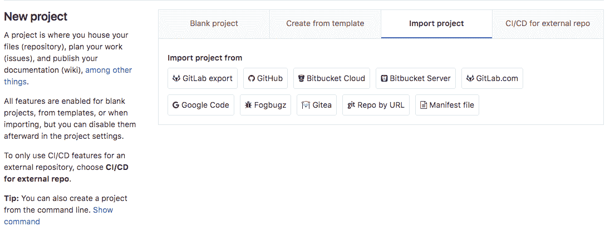
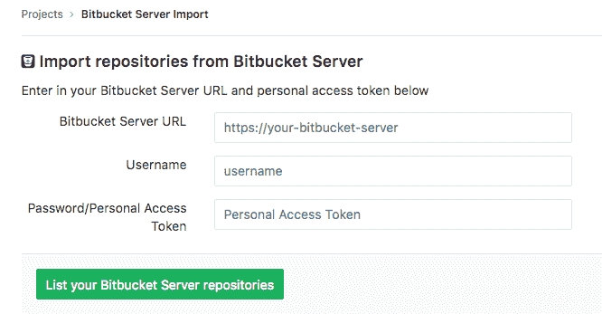
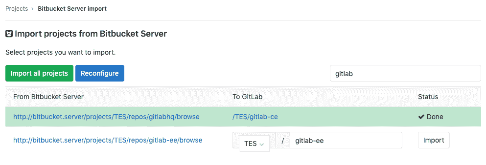

# Import your project from Bitbucket Server to GitLab

> 原文：[https://s0docs0gitlab0com.icopy.site/ee/user/project/import/bitbucket_server.html](https://s0docs0gitlab0com.icopy.site/ee/user/project/import/bitbucket_server.html)

*   [Overview](#overview)
*   [Limitations](#limitations)
*   [How it works](#how-it-works)
    *   [User assignment](#user-assignment)
*   [Importing your Bitbucket repositories](#importing-your-bitbucket-repositories)
*   [Troubleshooting](#troubleshooting)

# Import your project from Bitbucket Server to GitLab

在 GitLab 11.2 中[引入](https://gitlab.com/gitlab-org/gitlab-foss/-/merge_requests/20164) .

**注意：** Bitbucket Server 导入程序不适用于[Bitbucket Cloud](https://bitbucket.org) . 为此，请使用[Bitbucket Cloud 导入](bitbucket.html)程序.

轻松地将项目从 Bitbucket Server 导入到 GitLab.

## Overview

*   在当前状态下，Bitbucket 导入器可以导入：
    *   仓库描述（GitLab 11.2+）
    *   Git 存储库数据（GitLab 11.2+）
    *   拉取请求（GitLab 11.2+）
    *   拉取请求注释（GitLab 11.2+）
*   知识库公共访问权限保留. 如果存储库在 Bitbucket 中是私有的，则它也会在 GitLab 中也创建为私有的.

## Limitations

1.  目前，GitLab 不允许在任意代码行上添加注释，因此任何超出范围的 Bitbucket 注释都将作为注释插入到合并请求中.
2.  Bitbucket Server 允许多个级别的线程. GitLab 导入会将其折叠到一个线程中，并引用原始注释的一部分.
3.  拒绝的拉取请求具有无法到达的提交，这会阻止 GitLab 导入器生成适当的差异. 这些拉取请求将显示为空更改.
4.  Markdown 中的附件当前未导入.
5.  任务列表未导入.
6.  表情符号反应未导入
7.  项目过滤不支持模糊搜索（当前仅支持`starts with`或`full match strings` ）

## How it works

Bitbucket 服务器导入程序的工作方式如下：

1.  系统将提示用户输入 URL，用户名和密码（或个人访问令牌）以登录到 Bitbucket. 这些凭据仅在导入程序运行时才保留.
2.  导入程序将尝试列出 Bitbucket 服务器上的所有当前存储库.
3.  选择后，导入程序将克隆存储库并导入拉取请求和注释.

### User assignment

当导入问题/拉取请求时，Bitbucket 导入器将尝试在 GitLab 用户数据库中查找作者的电子邮件地址以及已确认的电子邮件地址. 如果没有这样的用户可用，则将项目创建者设置为作者. 进口商将在注释中添加注释以标记原始创建者.

如果不存在任何新的名称空间（组），或者如果采用了该名称空间，则导入器将创建任何新的名称空间（组），存储库将在启动导入过程的用户名称空间下导入.

## Importing your Bitbucket repositories

1.  登录到 GitLab 并转到您的仪表板.
2.  单击**新建项目** .
3.  点击" Bitbucket 服务器"按钮. 如果该按钮不存在，请在**管理>应用程序设置>可见性和访问控制>导入源中**启用**导入器** .

    

4.  输入您的 Bitbucket 服务器凭据.

    

5.  点击您要**导入的项目**或**导入所有项目** . 您还可以按名称过滤项目，并选择将在其下导入每个项目的名称空间.

    

## Troubleshooting

请参阅[Bitbucket](bitbucket.html)的[故障排除](bitbucket.html#troubleshooting)部分.