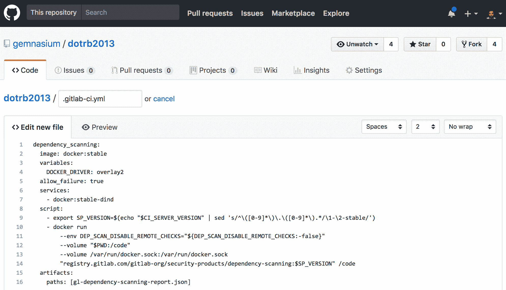
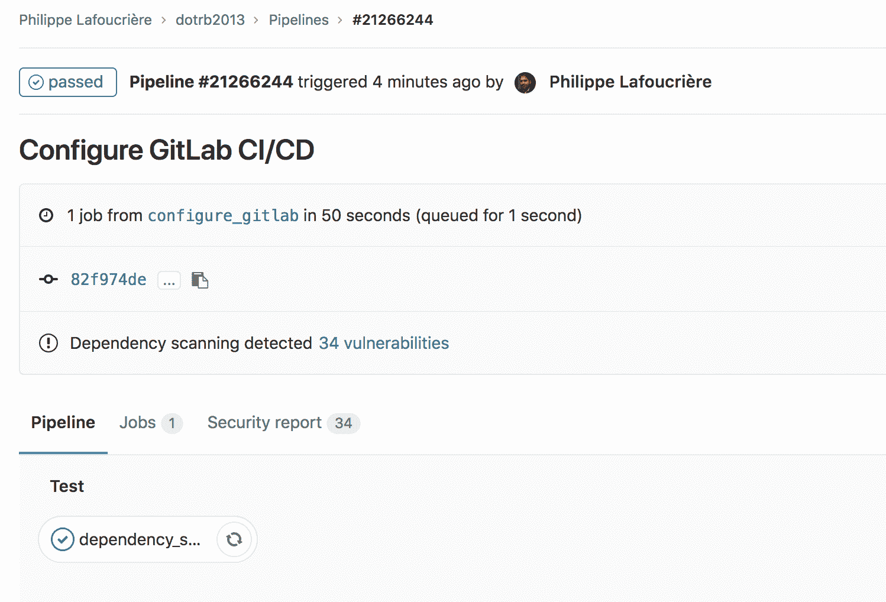
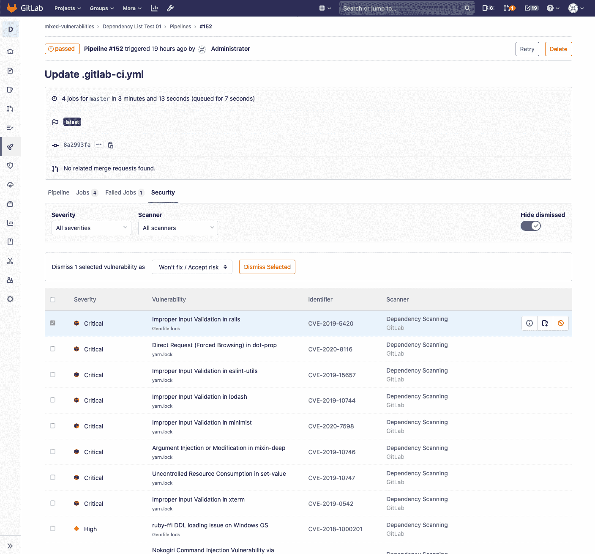

# Gemnasium

> 原文：[https://s0docs0gitlab0com.icopy.site/ee/user/project/import/gemnasium.html](https://s0docs0gitlab0com.icopy.site/ee/user/project/import/gemnasium.html)

*   [Why is Gemnasium.com closed?](#why-is-gemnasiumcom-closed)
*   [What happened to my account?](#what-happened-to-my-account)
*   [Will my account/data be transferred to GitLab Inc.?](#will-my-accountdata-be-transferred-to-gitlab-inc)
*   [What happened to my badge?](#what-happened-to-my-badge)
*   [Migrating to GitLab](#migrating-to-gitlab)
    *   [If your project is hosted on GitLab (`https://gitlab.com` / self-managed)](#if-your-project-is-hosted-on-gitlab-httpsgitlabcom--self-managed)
    *   [If your project is hosted on GitHub (`https://github.com` / GitHub Enterprise)](#if-your-project-is-hosted-on-github-httpsgithubcom--github-enterprise)

# Gemnasium

本指南介绍了如何从 Gemnasium.com 迁移到您自己的 GitLab 实例或 GitLab.com.

## Why is Gemnasium.com closed?

Gemnasium 在 2018 年 1 月[被 GitLab 收购](https://about.gitlab.com/press/releases/2018-01-30-gemnasium-acquisition.html) .自 2018 年 5 月 15 日起，Gemnasium 提供的服务不再可用. Gemnasium 背后的团队已加入 GitLab，成为新的安全产品团队，并且正在开发[各种工具](../../application_security/index.html) ，包括：

*   [Dependency Scanning](../../application_security/dependency_scanning/index.html)
*   [SAST](../../application_security/sast/index.html)
*   [DAST](../../application_security/dast/index.html)
*   [Container Scanning](../../application_security/container_scanning/index.html)

如果要继续监视依赖项，请参见下面的" [迁移到 GitLab"](#migrating-to-gitlab)部分.

## What happened to my account?

您的帐户已于 2018 年 5 月 15 日自动关闭.如果您当时有付费订阅，则您的卡将按比例退还. 您可以联系`gemnasium@gitlab.com`了解您的已关闭帐户.

## Will my account/data be transferred to GitLab Inc.?

所有帐户和数据已于 2018 年 5 月 15 日被删除.GitLab Inc.对您的私人数据或项目一无所知，因此不知道它们是否容易受到攻击. GitLab Inc.非常重视个人信息.

## What happened to my badge?

为避免损坏的 404 图像，所有指向 Gemnasium.com 的徽章都将用作占位符，邀请您迁移到 GitLab（并指向此页面）.

## Migrating to GitLab

Gemnasium 已被移植并直接集成到 GitLab CI / CD 中. 您仍然可以从我们的依赖项监视功能中受益，并且需要一些步骤来迁移项目. 由于 GitLab 对 Gemnasium.com 上存在的任何项目一无所知，因此没有自动导入. GitLab.com 上托管的公共（开源）项目免费提供安全功能.

### If your project is hosted on GitLab (`https://gitlab.com` / self-managed)

您快要准备好了！ 如果您已经在使用[Auto DevOps](../../../topics/autodevops/) ，那么您已经了解了. 否则，您必须根据[依赖项扫描页面](../../application_security/dependency_scanning/index.html)配置`.gitlab-ci.yml` .

### If your project is hosted on GitHub (`https://github.com` / GitHub Enterprise)

由于[GitLab 10.6 带有 GitHub 集成](https://about.gitlab.com/solutions/github/) ，因此 GitLab 用户现在可以在 GitLab 中创建一个 CI / CD 项目，该项目连接到外部 GitHub.com 或 GitHub Enterprise 仓库. 每当将代码推送到 GitHub 时，这都会自动提示 GitLab CI / CD 运行，并在完成后将 CI / CD 结果发布回 GitLab 和 GitHub.

1.  创建一个新项目，然后选择"用于外部仓库的 CI / CD"选项卡：

    

2.  使用" GitHub"按钮连接存储库.

    

3.  选择要使用 GitLab CI / CD 设置的项目，然后选择"连接".

    

    配置完成后，您可以在 GitLab 上单击新项目.

    

    现在，您的项目已镜像到 GitLab，Runners 可以在其中访问您的源代码并运行您的测试.

    可选步骤：如果您在 GitHub 项目是公共的，则在 GitLab.com 上进行设置，请确保该项目是公共的（在项目设置中），因为该安全功能仅适用于[GitLab Ultimate](https://about.gitlab.com/pricing/) .

4.  要设置与 Gemnasium 所做的工作相对应的依赖项扫描作业，您必须创建`.gitlab-ci.yml`文件，或根据[依赖项扫描文档](../../application_security/dependency_scanning/index.html)对其进行更新. 默认情况下，镜像是仅拉式的，因此您可以在 GitHub 上创建或更新文件：

    

5.  提交文件后，如果文件有效，将自动触发新的管道：

    

6.  作业的结果将直接在管道视图中可见：

    

**注意：**如果您不经常提交项目，则可能要使用[计划的管道](../../../ci/pipelines/schedules.html)定期运行作业.