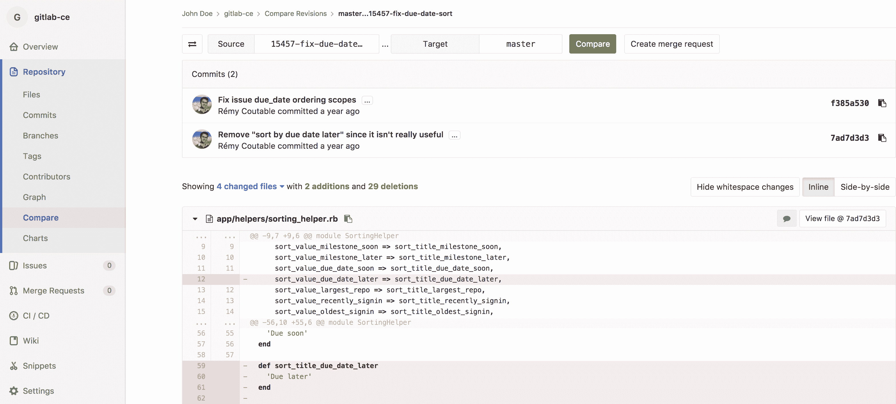
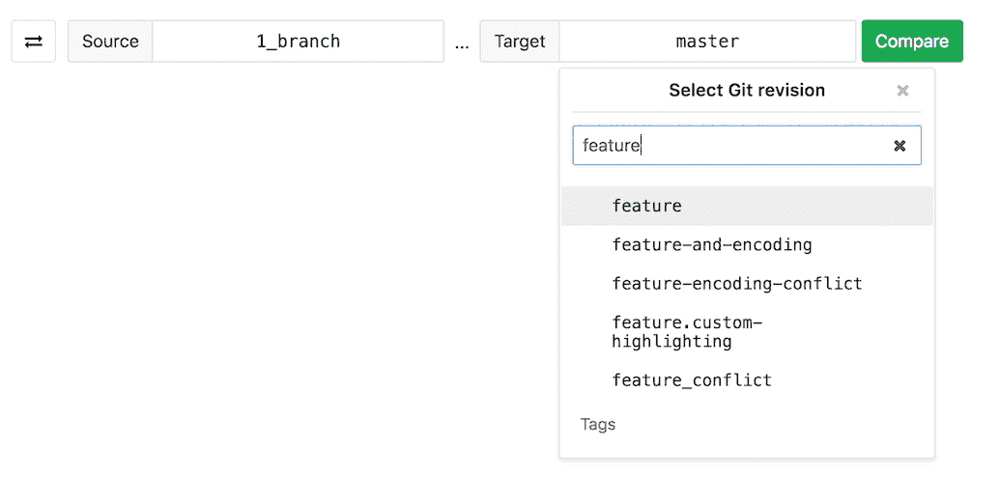

# Branches

> 原文：[https://s0docs0gitlab0com.icopy.site/ee/user/project/repository/branches/](https://s0docs0gitlab0com.icopy.site/ee/user/project/repository/branches/)

*   [Default branch](#default-branch)
    *   [Custom initial branch name](#custom-initial-branch-name-core-only)
        *   [Enable or disable custom initial branch name](#enable-or-disable-custom-initial-branch-name-core-only)
*   [Compare](#compare)
*   [Delete merged branches](#delete-merged-branches)
*   [Branch filter search box](#branch-filter-search-box)

# Branches[](#branches "Permalink")

分支是项目工作树的版本. 您为所做的每组相关更改创建一个分支. 这样可以使每组更改彼此独立，从而可以并行进行更改，而不会互相影响.

将更改推送到新分支后，您可以：

*   创建[合并请求](../../merge_requests/index.html)
*   执行内联代码审查
*   与团队[讨论](../../../discussions/index.html)实施情况
*   使用[Review Apps](../../../../ci/review_apps/index.html)预览提交到新分支的更改.

使用[GitLab Starter](https://about.gitlab.com/pricing/) ，您还可以请求经理的[批准](../../merge_requests/merge_request_approvals.html) .

有关使用 GitLab UI 管理分支的更多信息，请参见：

*   [Default branches](#default-branch)
*   [Create a branch](../web_editor.html#create-a-new-branch)
*   [Protected branches](../../protected_branches.html#protected-branches)
*   [Delete merged branches](#delete-merged-branches)
*   [Branch filter search box](#branch-filter-search-box)

您也可以使用[命令行](../../../../gitlab-basics/start-using-git.html#create-a-branch)管理分支.

观看视频[GitLab Flow](https://www.youtube.com/watch?v=InKNIvky2KE) .

也可以看看：

*   [Branches API](../../../../api/branches.html) ，有关使用 GitLab API 在存储库分支上进行操作的信息.
*   [GitLab Flow](../../../../university/training/gitlab_flow.html) documentation.
*   [Git](../../../../topics/git/index.html)和 GitLab [入门](../../../../topics/git/index.html) .

## Default branch[](#default-branch "Permalink")

创建新[项目时](../../index.html) ，GitLab 会将`master`设置为存储库的默认分支. 您可以在项目的**设置>存储库**下选择另一个分支作为项目的默认分支.

通过[问题关闭模式](../../issues/managing_issues.html#closing-issues-automatically)直接从合并请求中[关闭问题时](../../issues/managing_issues.html#closing-issues-automatically) ，目标是项目的**默认分支** .

初始还对默认分支进行了[保护，以](../../protected_branches.html#protected-branches)防止意外删除和强制推送.

### Custom initial branch name[](#custom-initial-branch-name-core-only "Permalink")

版本历史

*   在 GitLab 13.2 中[引入](https://gitlab.com/gitlab-org/gitlab/-/issues/221013) .
*   它部署在默认情况下启用的功能标志后面.
*   在 GitLab.com 上启用了它.
*   不能根据项目启用或禁用它.
*   建议用于生产.
*   对于 GitLab 自我管理的实例，GitLab 管理员可以选择[禁用它](#enable-or-disable-custom-initial-branch-name-core-only) .

默认情况下，当您在 GitLab 中创建新项目时，初始分支称为`master` . 对于自我管理的实例，GitLab 管理员可以将初始分支名称自定义为其他名称. 这样，此后创建的每个新项目都将从自定义分支名称开始，而不是`master` . 为此：

1.  转到 **在管理区域>设置>存储库中** ，展开**默认初始分支名称** .
2.  将默认的初始分支更改为您选择的自定义名称.
3.  **保存更改**.

#### Enable or disable custom initial branch name[](#enable-or-disable-custom-initial-branch-name-core-only "Permalink")

正在设置默认的初始分支名称，但已准备好用于生产. 它部署在**默认情况下启用**的功能标志的后面. [有权访问 GitLab Rails 控制台的 GitLab 管理员](../../../../administration/feature_flags.html)可以选择为您的实例禁用它.

禁用它：

```
Feature.disable(:global_default_branch_name) 
```

要启用它：

```
Feature.enable(:global_default_branch_name) 
```

## Compare[](#compare "Permalink")

要比较存储库中的分支：

1.  导航到项目的存储库.
2.  在边栏中选择**存储库>比较** .
3.  使用[分支过滤器搜索框](#branch-filter-search-box)选择要比较的[分支](#branch-filter-search-box)
4.  单击" **比较** "以内联查看更改：

[](img/compare_branches.png)

## Delete merged branches[](#delete-merged-branches "Permalink")

在 GitLab 8.14 中[引入](https://gitlab.com/gitlab-org/gitlab-foss/-/merge_requests/6449) .

[](img/delete_merged_branches.png)

此功能允许合并的分支被批量删除. 作为此操作的一部分，只有已合并[但未受保护的](../../protected_branches.html)分支才会被删除.

清理合并请求时未自动删除的旧分支尤其有用.

## Branch filter search box[](#branch-filter-search-box "Permalink")

在 GitLab 11.5 中[引入](https://gitlab.com/gitlab-org/gitlab-foss/-/merge_requests/22166) .

[](img/branch_filter_search_box.png)

此功能使您可以快速搜索和选择分支. 搜索结果按以下顺序显示：

*   名称与搜索字词完全匹配的分支.
*   名称包含搜索词的其他分支，按字母顺序排序.

有时，当您有数百个分支时，可能需要更灵活的匹配模式. 在这种情况下，您可以使用以下方法：

*   `^feature`将仅匹配以'feature'开头的分支名称.
*   `feature$` will only match branch names that end with ‘feature’.