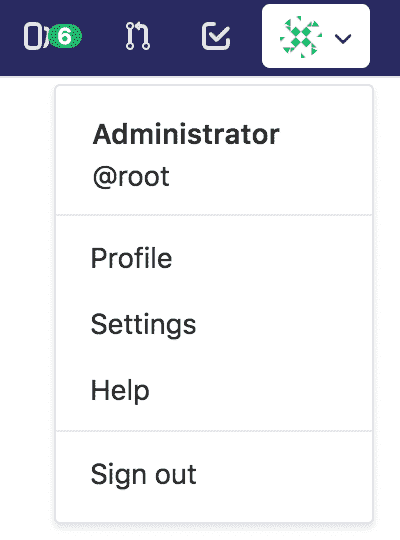
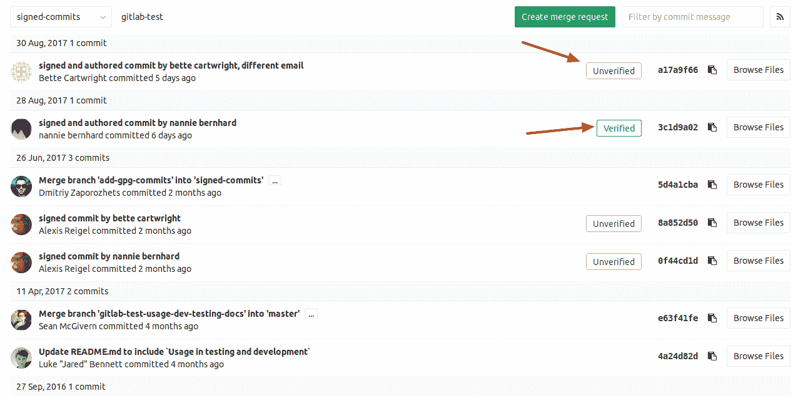
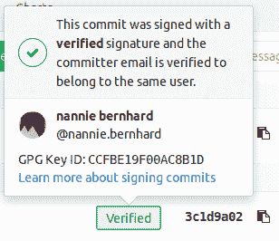
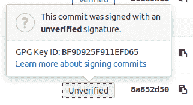

# Signing commits with GPG

> 原文：[https://s0docs0gitlab0com.icopy.site/ee/user/project/repository/gpg_signed_commits/](https://s0docs0gitlab0com.icopy.site/ee/user/project/repository/gpg_signed_commits/)

*   [How GitLab handles GPG](#how-gitlab-handles-gpg)
*   [Generating a GPG key](#generating-a-gpg-key)
*   [Adding a GPG key to your account](#adding-a-gpg-key-to-your-account)
*   [Associating your GPG key with Git](#associating-your-gpg-key-with-git)
*   [Signing commits](#signing-commits)
*   [Verifying commits](#verifying-commits)
*   [Revoking a GPG key](#revoking-a-gpg-key)
*   [Removing a GPG key](#removing-a-gpg-key)
*   [Rejecting commits that are not signed](#rejecting-commits-that-are-not-signed-premium)
*   [GPG signing API](#gpg-signing-api)
*   [Further reading](#further-reading)

# Signing commits with GPG[](#signing-commits-with-gpg "Permalink")

版本历史

*   在 GitLab 9.5 中[引入](https://gitlab.com/gitlab-org/gitlab-foss/-/merge_requests/9546) .
*   在 GitLab 10.1 中添加了子项支持.

您可以使用 GPG 密钥对在 GitLab 存储库中进行的 Git 提交进行签名. 如果可以验证提交者的身份，则已签名的提交将标记为" **已**验证". 为了验证提交者的身份，GitLab 需要他们的公共 GPG 密钥.

**注意：**术语 GPG 用于所有与 OpenPGP / PGP / GPG 相关的材料和实现.

目前尚不支持通过 GPG 验证的标签.

有关 GPG 的更多详细信息，请参见[进一步阅读](#further-reading)部分.

## How GitLab handles GPG[](#how-gitlab-handles-gpg "Permalink")

GitLab 使用其自己的密钥环来验证 GPG 签名. 它不访问任何公钥服务器.

对于要由 GitLab 验证的提交：

*   提交者必须具有 GPG 公钥/私钥对.
*   提交者的公钥必须已上传到其 GitLab 帐户.
*   GPG 密钥中的一封电子邮件必须与提交者在 GitLab 中使用的**经过验证的**电子邮件地址匹配.
*   提交者的电子邮件地址必须与 GPG 密钥中验证的电子邮件地址匹配.

## Generating a GPG key[](#generating-a-gpg-key "Permalink")

如果您还没有 GPG 密钥，则以下步骤将帮助您入门：

1.  为您的操作系统[安装 GPG](https://www.gnupg.org/download/index.html) . 如果您的操作系统具有`gpg2`安装，更换`gpg`与`gpg2`在下面的命令.
2.  使用以下命令生成私钥/公钥对，这将产生一系列问题：

    ```
    gpg --full-gen-key 
    ```

    **注意：**在某些情况下，例如 Windows 和其他 macOS 版本上的 Gpg4win，此处的命令可能是`gpg --gen-key` .
3.  第一个问题是可以使用哪种算法. 选择所需的类型或按`Enter 键`选择默认类型（RSA 和 RSA）：

    ```
    Please select what kind of key you want:
       (1) RSA and RSA (default)
       (2) DSA and Elgamal
       (3) DSA (sign only)
       (4) RSA (sign only)
    Your selection? 1 
    ```

4.  下一个问题是密钥长度. 我们建议您选择`4096` ：

    ```
    RSA keys may be between 1024 and 4096 bits long.
    What keysize do you want? (2048) 4096
    Requested keysize is 4096 bits 
    ```

5.  指定密钥的有效期. 这是主观的，您可以使用默认值，该值永远不会过期：

    ```
    Please specify how long the key should be valid.
             0 = key does not expire
          <n>  = key expires in n days
          <n>w = key expires in n weeks
          <n>m = key expires in n months
          <n>y = key expires in n years
    Key is valid for? (0) 0
    Key does not expire at all 
    ```

6.  通过输入`y`确认您给出的答案是正确的：

    ```
    Is this correct? (y/N) y 
    ```

7.  输入您的真实姓名，与此键关联的电子邮件地址（应与您在 GitLab 中使用的经过验证的电子邮件地址匹配）和可选注释（按`Enter`跳过）：

    ```
    GnuPG needs to construct a user ID to identify your key.

    Real name: Mr. Robot
    Email address: <your_email>
    Comment:
    You selected this USER-ID:
        "Mr. Robot <your_email>"

    Change (N)ame, (C)omment, (E)mail or (O)kay/(Q)uit? O 
    ```

8.  在询问时选择一个强密码，然后输入两次以确认.
9.  使用以下命令列出您刚刚创建的私密 GPG 密钥：

    ```
    gpg --list-secret-keys --keyid-format LONG <your_email> 
    ```

    将`<your_email>`替换为您在上面输入的电子邮件地址.

10.  复制以`sec`开头的 GPG 密钥 ID. 在以下示例中，即`30F2B65B9246B6CA` ：

    ```
    sec   rsa4096/30F2B65B9246B6CA 2017-08-18 [SC]
          D5E4F29F3275DC0CDA8FFC8730F2B65B9246B6CA
    uid                   [ultimate] Mr. Robot <your_email>
    ssb   rsa4096/B7ABC0813E4028C0 2017-08-18 [E] 
    ```

11.  导出该 ID 的公共密钥（替换上一步中的密钥 ID）：

    ```
    gpg --armor --export 30F2B65B9246B6CA 
    ```

12.  最后，复制公钥并将其[添加到您的个人资料设置中](#adding-a-gpg-key-to-your-account)

## Adding a GPG key to your account[](#adding-a-gpg-key-to-your-account "Permalink")

**注意：**添加密钥后，就无法对其进行编辑，只能将其删除. 如果粘贴无效，则必须删除有问题的密钥并重新添加.

您可以在个人资料的设置中添加 GPG 密钥：

1.  点击右上角的头像，然后转到**"设置"** .

    [](../../../profile/img/profile_settings_dropdown.png)

2.  导航至**GPG 密钥**标签，然后将您的*公共*密钥粘贴到"密钥"框中.

    [](img/profile_settings_gpg_keys_paste_pub.png)

3.  最后，单击**添加键**将其添加到 GitLab. 您将能够看到其指纹，相应的电子邮件地址和创建日期.

    [](img/profile_settings_gpg_keys_single_key.png)

## Associating your GPG key with Git[](#associating-your-gpg-key-with-git "Permalink")

[创建 GPG 密钥](#generating-a-gpg-key)并将其[添加到您的帐户之后](#adding-a-gpg-key-to-your-account) ，是时候告诉 Git 使用哪个密钥了.

1.  使用以下命令列出您刚刚创建的私密 GPG 密钥：

    ```
    gpg --list-secret-keys --keyid-format LONG <your_email> 
    ```

    将`<your_email>`替换为您在上面输入的电子邮件地址.

2.  复制以`sec`开头的 GPG 密钥 ID. 在以下示例中，即`30F2B65B9246B6CA` ：

    ```
    sec   rsa4096/30F2B65B9246B6CA 2017-08-18 [SC]
          D5E4F29F3275DC0CDA8FFC8730F2B65B9246B6CA
    uid                   [ultimate] Mr. Robot <your_email>
    ssb   rsa4096/B7ABC0813E4028C0 2017-08-18 [E] 
    ```

3.  告诉 Git 使用该密钥对提交进行签名：

    ```
    git config --global user.signingkey 30F2B65B9246B6CA 
    ```

    用您的 GPG 密钥 ID 替换`30F2B65B9246B6CA` .

4.  （可选）如果 Git 使用`gpg`并且出现诸如`secret key not available`或`gpg: signing failed: secret key not available` ，请运行以下命令更改为`gpg2` ：

    ```
    git config --global gpg.program gpg2 
    ```

## Signing commits[](#signing-commits "Permalink")

[创建 GPG 密钥](#generating-a-gpg-key)并将其[添加到您的帐户之后](#adding-a-gpg-key-to-your-account) ，您可以开始对提交进行签名：

1.  像以前一样提交，唯一的区别是添加了`-S`标志：

    ```
    git commit -S -m "My commit msg" 
    ```

2.  询问时输入 GPG 密钥的密码.
3.  推送至 GitLab 并检查您的提交[是否已通过验证](#verifying-commits) .

如果您不想在每次提交时都键入`-S`标志，则可以告诉 Git 自动签名您的提交：

```
git config --global commit.gpgsign true 
```

## Verifying commits[](#verifying-commits "Permalink")

1.  在项目或[合并请求中](../../merge_requests/index.html) ，导航到" **提交"**选项卡. 签名的提交将显示包含" Verified"或" Unverified"的徽章，具体取决于 GPG 签名的验证状态.

    [](img/project_signed_and_unsigned_commits.png)

2.  通过单击 GPG 徽章，将显示签名的详细信息.

    [](img/project_signed_commit_verified_signature.png)

    [](img/project_signed_commit_unverified_signature.png)

## Revoking a GPG key[](#revoking-a-gpg-key "Permalink")

撤消密钥将**取消验证**已签名的提交. 使用此密钥验证的提交将变为未验证状态. 撤销此密钥后，将来的提交也将保持不变. 如果您的密钥已被盗用，则应使用此操作.

撤销 GPG 密钥：

1.  点击右上角的头像，然后转到**"设置"** .
2.  导航到**GPG 键**标签.
3.  单击您要删除的 GPG 键**旁边的撤消** .

## Removing a GPG key[](#removing-a-gpg-key "Permalink")

删除密钥**不会**取消**验证**已签名的提交. 使用此密钥验证的提交将保持验证状态. 删除此密钥后，只有未按下的提交才会保持未验证状态. 要取消验证已签名的提交，您需要从您的帐户中[撤销关联的 GPG 密钥](#revoking-a-gpg-key) .

要从您的帐户中删除 GPG 密钥，请执行以下操作：

1.  点击右上角的头像，然后转到**"设置"** .
2.  导航到**GPG 键**标签.
3.  单击您要删除的 GPG 密钥旁边的垃圾桶图标.

## Rejecting commits that are not signed[](#rejecting-commits-that-are-not-signed-premium "Permalink")

您可以将您的项目配置为拒绝不是通过[推送规则进行](../../../../push_rules/push_rules.html) GPG 签名的提交.

## GPG signing API[](#gpg-signing-api "Permalink")

了解如何[通过 API 通过提交获取 GPG 签名](../../../../api/commits.html#get-gpg-signature-of-a-commit) .

## Further reading[](#further-reading "Permalink")

有关 GPG 的更多详细信息，请参见：

*   [Git Tools - Signing Your Work](https://git-scm.com/book/en/v2/Git-Tools-Signing-Your-Work)
*   [Managing OpenPGP Keys](https://riseup.net/en/security/message-security/openpgp/gpg-keys)
*   [OpenPGP Best Practices](https://riseup.net/en/security/message-security/openpgp/best-practices)
*   [Creating a new GPG key with subkeys](https://www.void.gr/kargig/blog/2013/12/02/creating-a-new-gpg-key-with-subkeys/) (advanced)