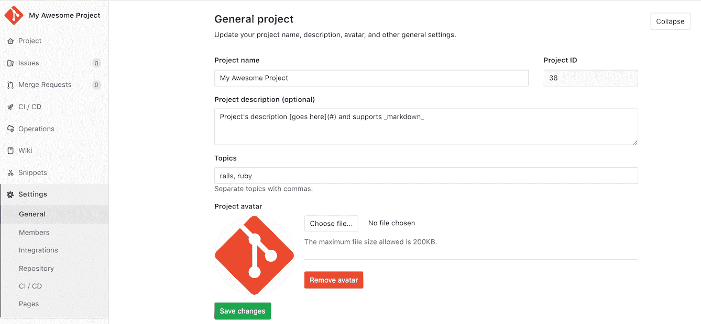
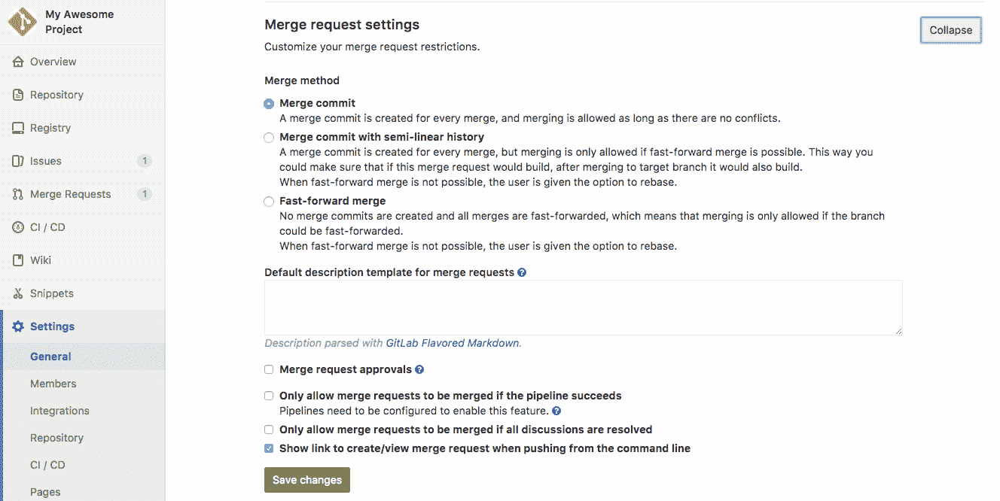

# Project settings

> 原文：[https://s0docs0gitlab0com.icopy.site/ee/user/project/settings/](https://s0docs0gitlab0com.icopy.site/ee/user/project/settings/)

*   [General settings](#general-settings)
    *   [General project settings](#general-project-settings)
        *   [Compliance framework](#compliance-framework-premium)
    *   [Sharing and permissions](#sharing-and-permissions)
        *   [Disabling email notifications](#disabling-email-notifications)
    *   [Merge request settings](#merge-request-settings)
    *   [Service Desk](#service-desk-starter)
    *   [Export project](#export-project)
    *   [Advanced settings](#advanced-settings)
        *   [Archiving a project](#archiving-a-project)
        *   [Unarchiving a project](#unarchiving-a-project)
        *   [Renaming a repository](#renaming-a-repository)
        *   [Transferring an existing project into another namespace](#transferring-an-existing-project-into-another-namespace)
        *   [Remove a project](#remove-a-project)
        *   [Restore a project](#restore-a-project-premium)
        *   [Removing a fork relationship](#removing-a-fork-relationship)
*   [Operations settings](#operations-settings)
    *   [Error Tracking](#error-tracking)
    *   [Jaeger tracing](#jaeger-tracing-ultimate)
    *   [Status Page](#status-page)

# Project settings

**注意：**只有项目维护者和管理员用户[有权](../../permissions.html#project-members-permissions)访问项目设置.

您可以通过导航到项目的主页并点击**设置**来调整[项目](../index.html)设置.

## General settings

在项目的常规设置下，您可以找到与项目功能有关的所有内容.

### General project settings

调整项目的名称，描述，头像， [默认分支](../repository/branches/index.html#default-branch)和主题：

项目描述还部分支持[标准 Markdown](../../markdown.html#standard-markdown-and-extensions-in-gitlab) . 您可以使用[强调](../../markdown.html#emphasis) ， [链接](../../markdown.html#links)和[换行符](../../markdown.html#line-breaks)为项目描述添加更多上下文.

#### Compliance framework

您可以选择一个框架标签来标识您的项目具有某些合规性要求或需要其他监督. 可用的标签包括：

*   GDPR-通用数据保护法规
*   HIPAA-健康保险可移植性和责任法案
*   PCI-DSS-支付卡行业数据安全标准
*   SOC 2-服务组织控制 2
*   SOX-萨班斯-奥克斯利

### Sharing and permissions

对于您的存储库，您可以设置功能，例如公共访问，存储库功能，文档，访问权限等等. 要从您的项目中执行此操作，请转到**"设置"** >" **常规"** ，然后展开" **可见性"，"项目功能"，"权限"**部分.

现在，您可以更改[项目可见性](../../../public_access/public_access.html) . 如果将" **项目可见性"**设置为公开，则可以将某些功能的访问权限限制为" **仅项目成员"** . 此外，您可以选择[允许用户请求访问权限](../members/index.html#project-membership-and-requesting-access)的选项.

**警告：**如果[降低项目的可见性级别](../../../public_access/public_access.html#reducing-visibility) ，则该操作将取消该项目的所有分支的链接.

使用开关启用或禁用以下功能：

| Option | 更多访问限制选项 | Description |
| --- | --- | --- |
| **Issues** | ✓ | 激活 GitLab 问题跟踪器 |
| **Repository** | ✓ | Enables [repository](../repository/) functionality |
| **合并请求** | ✓ | 启用[合并请求](../merge_requests/)功能； 另请参阅[合并请求设置](#merge-request-settings) |
| **Forks** | ✓ | Enables [forking](../index.html#fork-a-project) functionality |
| **Pipelines** | ✓ | Enables [CI/CD](../../../ci/README.html) functionality |
| **集装箱登记处** |   | 为您的 Docker 映像激活[注册表](../../packages/container_registry/) |
| **Git 大文件存储** |   | 允许使用[大文件](../../../topics/git/lfs/index.html#git-large-file-storage-lfs) |
| **Packages** |   | Supports configuration of a [package registry](../../../administration/packages/index.html#gitlab-package-registry-administration-premium-only) functionality |
| **Wiki** | ✓ | 启用单独的[文档](../wiki/)系统 |
| **Snippets** | ✓ | Enables [sharing of code and text](../../snippets.html) |
| **Pages** | ✓ | 允许您[发布静态网站](../pages/) |
| **指标仪表板** | ✓ | 控制对[指标仪表板的](../integrations/prometheus.html)访问 |

一些功能取决于其他功能：

*   如果禁用" **问题"**选项，则 GitLab 还将删除以下功能：
    *   **发行板**
    *   [**服务台**](#service-desk-starter)**注意：**禁用" **问题"**选项后，您仍然可以从合并请求访问**里程碑** .
*   此外，如果您同时禁用**Issues**和**Merge Requests** ，则将无法再访问：
    *   **标签**
    *   **大事记**
*   如果禁用**存储库**功能，GitLab 还将为您的项目禁用以下功能：
    *   **合并请求**
    *   **流水线**
    *   **集装箱登记处**
    *   **Git 大文件存储**
    *   **配套**
*   指标仪表板访问要求同时阅读项目环境和部署. 有权访问指标仪表板的用户还可以访问环境和部署.

#### Disabling email notifications

项目所有者可以通过选中" **禁用电子邮件通知"**复选框来**禁用**与项目相关的所有[电子邮件通知](../../profile/notifications.html#gitlab-notification-emails) .

### Merge request settings

设置项目的合并请求设置：

*   设置合并请求方法（合并提交， [快速合并](../merge_requests/fast_forward_merge.html) ）.
*   添加合并请求[描述模板](../description_templates.html#description-templates) .
*   Enable [merge request approvals](../merge_requests/merge_request_approvals.html).
*   Enable [merge only if pipeline succeeds](../merge_requests/merge_when_pipeline_succeeds.html).
*   Enable [merge only when all threads are resolved](../../discussions/index.html#only-allow-merge-requests-to-be-merged-if-all-threads-are-resolved).
*   Enable [`delete source branch after merge` option by default](../merge_requests/getting_started.html#deleting-the-source-branch)
*   Configure [suggested changes commit messages](../../discussions/index.html#configure-the-commit-message-for-applied-suggestions)

### Service Desk

为您的项目启用[Service Desk](../service_desk.html)以提供客户支持.

### Export project

了解如何在 GitLab 中[导出项目](import_export.html#importing-the-project) .

### Advanced settings

在这里，您可以运行内部管理，存档，重命名，传输， [删除派生关系](#removing-a-fork-relationship)或删除项目.

#### Archiving a project

归档项目后，所有用户都将其设为只读，并表明该项目已不再处于主动维护状态. 也可以取消归档已归档的项目. 只有项目所有者和管理员用户才[有权](../../permissions.html#project-members-permissions)归档项目.

归档项目后，存储库，问题，合并请求和所有其他功能均为只读. 归档的项目也隐藏在项目列表中.

归档项目：

1.  导航到您项目的 **设置>常规** .
2.  在" **高级"下** ，单击" **展开"** .
3.  在" **存档项目"**部分中，单击" **存档项目"**按钮.
4.  根据要求确认操作.

#### Unarchiving a project

取消归档项目会删除对项目的只读限制，并使其在项目列表中可用. 只有项目所有者和管理员用户才[有权](../../permissions.html#project-members-permissions)取消归档项目.

要查找已归档的项目：

1.  以具有项目所有者或管理员权限的用户身份登录到 GitLab.
2.  如果你：
    *   拥有项目的 URL，在浏览器中打开项目的页面.
    *   没有项目的 URL：1.单击**项目>浏览项目** . 1.在" **排序项目"**下拉框中，选择" **显示存档的项目"** . 1.在**按名称过滤**字段中，提供项目的名称. 1.单击指向项目的链接以打开其" **详细信息"**页面.

接下来，要取消归档项目：

1.  导航到您项目的 **设置>常规** .
2.  Under **Advanced**, click **Expand**.
3.  在" **取消存档项目"**部分中，单击" **取消存档项目"**按钮.
4.  根据要求确认操作.

#### Renaming a repository

**注意：**只有项目维护者和管理员用户才[有权](../../permissions.html#project-members-permissions)重命名存储库. 不要与项目名称混淆，也可以从[常规项目设置中](#general-project-settings)进行更改.

项目的存储库名称定义其 URL（您用于通过浏览器访问该项目的 URL）及其在安装 GitLab 的文件磁盘上的位置.

要重命名存储库：

1.  导航到您项目的 **设置>常规** .
2.  在" **高级"下** ，单击" **展开"** .
3.  在"重命名存储库"下，根据您的喜好更改"路径".
4.  Hit **重命名项目**.

请记住，这可能会带来意想不到的副作用，因为使用旧网址的每个人都无法推送或拉动. 阅读有关[重命名存储库时重定向](../index.html#redirects-when-changing-repository-paths)发生的更多[信息](../index.html#redirects-when-changing-repository-paths) .

#### Transferring an existing project into another namespace

**注意：**只有项目所有者和管理员用户才[有权](../../permissions.html#project-members-permissions)传输项目.

在以下情况下，您可以将现有项目转移到[组中](../../group/index.html) ：

*   您至少对该组具有**维护者** [权限](../../permissions.html#project-members-permissions) .
*   您至少是要转让的项目的**所有者** .
*   将项目转移到的组必须允许创建新项目.

转移项目：

1.  导航到您项目的 **设置>常规** .
2.  在" **高级"下** ，单击" **展开"** .
3.  在"传输项目"下，选择要将项目传输到的名称空间.
4.  按照说明键入项目路径，以确认传输.

完成后，您将被带到新项目的名称空间. 此时，请阅读[从旧项目到新项目](../index.html#redirects-when-changing-repository-paths)的[重定向](../index.html#redirects-when-changing-repository-paths)发生了什么.

**注意：**如果需要，GitLab 管理员可以使用管理界面将任何项目移动到任何名称空间.

#### Remove a project

**注意：**只有项目所有者和管理员才[有权](../../permissions.html#project-members-permissions)删除项目.

删除项目：

1.  导航到您的项目，然后选择 **设置>常规>高级** .
2.  在"删除项目"部分中，单击" **删除项目"**按钮.
3.  根据要求确认操作.

这个动作：

*   删除包含所有相关资源（问题，合并请求等）的项目.
*   从[Premium 或 Silver](https://about.gitlab.com/pricing/)或更高级别的[GitLab 13.2](https://gitlab.com/gitlab-org/gitlab/-/issues/220382) ，组管理员可以[将](../../group/index.html#enabling-delayed-project-removal-premium)组内的项目[配置](../../group/index.html#enabling-delayed-project-removal-premium)为在延迟一段时间后删除. 启用后，实际删除将在[实例设置中](../../admin_area/settings/visibility_and_access_controls.html#default-deletion-adjourned-period-premium-only)指定的天数后发生.

**Warning:** The default behavior of [Delayed Project deletion](https://gitlab.com/gitlab-org/gitlab/-/issues/32935) in GitLab 12.6 was changed to [Immediate deletion](https://gitlab.com/gitlab-org/gitlab/-/issues/220382) in GitLab 13.2.

#### Restore a project

在 GitLab 12.6 中[引入](https://gitlab.com/gitlab-org/gitlab/-/issues/32935) .

要还原标记为删除的项目：

1.  导航到您的项目，然后选择 **设置>常规>高级** .
2.  在"还原项目"部分中，单击" **还原项目"**按钮.

#### Removing a fork relationship

分叉是为您不是会员[的项目](../repository/forking_workflow.html)做[贡献](../repository/forking_workflow.html)的好方法. 如果您想自己使用 fork，而无需将[合并请求](../merge_requests.html)发送到上游项目，则可以安全地删除 fork 关系.

**注意：**删除后，将无法恢复派生关系. 您将不再能够将合并请求发送到源，并且如果有人分叉了您的项目，他们的分支也将失去关系.

为此：

1.  导航到项目的**设置>常规>高级** .
2.  在" **删除分叉关系"下** ，单击同样标记的按钮.
3.  按照说明键入项目的路径，以确认操作.

**注意：**只有项目所有者[有权](../../permissions.html#project-members-permissions)删除派生关系.

## Operations settings

### Error Tracking

配置错误跟踪以[在 GitLab 中](../operations/error_tracking.html)发现和查看[Sentry 错误](../operations/error_tracking.html) .

### Jaeger tracing

添加 Jaeger 服务器的 URL，以使您的用户可以[从 GitLab 轻松访问 Jaeger UI](../../../operations/tracing.html) .

### Status Page

[添加存储凭据](../status_page/#syncing-incidents-to-the-status-page)以启用将公共问题同步到已[部署状态页面的功能](../status_page/#status-page-project) .