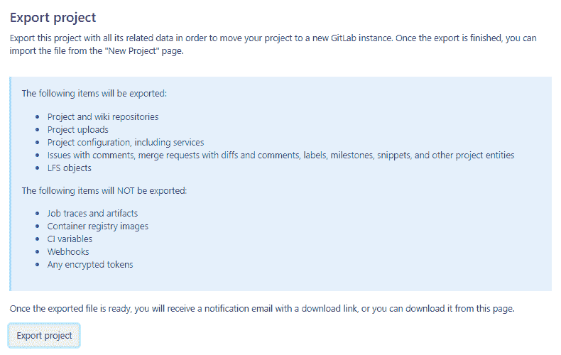
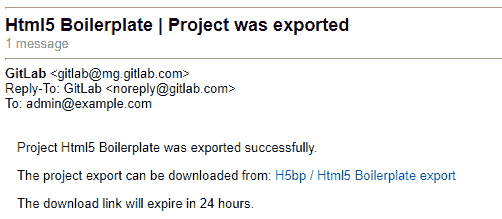
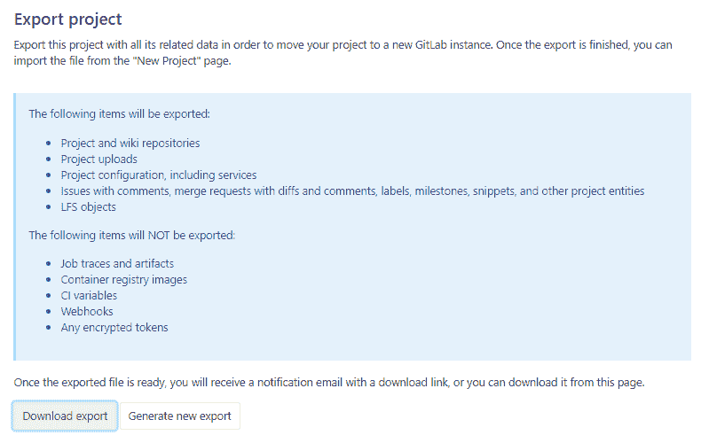
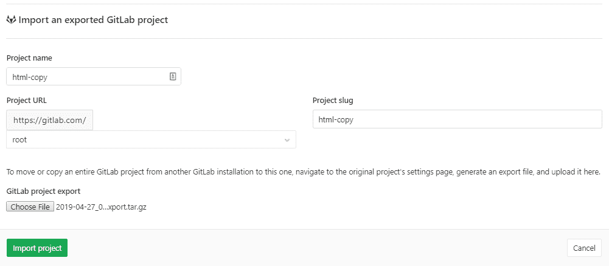

# Project import/export

> 原文：[https://s0docs0gitlab0com.icopy.site/ee/user/project/settings/import_export.html](https://s0docs0gitlab0com.icopy.site/ee/user/project/settings/import_export.html)

*   [Important notes](#important-notes)
*   [Version history](#version-history)
    *   [13.0+](#130)
    *   [12.x](#12x)
*   [Between CE and EE](#between-ce-and-ee)
*   [Exported contents](#exported-contents)
*   [Exporting a project and its data](#exporting-a-project-and-its-data)
*   [Importing the project](#importing-the-project)
    *   [Project import status](#project-import-status)
    *   [Import large projects](#import-large-projects-core-only)
*   [Rate limits](#rate-limits)

# Project import/export

版本历史

*   在 GitLab 8.9 中[引入](https://gitlab.com/gitlab-org/gitlab-foss/-/issues/3050) .
*   从 GitLab 10.0，管理员可以在 GitLab 实例上禁用项目导出选项.

可以将在任何 GitLab 实例或 GitLab.com 上运行的现有项目及其所有相关数据导出，并移入新的 GitLab 实例.

如果启用了项目导入选项，则会显示**GitLab 导入/导出**按钮.

也可以看看：

*   [Project import/export API](../../../api/project_import_export.html)
*   [Project import/export administration Rake tasks](../../../administration/raketasks/project_import_export.html)
*   [Group import/export](../../group/settings/import_export.html)
*   [Group import/export API](../../../api/group_import_export.html)

设置项目导入/导出：

1.  导航 **管理区>** **设置>可见性和访问控制** .
2.  滚动到**导入源**
3.  启用所需的**导入源**

## Important notes

请注意以下几点：

*   不支持从较新版本的 GitLab 导入. 导入的 GitLab 版本必须大于或等于导出的 GitLab 版本.
*   除非导入和导出 GitLab 实例与[版本历史记录中](#version-history)描述的兼容，否则导入将失败.
*   导出存储在一个临时[共享目录中](../../../development/shared_files.html) ，并由特定工作人员每 24 小时删除一次.
*   只要用户对所导出项目所在的组具有维护者或管理员访问权限，组成员就会作为项目成员导出.
*   具有所有者访问权限的项目成员将被导入为维护者.
*   使用管理员帐户导入将通过电子邮件地址映射用户（仅限自我管理）. 否则，将留下补充评论，以提及原始作者和 MR，注释或问题将归进口商所有.
*   如果导入的项目包含源自派生的合并请求，则将在导入/导出期间在项目内创建与此类合并请求关联的新分支. 因此，导出项目中的分支数量可能会大于原始项目中的分支数量.

## Version history

### 13.0+

从 GitLab 13.0 开始，GitLab 可以导入从其他 GitLab 部署导出的捆绑软件. 此功能仅限于之前的两个 GitLab [次要](../../../policy/maintenance.html#versioning)发行版，这与我们的[安全发布](../../../policy/maintenance.html#security-releases)流程类似.

例如：

| 当前版本 | 可以导入从 |
| --- | --- |
| 13.0 | 13.0, 12.10, 12.9 |
| 13.1 | 13.1, 13.0, 12.10 |

### 12.x

在 13.0 之前，这是一个已定义的兼容性表：

| 导出 GitLab 版本 | 导入 GitLab 版本 |
| --- | --- |
| 11.7 至 12.10 | 11.7 至 12.10 |
| 11.1 至 11.6 | 11.1 至 11.6 |
| 10.8 至 11.0 | 10.8 至 11.0 |
| 10.4 至 10.7 | 10.4 至 10.7 |
| 10.3 | 10.3 |
| 10.0 至 10.2 | 10.0 至 10.2 |
| 9.4 至 9.6 | 9.4 至 9.6 |
| 9.2 至 9.3 | 9.2 至 9.3 |
| 8.17 至 9.1 | 8.17 至 9.1 |
| 8.13 至 8.16 | 8.13 至 8.16 |
| 8.12 | 8.12 |
| 8.10.3 至 8.11 | 8.10.3 至 8.11 |
| 8.10.0 至 8.10.2 | 8.10.0 至 8.10.2 |
| 8.9.5 至 8.9.11 | 8.9.5 至 8.9.11 |
| 8.9.0 至 8.9.4 | 8.9.0 至 8.9.4 |

只能在具有匹配导入/导出版本的 GitLab 版本之间导出和导入项目.

例如，8.10.3 和 8.11 具有相同的导入/导出版本（0.1.3），它们之间的导出将兼容.

## Between CE and EE

您可以将项目从[Community Edition](https://about.gitlab.com/install/ce-or-ee/)导出[到 Enterprise Edition](https://about.gitlab.com/install/ce-or-ee/) ，反之亦然. 假定满足[版本历史记录](#version-history)要求.

如果要将项目从企业版导出到社区版，则可能会丢失仅保留在企业版中的数据. 有关更多信息，请参阅[从 EE 降级为 CE](../../../README.html) .

## Exported contents

将导出以下项目：

*   项目和 Wiki 存储库
*   项目上传
*   项目配置，不包括集成
*   注释问题，带有差异和注释的合并请求，标签，里程碑，摘要，时间跟踪和其他项目实体
*   设计管理文件和数据
*   LFS 对象
*   发行板
*   管道历史

以下项目将不会导出：

*   建立痕迹和工件
*   容器注册表映像
*   可变配置项
*   Webhooks
*   任何加密令牌
*   合并请求批准者
*   推送规则
*   Awards

**注意：**有关项目导出中[`import_export.yml`](https://gitlab.com/gitlab-org/gitlab/blob/master/lib/gitlab/import_export/project/import_export.yml)的特定数据的更多详细信息，请参阅[`import_export.yml`](https://gitlab.com/gitlab-org/gitlab/blob/master/lib/gitlab/import_export/project/import_export.yml)文件.

## Exporting a project and its data

1.  转到项目的主页.

2.  请点击 侧栏中的**设置** .

3.  向下滚动以找到" **导出项目"**按钮：

    

4.  生成导出后，您应该会收到一封电子邮件，其中包含用于下载文件的链接：

    

5.  或者，您可以返回项目设置并从那里下载文件，或生成新的导出. 文件可用后，页面应显示" **下载导出"**按钮：

    

## Importing the project

1.  在创建新项目时，GitLab 项目导入功能是第一个导入选项. 点击**GitLab 导出** ：

    

2.  输入您的项目名称和 URL. 然后选择您之前导出的文件：

    

3.  单击**导入项目**开始导入. 您新导入的项目页面将很快出现.

**注意：**如果" `Internal`可见性级别[的使用受到限制](../../../public_access/public_access.html#restricting-the-use-of-public-or-internal-projects) ，则所有导入的项目都将获得" `Private`的可见性.**注意：**可以由管理员设置最大导入文件大小，默认为 50MB. 作为管理员，您可以修改最大导入文件大小. 为此，请在" [应用程序设置" API](../../../api/settings.html#change-application-settings)或" [管理界面"中](../../admin_area/settings/account_and_limit_settings.html)使用`max_import_size`选项.

### Project import status

您可以通过[Project import / export API](../../../api/project_import_export.html#import-status)查询导入. 如 API 文档中所述，查询可能返回导入错误或异常.

### Import large projects

如果您的项目较大，请考虑使用 Rake 任务，如[开发人员文档中所述](../../../development/import_project.html#importing-via-a-rake-task) .

## Rate limits

为了避免滥用，用户的速率仅限于：

| 请求类型 | Limit |
| --- | --- |
| Export | 每 5 分钟 30 个项目 |
| 下载导出 | 每 10 分钟有 10 个下载项目 |
| Import | 每 5 分钟 30 个项目 |