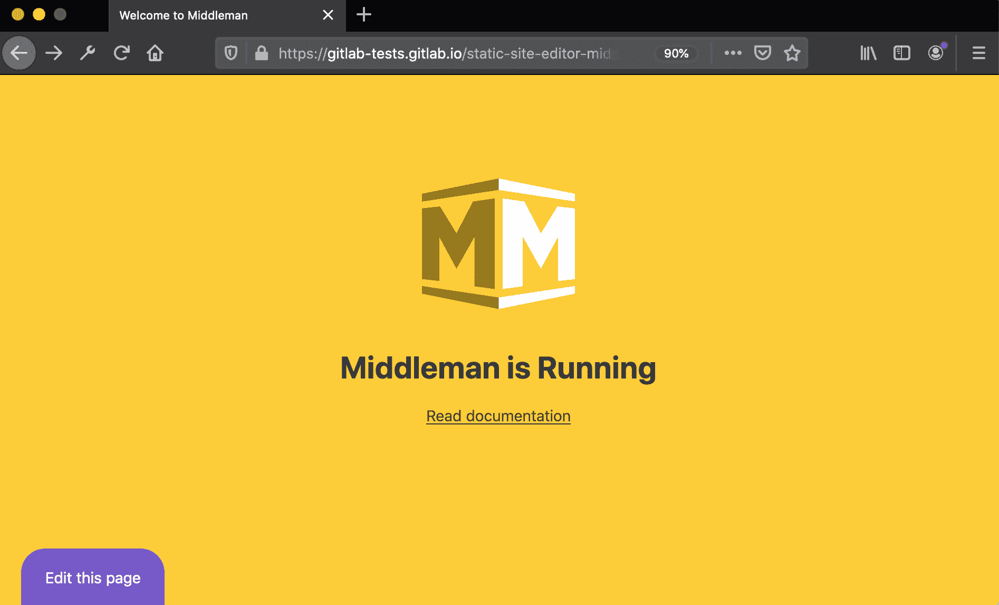
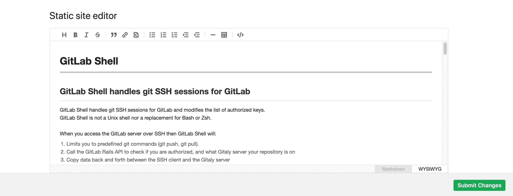

# Static Site Editor

> 原文：[https://s0docs0gitlab0com.icopy.site/ee/user/project/static_site_editor/](https://s0docs0gitlab0com.icopy.site/ee/user/project/static_site_editor/)

*   [Use cases](#use-cases)
*   [Requirements](#requirements)
*   [How it works](#how-it-works)
*   [Getting started](#getting-started)
    *   [Set up your project](#set-up-your-project)
    *   [Use the Static Site Editor to edit your content](#use-the-static-site-editor-to-edit-your-content)
*   [Limitations](#limitations)

# Static Site Editor

版本历史

*   在 GitLab 12.10 中[引入](https://gitlab.com/gitlab-org/gitlab/-/merge_requests/28758) .
*   在 GitLab 13.0 中[引入](https://gitlab.com/gitlab-org/gitlab/-/issues/214559)了所见即所得的编辑器.
*   支持通过 GitLab 13.1 中[引入](https://gitlab.com/gitlab-org/gitlab/-/issues/216640)的 WYSIWYG 编辑器添加图像.
*   Markdown 前端问题隐藏在 GitLab 13.1 中[引入](https://gitlab.com/gitlab-org/gitlab/-/issues/216834)的 WYSIWYG 编辑器中.
*   支持 GitLab 13.2 中[引入的](https://gitlab.com/gitlab-org/gitlab/-/issues/223171) `*.md.erb`文件.

**危险：**在 GitLab 13.0 中，我们对静态站点编辑器的 URL 结构进行了[重大更改](https://gitlab.com/gitlab-org/gitlab/-/issues/213282) . 请按照此[代码段中](https://gitlab.com/gitlab-org/project-templates/static-site-editor-middleman/snippets/1976539)的说明使用最新更改来更新您的项目.

静态站点编辑器使用户可以在静态网站上编辑内容，而无需事先了解基础模板语言，站点体系结构或 Git 命令. 您的项目的贡献者可以快速编辑 Markdown 页面，并将更改提交审核.

## Use cases

静态站点编辑器允许协作者无缝地将更改提交到静态站点文件. 例如：

*   非技术合作者可以直接从浏览器中轻松编辑页面； 他们不需要知道 Git 和您的项目的详细信息就能做出贡献.
*   最近雇用的团队成员可以快速编辑内容.
*   临时协作者可以从一个项目跳到另一个项目并快速编辑页面，而不必克隆或派生需要提交更改的每个项目.

## Requirements

*   为了使用静态站点编辑器功能，您的项目需要使用[静态站点编辑器 Middleman 模板](https://gitlab.com/gitlab-org/project-templates/static-site-editor-middleman)进行预配置.
*   该编辑器需要登录到 GitLab，并且必须是该项目的成员（具有 Developer 或更高权限级别）.

## How it works

静态网站编辑器尚处于开发的早期阶段，目前仅适用于 Middleman 网站. 您必须使用特定的站点模板才能开始使用它. 项目模板配置为使用[GitLab Pages](../pages/index.html)部署[Middleman](https://middlemanapp.com/)静态网站.

网站启动并运行后，您将在其页面的左下角看到一个" **编辑此页面"**按钮：

单击它后，GitLab 将打开一个编辑器窗口，从中可以直接编辑内容. 准备就绪后，只需单击一下按钮即可提交更改：

当编辑者在后台提交更改时，GitLab 会自动创建一个新分支，提交更改并打开合并请求. 编辑者将直接进入合并请求，然后可以将其分配给同事进行审查.

## Getting started

首先，设置项目. 完成后，您可以使用静态站点编辑器轻松地编辑您的内容.

### Set up your project

1.  首先，从" [静态站点编辑器-中间人"](https://gitlab.com/gitlab-org/project-templates/static-site-editor-middleman)模板创建一个新项目. 您可以将其[派生](../repository/forking_workflow.html#creating-a-fork)或[从模板创建一个新项目](../../../gitlab-basics/create-project.html#built-in-templates) .
2.  编辑`data/config.yml`文件，添加项目的路径.
3.  编辑文件将触发 CI / CD 管道，以使用 GitLab Pages 部署项目.
4.  管道完成后，从项目的左侧菜单转到**"设置">"页面"**以找到新网站的 URL.
5.  访问您的网站并查看屏幕的左下角，以查看新的" **编辑此页面"**按钮.

满足[要求的](#requirements)任何人都可以编辑页面内容，而无需事先了解 Git 或您网站的代码库.

**注意：**从 GitLab 13.1 开始，Markdown 文件的 YAML 前端问题被隐藏在 WYSIWYG 编辑器中，以避免意外更改. 要对其进行编辑，请使用 Markdown 编辑模式，常规的 GitLab 文件编辑器或 Web IDE.

### Use the Static Site Editor to edit your content

例如，假设您是一家大型公司的新近聘用的技术作家，并且该公司的产品已添加了新功能.

1.  您被分配了更新文档的任务.
2.  您访问页面并看到需要编辑的内容.
3.  单击生产站点上的" **编辑此页面"**按钮.
4.  该文件在"静态站点编辑器"中以" **所见即所得"**模式打开. 如果您想编辑原始 Markdown，则可以在右下角切换**Markdown**模式.
5.  您在此处编辑文件，然后单击" **提交更改"** .
6.  将自动创建一个新的合并请求，然后将其分配给您的同事进行审核.

## Limitations

*   静态站点编辑器仍然不能快速添加到现有的 Middleman 站点. 跟随此[史诗](https://gitlab.com/groups/gitlab-org/-/epics/2784)进行更新.