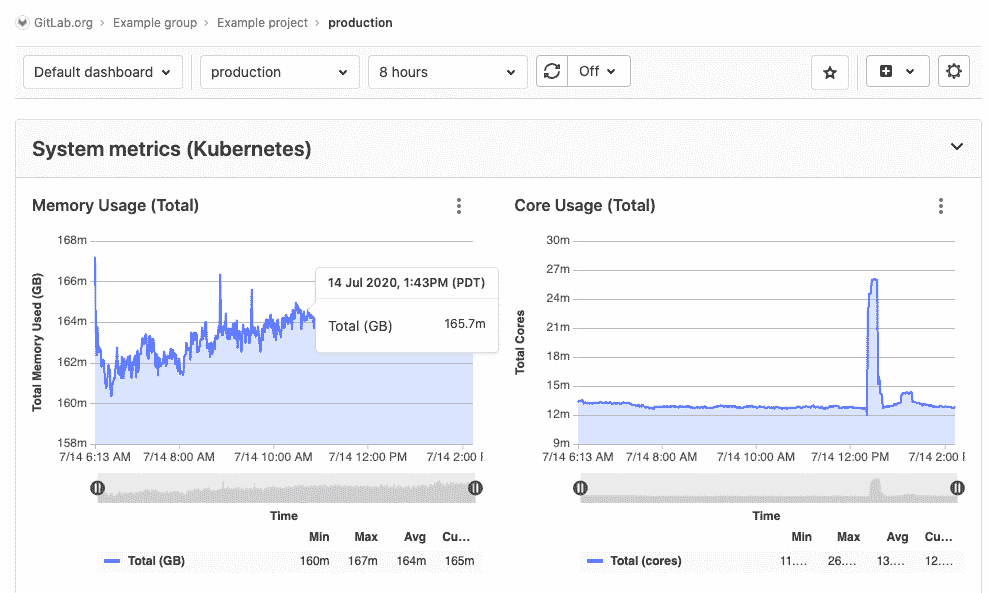
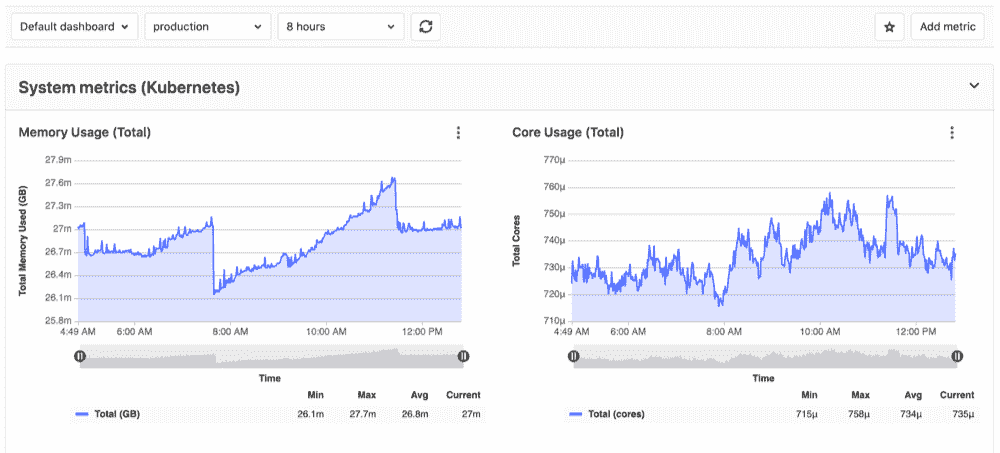
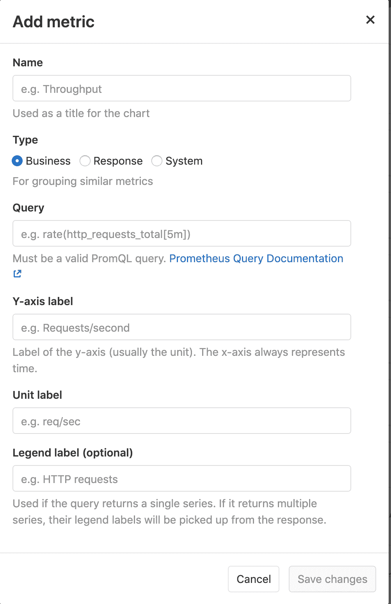
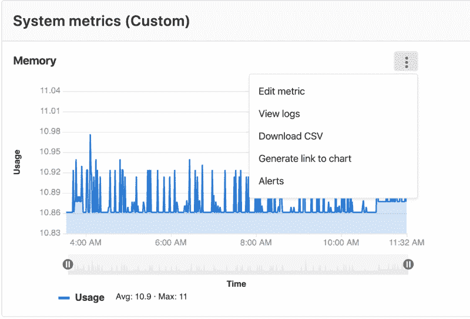

# Monitor metrics for your CI/CD environment

> 原文：[https://s0docs0gitlab0com.icopy.site/ee/operations/metrics/](https://s0docs0gitlab0com.icopy.site/ee/operations/metrics/)

*   [Populate your metrics dashboard](#populate-your-metrics-dashboard)
*   [Customize your metrics dashboard](#customize-your-metrics-dashboard)
*   [Metrics dashboard visibility](#metrics-dashboard-visibility)
*   [Adding custom metrics](#adding-custom-metrics)
*   [Editing additional metrics from the dashboard](#editing-additional-metrics-from-the-dashboard)
*   [Keyboard shortcuts for charts](#keyboard-shortcuts-for-charts)

# Monitor metrics for your CI/CD environment

在[为群集配置 Prometheus](../../user/project/integrations/prometheus.html)之后，GitLab 会尝试在成功部署的任何[环境中](../../ci/environments/index.html)检索性能指标.

GitLab 在 Prometheus 服务器上扫描来自 Kubernetes 和 NGINX 等已知服务器的指标，并尝试识别各个环境. 要了解有关支持的指标和扫描过程的更多信息，请参阅[Prometheus Metrics Library 文档](../../user/project/integrations/prometheus_library/index.html) .

要查看已[完成至少一个部署](#populate-your-metrics-dashboard)的环境的指标仪表板，请执行[以下操作](#populate-your-metrics-dashboard) ：

1.  *如果指标仪表盘仅对项目成员可见，请以项目成员*身份登录到 GitLab. 了解有关[指标仪表板可见性的](#metrics-dashboard-visibility)更多[信息](#metrics-dashboard-visibility) .
2.  在您的项目中，导航到 **操作>指标** .

GitLab 显示环境的默认指标仪表板，如以下示例所示：

仪表板的顶部包含一个导航栏. 从左到右，导航栏包含：

*   **仪表板** -项目可用的所有仪表板的下拉列表，其中加星标的仪表板排在最前面.
*   **环境** -所有[环境的](../index.html)下拉列表，可在您键入时搜索所有环境.
*   **范围** -要显示的数据的时间段.
*   **刷新仪表板** -用当前数据重新加载仪表板.
*   **设置刷新率** - Set a time frame for refreshing the data displayed.
*   **明星仪表板** -单击以将仪表板标记为收藏夹. 已加星标的信息中心显示实心星 按钮，然后在" **仪表板"**下拉列表中首先显示. （在 GitLab 13.0 中[引入](https://gitlab.com/gitlab-org/gitlab/-/issues/214582) .）
*   **创建仪表板** - [为您的项目](dashboards/index.html#adding-a-new-dashboard-to-your-project)创建一个[新的自定义仪表板](dashboards/index.html#adding-a-new-dashboard-to-your-project) .
*   **指标设置** -配置[此仪表板](dashboards/index.html#manage-the-metrics-dashboard-settings)的[设置](dashboards/index.html#manage-the-metrics-dashboard-settings) .

## Populate your metrics dashboard

在[为群集配置 Prometheus](../../user/project/integrations/prometheus.html)之后，您还必须为 **操作>指标**页面以包含数据. 设置[Auto DevOps](../../topics/autodevops/index.html)有助于快速创建部署：

1.  导航到您项目的 **操作> Kubernetes**页面.
2.  确保除了 Prometheus 外，还安装了 Runner 和 Ingress.
3.  安装 Ingress 后，复制其端点.
4.  Navigate to your project’s **设置> CI / CD** page. In the **自动 DevOps** section, select a deployment strategy and save your changes.
5.  在同一页上的" **变量"**部分中，添加一个名为`KUBE_INGRESS_BASE_DOMAIN`的变量， `KUBE_INGRESS_BASE_DOMAIN`包含您先前复制的 Ingress 端点的值. 将类型保留为**Variable** .
6.  导航到您项目的 **CI / CD>管道**页面，然后在任何分支上运行管道.
7.  管道成功运行后，图表将在 **操作>指标**页面.

## Customize your metrics dashboard

创建仪表板后，您可以对其进行自定义以满足您的需求：

*   **添加自定义指标** ：除了 GitLab 默认指标之外，您还可以[创建自定义指标](#adding-custom-metrics)并将其显示在指标仪表板上.
*   **配置指标警报** ：当环境性能超出您设置的范围时，为团队[配置自定义警报](alerts.html) .
*   **通过警报触发操作** ： [为您的团队打开新问题](alerts.html#trigger-actions-from-alerts-ultimate) 当环境性能超出您设置的范围时.

## Metrics dashboard visibility

在 GitLab 13.0 中[引入](https://gitlab.com/gitlab-org/gitlab/-/issues/201924) .

您可以将指标仪表板的可见性设置为" **仅项目成员"**或" **具有访问权限的所有人"** . 当设置为" **具有访问权的所有人"时** ，指标仪表板对于已认证和未认证的用户都是可见的.

## Adding custom metrics

版本历史

*   在[GitLab Premium](https://about.gitlab.com/pricing/) 10.6 中[引入](https://gitlab.com/gitlab-org/gitlab/-/merge_requests/3799) .
*   [移至](https://gitlab.com/gitlab-org/gitlab/-/merge_requests/28527) [GitLab Core](https://about.gitlab.com/pricing/) 12.10\.

可以通过在监控仪表板页面上添加自定义指标来对其进行监控. 保存它们后，它们将显示在环境指标仪表板上，前提是：

*   使用具有匹配[环境范围的](../../ci/environments/index.html#scoping-environments-with-specs) [连接的 Kubernetes 群集](../../user/project/clusters/add_remove_clusters.html) ，并将[Prometheus 安装在群集上](../../user/project/integrations/prometheus.html#enabling-prometheus-integration) .
*   Prometheus 是[手动配置的](../../user/project/integrations/prometheus.html#manual-configuration-of-prometheus) .

必须填写几个字段：

*   **名称** ：图表标题
*   **类型** ：指标的类型. 相同类型的指标将一起显示.
*   **查询** ：有效的[PromQL 查询](https://s0prometheus0io.icopy.site/docs/prometheus/latest/querying/basics/) .
*   **Y 轴标签** ：Y 轴标题显示在仪表板上.
*   **单位标签** ：查询单位，例如`req / sec` . 值旁边显示.

如果指标之间的**名称** ， **类型**和**Y 轴标签**字段匹配，则可以在同一图表上显示多个指标. 例如，具有" **名称** `Requests Rate` ，" `Business` **类型"**和**Y 轴标签** `rec / sec`度量标准将与另一个具有相同值的度量标准显示在同一图表上. 如果使用此功能，则建议使用**图例标签** .

## Editing additional metrics from the dashboard

在 GitLab 12.9 中[引入](https://gitlab.com/gitlab-org/gitlab/-/issues/208976) .

您可以通过以下方式为信息中心编辑现有的其他自定义指标： **更多操作**下拉菜单，然后选择**编辑指标** .

## Keyboard shortcuts for charts

在 GitLab 13.2 中[引入](https://gitlab.com/gitlab-org/gitlab/-/issues/202146) .

您可以使用键盘快捷键与当前关注的图表面板更快地进行交互. 要激活键盘快捷键，请使用键盘标签突出显示 **"更多操作"**下拉菜单，或用鼠标悬停在下拉菜单上，然后按与所需操作对应的键：

*   **展开面板** - `e`
*   **查看日志** `-l` （小写" L"）
*   **下载 CSV** - `d`
*   **复制链接到图表** - `c`
*   **Alerts** - `a`