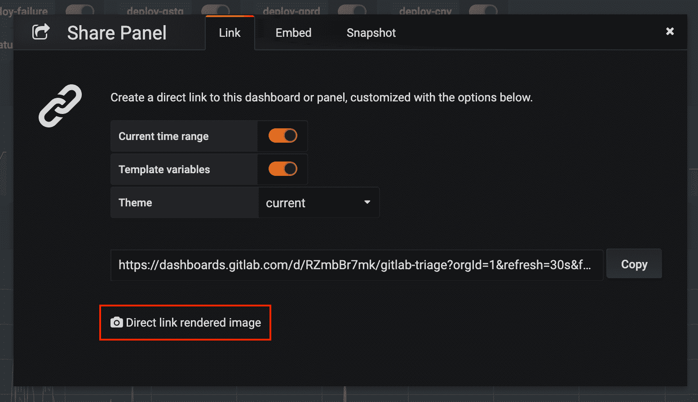
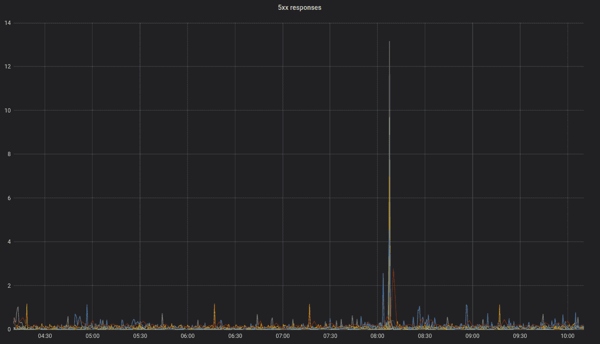
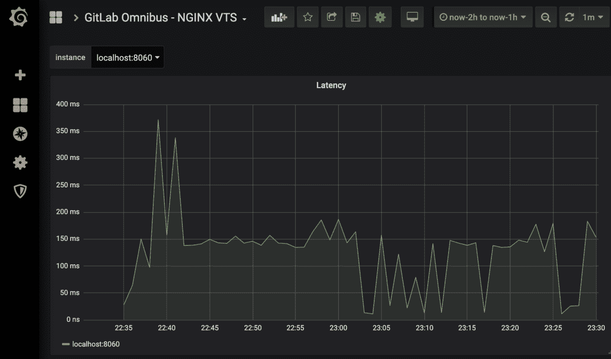
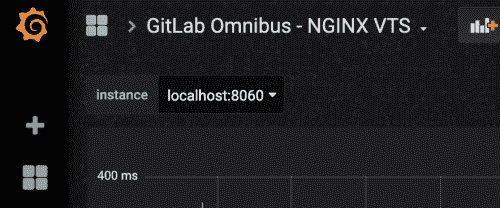
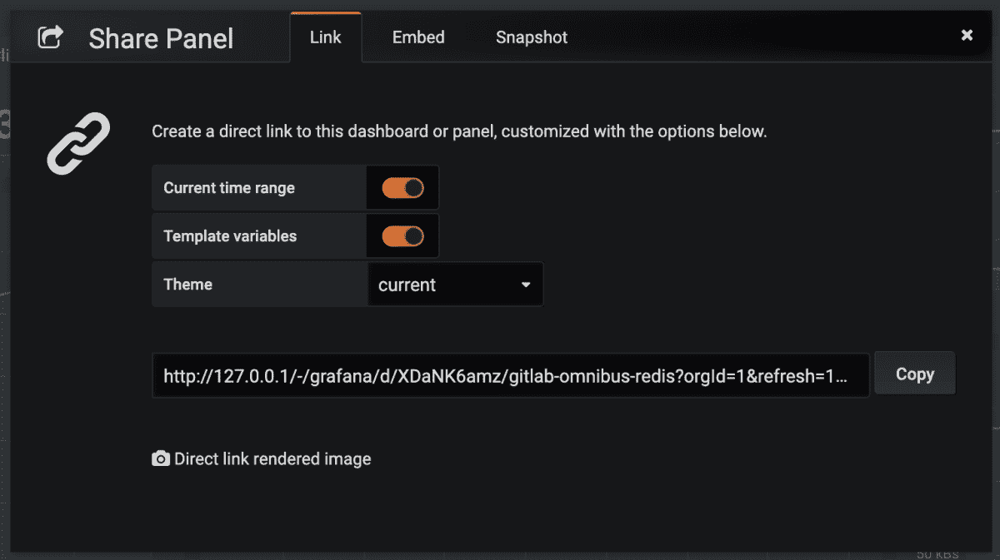
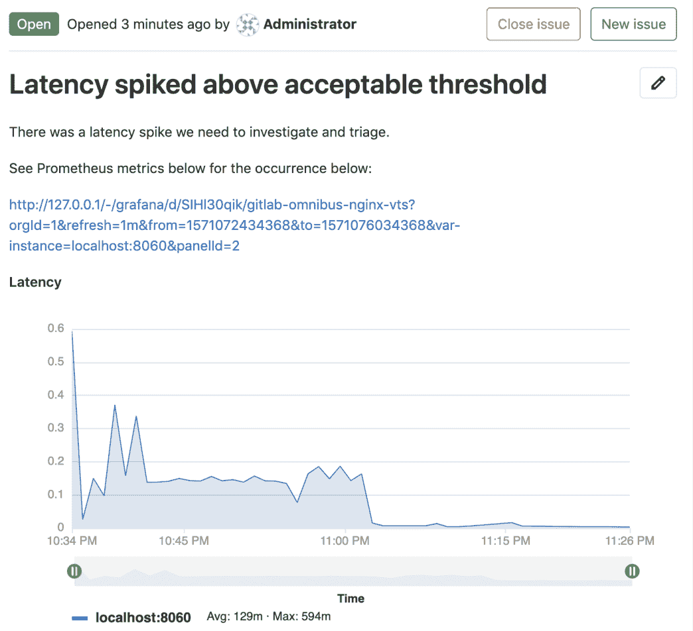

# Embedding Grafana charts

> 原文：[https://s0docs0gitlab0com.icopy.site/ee/operations/metrics/embed_grafana.html](https://s0docs0gitlab0com.icopy.site/ee/operations/metrics/embed_grafana.html)

*   [Embedding charts via Grafana Rendered Images](#embedding-charts-via-grafana-rendered-images)
*   [Embedding charts via integration with Grafana HTTP API](#embedding-charts-via-integration-with-grafana-http-api)
*   [Setting up the Grafana integration](#setting-up-the-grafana-integration)
*   [Generating a link to a chart](#generating-a-link-to-a-chart)

# Embedding Grafana charts[](#embedding-grafana-charts "Permalink")

Grafana 指标可以嵌入到[GitLab 风味 Markdown 中](../../user/markdown.html) .

## Embedding charts via Grafana Rendered Images[](#embedding-charts-via-grafana-rendered-images "Permalink")

可以在问题中嵌入实时[Grafana](https://s0docs0gitlab0com.icopy.site/omnibus/settings/grafana.html)图表，作为[直接链接的渲染图像](https://grafana.com/docs/grafana/latest/reference/share_panel/#direct-link-rendered-image) .

Grafana 中的共享对话框提供了链接，如下所示.

[](../../user/project/integrations/img/grafana_live_embed.png)

**注意：**为了使此嵌入正确显示，Grafana 实例必须可作为公共仪表板或在同一网络上供目标用户使用.

复制链接并在 Markdown 中将图像标签添加为[内联 HTML](../../user/markdown.html#inline-html) . 您可以根据需要调整查询参数. 例如，删除`&from=`和`&to=`参数将为您提供实时图表. 这是来自 GitLab 公共仪表板的实时图表的示例标记：

```
 
```

这将呈现为：

[](../../user/project/integrations/img/grafana_embedded.png)

## Embedding charts via integration with Grafana HTTP API[](#embedding-charts-via-integration-with-grafana-http-api "Permalink")

在 GitLab 12.5 中[引入](https://gitlab.com/gitlab-org/gitlab/-/issues/31376) .

每个项目可以支持与一个 Grafana 实例的集成. 此配置允许用户将链接复制到 Grafana 中的面板，然后将其粘贴到 GitLab Markdown 字段中. 该图表将以 GitLab 图表格式呈现.

从 Grafana 实例嵌入的先决条件：

1.  数据源必须是 Prometheus 实例.
2.  数据源必须是可代理的，因此 HTTP 访问设置应设置为`Server` .

[](../../user/project/integrations/img/http_proxy_access_v12_5.png)

## Setting up the Grafana integration[](#setting-up-the-grafana-integration "Permalink")

1.  [Generate an Admin-level API Token in Grafana.](https://grafana.com/docs/grafana/latest/http_api/auth/#create-api-token)
2.  在您的 GitLab 项目中，导航至**设置>操作> Grafana 身份验证** .
3.  要启用集成，请选中"活动"复选框.
4.  对于" Grafana URL"，输入 Grafana 实例的基本 URL.
5.  对于" API 令牌"，输入您刚生成的 Admin API 令牌.
6.  Click **保存更改**.

## Generating a link to a chart[](#generating-a-link-to-a-chart "Permalink")

1.  在 Grafana 中，导航到要嵌入面板的仪表板. [](../../user/project/integrations/img/grafana_panel_v12_5.png)
2.  在页面的左上角，为图表中查询所需的每个变量选择一个特定值. [](../../user/project/integrations/img/select_query_variables_v12_5.png)
3.  在 Grafana 中，单击面板的标题，然后单击" **共享"**以将面板的共享对话框打开到" **链接"**选项卡. 如果您单击*仪表板的*共享面板，则 GitLab 将尝试在仪表板上嵌入第一个受支持的面板（如果有）.
4.  如果您的普罗米修斯查询使用 Grafana 的自定义模板变量，确保"模板变量"选项切换为**开** . 在 Grafana 全局模板变量中，目前仅支持`$__interval` ， `$__from`和`$__to` . 切换**"**当前时间范围"选项来指定图表的时间范围. 否则，默认范围将是最近 8 小时. [](../../user/project/integrations/img/grafana_sharing_dialog_v12_5.png)
5.  单击**复制**将 URL **复制**到剪贴板.
6.  在 GitLab 中，将该 URL 粘贴到 Markdown 字段中并保存. 该图表将需要一些时间来呈现. [](../../user/project/integrations/img/rendered_grafana_embed_v12_5.png)