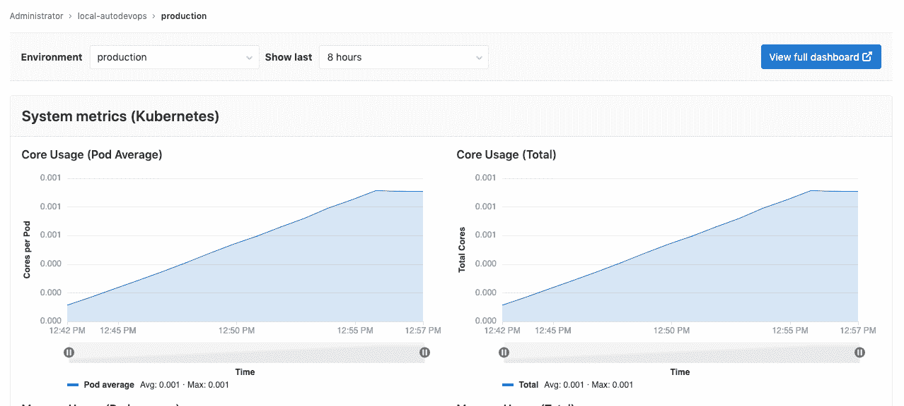

# Metrics dashboard settings

> 原文：[https://s0docs0gitlab0com.icopy.site/ee/user/project/operations/dashboard_settings.html](https://s0docs0gitlab0com.icopy.site/ee/user/project/operations/dashboard_settings.html)

*   [Change the dashboard time zone](#change-the-dashboard-time-zone)
*   [Link to an external dashboard](#link-to-an-external-dashboard)

# Metrics dashboard settings

您可以配置[监控仪表板](../integrations/prometheus.html)以显示您选择的时区以及您选择的链接.

要配置这些设置，您必须具有"管理项目操作" [权限](../../permissions.html) .

## Change the dashboard time zone

在 GitLab 13.1 中[引入](https://gitlab.com/gitlab-org/gitlab/-/issues/214370) .

默认情况下，监视仪表板在本地时区中显示日期和时间，但是您可以 UTC 格式显示日期和时间. 更改时区：

1.  以具有"管理项目操作" [权限](../../permissions.html)的用户身份登录.
2.  导航 **设置>操作** ，然后滚动到" **指标仪表板"** .
3.  在" **仪表板时区"**选择框中，选择" *用户的本地时区"*或" *UTC"* ：

    

4.  Click **保存更改**.

## Link to an external dashboard

在 GitLab 12.0 中[引入](https://gitlab.com/gitlab-org/gitlab-foss/-/issues/57171) .

您可以在监视仪表板上添加一个按钮，该按钮直接链接到现有的外部仪表板：

1.  以具有"管理项目操作" [权限](../../permissions.html)的用户身份登录.
2.  导航 **设置>操作** ，然后滚动到" **指标仪表板"** .
3.  在**外部仪表板 URL 中** ，提供您的外部仪表板的 URL：

    

4.  Click **保存更改**.

GitLab 在[监视仪表板的](../../../ci/environments/index.html#monitoring-environments)右上角显示一个" **查看完整的仪表板"**按钮，该按钮可打开您提供的 URL：

