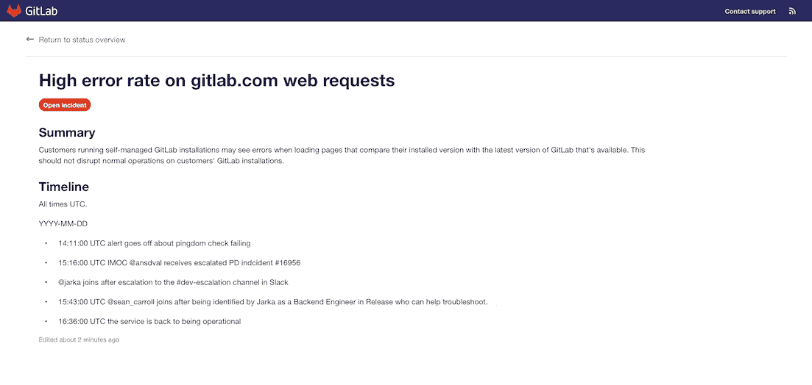
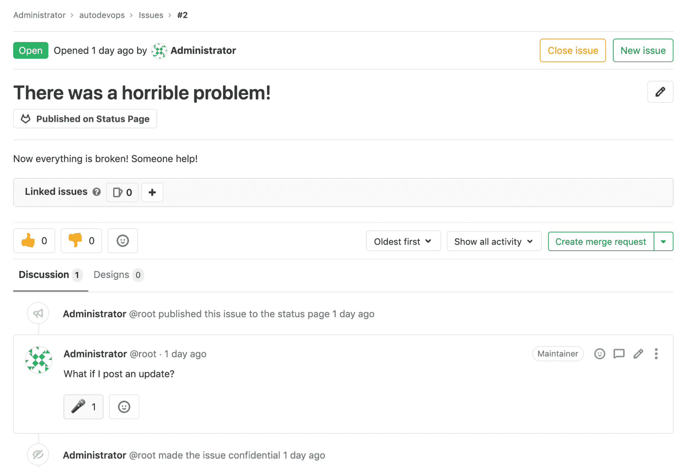

# GitLab Status Page

> 原文：[https://s0docs0gitlab0com.icopy.site/ee/user/project/status_page/](https://s0docs0gitlab0com.icopy.site/ee/user/project/status_page/)

*   [How to set up](#how-to-set-up)
    *   [Cloud account set up](#cloud-account-set-up)
        *   [AWS Setup](#aws-setup)
    *   [Status Page project](#status-page-project)
    *   [Syncing incidents to the Status Page](#syncing-incidents-to-the-status-page)
*   [Status Page UI](#status-page-ui)
    *   [Incident detail page](#incident-detail-page)
*   [How it works](#how-it-works)
    *   [Publishing Incidents](#publishing-incidents)
    *   [Publishing updates](#publishing-updates)
    *   [Adding comments](#adding-comments)
    *   [Changing the Incident status](#changing-the-incident-status)
*   [Attachment storage](#attachment-storage)
    *   [Limit](#limit)

# GitLab Status Page

[Introduced](https://gitlab.com/groups/gitlab-org/-/epics/2479) in [GitLab Ultimate](https://about.gitlab.com/pricing/) 12.10.

通过 GitLab 状态页面，您可以创建和部署静态网站，以便在事件发生时与用户进行有效沟通.

## How to set up

**注意：**仅支持将 AWS S3 作为部署目标.图 TB 子图 GitLab 实例问题（问题更新）-触发器->中间件（背景工作：JSON 生成）结束子图 Cloud Provider 中间件-保存数据-> c1（云桶存储 JSON 文件）结束子图状态页 d（ CDN 上的静态站点）-获取数据-> C1 端

设置状态页面非常简单，但是您需要做一些事情.

### Cloud account set up

要使用 GitLab 状态页，您首先需要在操作设置页中为您的云提供商设置帐户详细信息. 今天，仅支持 AWS.

#### AWS Setup

1.  在您的 AWS acccout 中，创建两个新的 IAM 策略.
    *   [创建存储桶](https://gitlab.com/gitlab-org/status-page/-/blob/master/deploy/etc/s3_create_policy.json) .
    *   [更新存储桶内容](https://gitlab.com/gitlab-org/status-page/-/blob/master/deploy/etc/s3_update_bucket_policy.json) （请记住用您的存储桶名称替换`S3_BUCKET_NAME` ）.
2.  使用第一步中创建的权限策略创建一个新的 AWS 访问密钥.

### Status Page project

要将状态页面部署到 AWS S3，您需要添加状态页面项目并配置必要的 CI 变量.

1.  分叉[状态页](https://gitlab.com/gitlab-org/status-page)项目. 这也可以通过" [存储库镜像"](https://gitlab.com/gitlab-org/status-page#repository-mirroring)来完成，这将确保您获得最新的"状态页"功能.
2.  在**设置> CI / CD>变量中**添加以下**变量** . （要从 Amazon 获取这些变量，请使用您的 Amazon Console）：
    *   `S3_BUCKET_NAME` -Amazon S3 存储桶的名称（如果不存在具有提供名称的存储桶，则第一个管道运行将创建一个并为[静态网站托管](https://docs.aws.amazon.com/AmazonS3/latest/dev/HostingWebsiteOnS3Setup.html)配置它）
    *   `AWS_DEFAULT_REGION` -AWS 区域
    *   `AWS_ACCESS_KEY_ID` -AWS 访问密钥 ID
    *   `AWS_SECRET_ACCESS_KEY` -AWS 秘密
3.  运行管道以将状态页部署到 S3.

### Syncing incidents to the Status Page

设置 CI / CD 变量后，您需要设置要用于事件问题的项目：

1.  要查看" [操作设置"](../settings/#operations-settings)页面，请导航至 **设置>操作>状态页面** .
2.  填写您的云提供商的凭据，并确保已选中" **活动"**复选框.
3.  Click **保存更改**.

## Status Page UI

"状态页面"登录页面显示了最近事件的概述. 单击事件将带您到事件的详细信息页面.

### Incident detail page

事件详细信息页面显示有关特定事件的详细信息. 例如：

*   事件的状态，包括事件的最新更新时间.
*   事件标题，包括所有表情符号.
*   事件描述，包括表情符号.
*   事件描述或注释中提供的带有有效图像扩展名的任何文件附件. 在 GitLab 13.1 中[引入](https://gitlab.com/gitlab-org/gitlab/-/issues/205166) .
*   按时间顺序排列的事件更新列表.

## How it works

### Publishing Incidents

要发布事件，您首先需要在启用状态页设置的项目中创建一个问题.

默认情况下，问题不会发布到状态页面. 在问题中使用`/publish` [快速操作](../quick_actions.html)来发布问题. 仅[项目或小组所有者](../../permissions.html)可以发布问题.

使用快速操作后，后台工作人员将使用在安装过程中提供的凭据将问题发布到"状态页"上.

由于所有事件都是公开发布的，因此用户和组提及将由`Incident Responder`匿名，并且非公共[GitLab 参考的](../../markdown.html#special-gitlab-references)标题也将被删除.

When an Incident is published in the GitLab project, you can access the details page of the Incident by clicking the **在状态页上发布** button displayed under the Incident’s title.

**注意：**机密性问题无法发布. 如果您将已发布的问题设为机密，则它将不会发布.

### Publishing updates

要发布事件更新，请更新事件问题的描述.

**小心：**更改引用的问题（例如标题，机密性）时，引用的事件不会自动更新.

### Adding comments

要将评论添加到状态页事件中，请对事件问题创建评论.

准备发布评论时，请在评论中添加麦克风[奖表情符号](../../../user/award_emojis.html)反应（ `:microphone` ）. 这会将注释标记为应部署到状态页的注释.

**警告：**有权查看问题的任何人都可以在评论中添加表情符号奖，因此您可能希望将问题仅限于团队成员.

### Changing the Incident status

要将事件状态从`open`更改为`closed` ，请在 GitLab 中关闭事件问题. 然后将在状态页面网站上对此进行更新.

## Attachment storage

在 GitLab 13.1 中[引入](https://gitlab.com/gitlab-org/gitlab/-/issues/205166) .

从 GitLab 13.1 开始，作为[发布流程的](#how-it-works)一部分，附加到事件问题描述或注释的文件将被发布和未发布到状态页存储中.

### Limit

每个问题仅 5000 个附件将被转移到状态页面.