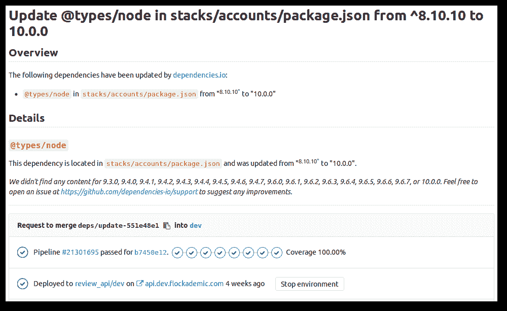

# End-to-end testing with GitLab CI/CD and WebdriverIO

> 原文：[https://s0docs0gitlab0com.icopy.site/ee/ci/examples/end_to_end_testing_webdriverio/](https://s0docs0gitlab0com.icopy.site/ee/ci/examples/end_to_end_testing_webdriverio/)

*   [What to test](#what-to-test)
*   [Selenium and WebdriverIO](#selenium-and-webdriverio)
*   [Writing tests](#writing-tests)
*   [Running locally](#running-locally)
*   [Configuring GitLab CI/CD](#configuring-gitlab-cicd)
*   [What’s next](#whats-next)

# End-to-end testing with GitLab CI/CD and WebdriverIO[](#end-to-end-testing-with-gitlab-cicd-and-webdriverio "Permalink")

[Review App](../../review_apps/index.html)很棒：对于每个合并请求（或分支），都可以将新代码复制并部署到新的类似于生产的实时环境中，从而非常省力地评估更改的影响. 因此，当我们使用像[Dependencies.io](https://www.dependencies.io/)这样的依赖项管理器时，它可以提交具有更新的依赖项的合并请求，并且很明显，仍然可以正确地构建和部署应用程序. 毕竟，您可以*看到*它正在运行！



但是，查看新部署的代码以检查其外观和行为是否仍符合预期是重复的手动工作，这意味着它是自动化的主要候选对象. 这就是自动[端到端测试的目的](https://martinfowler.com/bliki/BroadStackTest.html) ：让计算机在几种简单的场景下运行，这些场景要求您的应用程序的所有层（从前[端到数据库）](https://martinfowler.com/bliki/BroadStackTest.html)都具有适当的功能.

在本文中，我们将讨论如何编写这样的端到端测试，以及如何设置 GitLab CI / CD 以逐分支的基础针对新代码自动运行这些测试. 在本文的范围内，我们将引导您完成设置 GitLab CI / CD 的过程，以使用 WebdriverIO 端对端测试基于 JavaScript 的应用程序，但是一般策略应延续到其他语言. 我们假设您熟悉 GitLab， [GitLab CI / CD](../../README.html) ， [Review Apps](../../review_apps/index.html) ，并在本地运行您的应用程序，例如，在`localhost:8000` .

## What to test[](#what-to-test "Permalink")

在广泛使用的[测试金字塔策略中](https://martinfowler.com/bliki/TestPyramid.html) ，端到端测试的行为更像是一种保护措施： [大多数代码应包含在单元测试中](https://vincenttunru.com/100-percent-coverage/) ，以使您可以轻松地确定问题的根源. 相反，您可能希望将[端到端测试的数量限制](https://testing.googleblog.com/2015/04/just-say-no-to-more-end-to-end-tests.html)为刚好足以使您确信部署按预期进行，基础结构已启动并正在运行以及代码单元可以很好地协同工作.

## Selenium and WebdriverIO[](#selenium-and-webdriverio "Permalink")

[Selenium](https://s0www0selenium0dev.icopy.site/)是一款可以控制 Web 浏览器的软件，例如，使它们能够访问特定的 URL 或与页面上的元素进行交互. 它可以通过多种编程语言进行编程控制. 在本文中，我们将使用[WebdriverIO](https://webdriver.io/) JavaScript 绑定，但是一般概念应该可以很好地延续到[Selenium 支持的其他编程语言中](https://s0www0selenium0dev.icopy.site/documentation/en/legacy_docs/selenium_rc/) .

## Writing tests[](#writing-tests "Permalink")

您可以使用[WebdriverIO 支持的多个测试框架](https://webdriver.io/guide/testrunner/frameworks.html)编写测试. 我们将在这里使用[茉莉花](https://jasmine.github.io/) ：

```
describe('A visitor without account', function(){
    it('should be able to navigate to the homepage from the 404 page', function(){
        browser.url('/page-that-does-not-exist');

        expect(browser.getUrl()).toMatch('page-that-does-not-exist');

        browser.element('.content a[href="/"]').click();

        expect(browser.getUrl()).not.toMatch('page-that-does-not-exist');
    });
}); 
```

WebdriverIO 提供了`describe` ， `it`和`browser`的功能. 让我们一一分解.

函数`describe`允许您对相关测试进行分组. 例如，如果您想对多个测试运行相同的初始化命令（使用[`beforeEach`](https://jasmine.github.io/api/2.9/global.html#beforeEach) ），例如确保您已登录，则这将很有用.

`it`定义了单个测试的功能.

[`browser`对象](https://webdriver.io/guide/testrunner/browserobject.html)是 WebdriverIO 的特长. 它提供了大多数[WebdriverIO API 方法](https://webdriver.io/api.html) ，这些[方法](https://webdriver.io/api.html)是引导浏览器的关键. 在这种情况下，我们可以使用[`browser.url`](https://webdriver.io/api/protocol/url.html)来访问`/page-that-does-not-exist`以访问 404 页面. 然后，我们可以使用[`browser.getUrl`](https://webdriver.io/api/property/getUrl.html)验证当前页面确实在我们指定的位置. 要与页面进行交互，我们只需将 CSS 选择器传递给[`browser.element`](https://webdriver.io/api/protocol/element.html)即可访问页面上的元素并与其进行交互-例如，单击返回首页的链接.

上面显示的简单测试如果通过则可以给我们很大的信心：我们知道我们的部署成功了，这些元素在页面上可见，并且实际的浏览器可以与它交互，并且路由按预期工作. 所有这些仅用免费的空格就可以在 10 行中完成！ 加上后续的单元测试和成功完成的管道，您可以完全确信，依赖项升级不会破坏任何内容，甚至无需查看您的网站.

## Running locally[](#running-locally "Permalink")

稍后我们将在 CI / CD 中运行上述测试. 但是，在编写测试时，如果您不必等待管道成功以检查它们是否按照您期望的方式工作，那么它会有所帮助. 换句话说，让它在本地运行.

确保您的应用程序在本地运行. 如果使用 Webpack，则可以使用[Webpack Dev Server WebdriverIO 插件](https://s0www0npmjs0com.icopy.site/package/wdio-webpack-dev-server-service)在执行测试之前自动启动开发服务器.

The WebdriverIO documentation has [an overview of all configuration options](https://webdriver.io/guide/getstarted/configuration.html), but the easiest way to get started is to start with [WebdriverIO’s default configuration](https://webdriver.io/guide/testrunner/configurationfile.html), which provides an overview of all available options. The two options that are going to be most relevant now are the `specs` option, which is an array of paths to your tests, and the `baseUrl` option, which points to where your app is running. And finally, we will need to tell WebdriverIO in which browsers we would like to run our tests. This can be configured through the `capabilities` option, which is an array of browser names (e.g. `firefox` or `chrome`). It is recommended to install [selenium-assistant](https://googlechromelabs.github.io/selenium-assistant/) to detect all installed browsers:

```
 const seleniumAssistant = require('selenium-assistant');
  const browsers = seleniumAssistant.getLocalBrowsers();
  config.capabilities = browsers.map(browser => ({ browserName: browser.getId() })); 
```

但是，当然，简单的配置`config.capabilities = ['firefox']`也可以.

如果已将 WebdriverIO 安装为依赖项（ `npm install --save-dev webdriverio` ），则可以在`package.json`中的`scripts`属性中添加一行，该行运行`wdio`并将配置文件的路径作为值，例如：

```
 "confidence-check": "wdio wdio.conf.js", 
```

然后，您可以使用`npm run confidence-check`执行测试，之后您实际上会看到一个新的浏览器窗口，与您指定的应用交互.

## Configuring GitLab CI/CD[](#configuring-gitlab-cicd "Permalink")

这使我们进入了令人兴奋的部分：我们如何在 GitLab CI / CD 中运行它？ 为此，我们需要做两件事：

1.  设置实际上具有浏览器的[CI / CD 作业](../../yaml/README.html#introduction) .
2.  更新我们的 WebdriverIO 配置以使用那些浏览器来访问评论应用程序.

对于本文的范围，我们定义了一个附加的[CI / CD 阶段](../../yaml/README.html#stages) `confidence-check` ，该`confidence-check` *在*部署审阅应用程序的阶段*之后*执行. 它使用`node:latest` [Docker image](../../docker/using_docker_images.html) . 但是，WebdriverIO 会启动实际的浏览器来与您的应用程序进行交互，因此我们需要安装并运行它们. 此外，WebdriverIO 使用 Selenium 作为控制不同浏览器的通用接口，因此我们也需要安装和运行 Selenium. 幸运的是，Selenium 项目提供了分别为 Firefox 和 Chrome 提供的 Docker 映像[standalone-firefox](https://hub.docker.com/r/selenium/standalone-firefox/)和[standalone-chrome](https://hub.docker.com/r/selenium/standalone-chrome/) . （由于 Safari 和 Internet Explorer / Edge 不是开源的，并且不适用于 Linux，因此很遗憾，我们无法在 GitLab CI / CD 中使用它们.）

GitLab CI / CD 使用`service`属性将这些图像链接到我们的`confidence-check`作业变得轻而易举，这使得 Selenium 服务器可以在基于图像名称的主机名下使用. 我们的工作配置如下所示：

```
e2e:firefox:
  stage: confidence-check
  services:
    - selenium/standalone-firefox
  script:
    - npm run confidence-check --host=selenium__standalone-firefox 
```

对于 Chrome 同样如此：

```
e2e:chrome:
  stage: confidence-check
  services:
    - selenium/standalone-chrome
  script:
    - npm run confidence-check --host=selenium__standalone-chrome 
```

现在我们有一项工作可以运行端到端测试，我们需要告诉 WebdriverIO 如何连接到与其并排运行的 Selenium 服务器. 通过将[`host`](https://webdriver.io/guide/getstarted/configuration.html#host)选项的值作为参数传递给`npm run confidence-check`命令在命令行上`npm run confidence-check` ，我们已经作弊了. 但是，我们仍然需要告诉 WebdriverIO 使用哪个浏览器.

[GitLab CI / CD 提供了许多](../../variables/README.html#predefined-environment-variables)有关当前 CI 作业的信息[的变量](../../variables/README.html#predefined-environment-variables) . 我们可以使用此信息根据正在运行的作业动态设置 WebdriverIO 配置. 更具体地说，我们可以根据当前正在运行的作业的名称，告诉 WebdriverIO 使用哪个浏览器执行测试. 我们可以在 WebdriverIO 的配置文件中执行此操作，在上面将其命名为`wdio.conf.js` ：

```
if(process.env.CI_JOB_NAME) {
    dynamicConfig.capabilities = [
        { browserName: process.env.CI_JOB_NAME === 'e2e:chrome' ? 'chrome' : 'firefox' },
    ];
} 
```

同样，我们可以告诉 WebdriverIO 审阅应用程序在哪里运行-在本示例中，它位于`<branch name>.flockademic.com` ：

```
if(process.env.CI_COMMIT_REF_SLUG) {
    dynamicConfig.baseUrl = `https://${process.env.CI_COMMIT_REF_SLUG}.flockademic.com`;
} 
```

并且我们可以确保仅当*不*使用`if (!process.env.CI)`在 CI 中运行时，才使用本地特定的配置. 基本上，这是在 GitLab CI / CD 上进行端到端测试所需的全部成分！

回顾一下，我们的`.gitlab-ci.yml`配置文件如下所示：

```
image: node:8.10
stages:
  - deploy
  - confidence-check
deploy_terraform:
  stage: deploy
  script:
    # Your Review App deployment scripts - for a working example please check https://gitlab.com/Flockademic/Flockademic/blob/5a45f1c2412e93810fab50e2dab8949e2d0633c7/.gitlab-ci.yml#L315
e2e:firefox:
  stage: confidence-check
  services:
    - selenium/standalone-firefox
  script:
    - npm run confidence-check --host=selenium__standalone-firefox
e2e:chrome:
  stage: confidence-check
  services:
    - selenium/standalone-chrome
  script:
    - npm run confidence-check --host=selenium__standalone-chrome 
```

## What’s next[](#whats-next "Permalink")

如果您要自己进行设置并希望了解生产项目的工作配置，请参阅：

*   [Flockademic’s `wdio.conf.js`](https://gitlab.com/Flockademic/Flockademic/blob/dev/wdio.conf.js)
*   [Flockademic’s `.gitlab-ci.yml`](https://gitlab.com/Flockademic/Flockademic/blob/dev/.gitlab-ci.yml)
*   [Flockademic’s tests](https://gitlab.com/Flockademic/Flockademic/tree/dev/__e2e__)

WebdriverIO 还可以做更多的事情. 例如，您可以配置一个[`screenshotPath`](https://webdriver.io/guide/getstarted/configuration.html#screenshotPath)以告诉 WebdriverIO 在测试失败时进行截图. 然后告诉 GitLab CI / CD 存储这些[工件](../../yaml/README.html#artifacts) ，您将能够看到 GitLab 中出了什么问题.