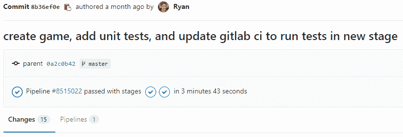
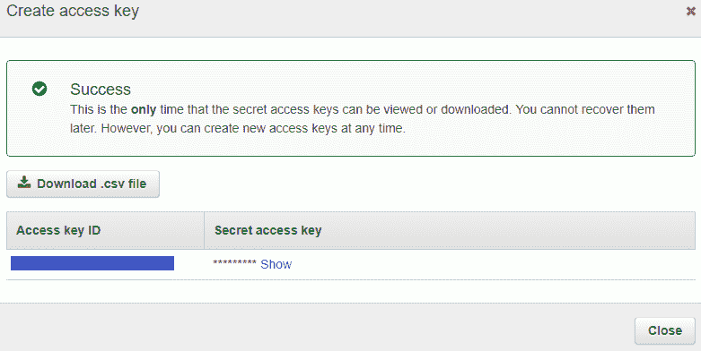
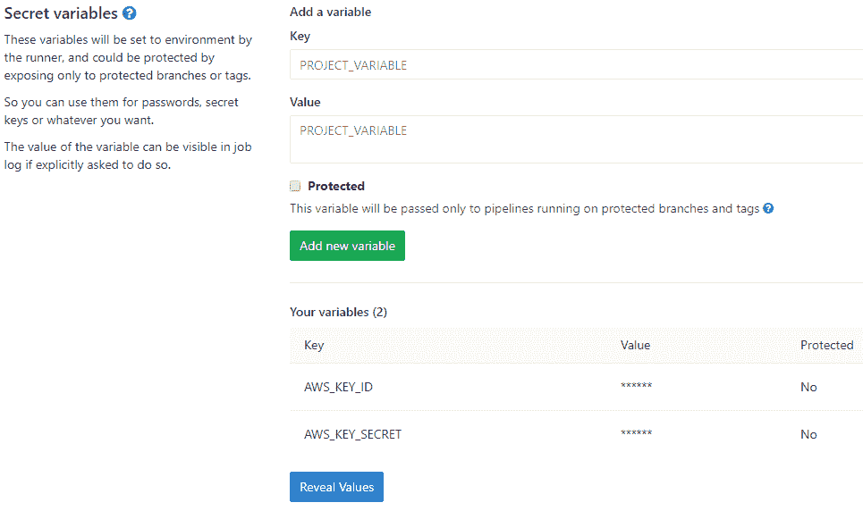

# DevOps and Game Dev with GitLab CI/CD

> 原文：[https://s0docs0gitlab0com.icopy.site/ee/ci/examples/devops_and_game_dev_with_gitlab_ci_cd/](https://s0docs0gitlab0com.icopy.site/ee/ci/examples/devops_and_game_dev_with_gitlab_ci_cd/)

*   [The game](#the-game)
*   [Requirements and setup](#requirements-and-setup)
*   [Continuous Integration](#continuous-integration)
    *   [Build your game with GitLab CI/CD](#build-your-game-with-gitlab-cicd)
    *   [Test your game with GitLab CI/CD](#test-your-game-with-gitlab-cicd)
    *   [Run your CI/CD pipeline](#run-your-cicd-pipeline)
*   [Continuous Deployment](#continuous-deployment)
    *   [Set up S3 Bucket](#set-up-s3-bucket)
    *   [Set up AWS Secrets](#set-up-aws-secrets)
    *   [Deploy your game with GitLab CI/CD](#deploy-your-game-with-gitlab-cicd)
*   [Conclusion](#conclusion)
*   [Further settings](#further-settings)

# DevOps and Game Dev with GitLab CI/CD[](#devops-and-game-dev-with-gitlab-cicd "Permalink")

随着 WebGL 和 WebSockets 的进步，浏览器作为游戏开发平台非常可行，而无需使用 Adobe Flash 之类的插件. 此外，通过使用 GitLab 和[AWS](https://aws.amazon.com/) ，单个游戏开发人员以及游戏开发团队可以轻松地在线托管基于浏览器的游戏.

在本教程中，我们将专注于 DevOps，以及使用[GitLab CI / CD](../../README.html)使用持续集成/部署方法测试和托管游戏. 我们假设您熟悉 GitLab，JavaScript 和游戏开发的基础知识.

## The game[](#the-game "Permalink")

我们的[演示游戏](http://gitlab-game-demo.s3-website-us-east-1.amazonaws.com/)由一个简单的太空飞船组成，该太空飞船通过在给定方向上单击鼠标进行射击.

在开发另一款游戏[Dark Nova](https://www.darknova.io)的开始时，创建强大的 CI / CD 流水线对于团队工作的快速节奏至关重要. 本教程将以我[之前的介绍性文章为基础，](https://ryanhallcs.wordpress.com/2017/03/15/devops-and-game-dev/)并执行以下步骤：

1.  使用上一篇文章中的代码开始由 gulp 文件构建的准[相位](https://phaser.io)游戏
2.  添加和运行单元测试
3.  创建可以触发以给定方向生成`Bullet`的`Weapon`类
4.  添加使用此武器并在屏幕上四处移动的`Player`类
5.  添加我们将用于`Player`和`Weapon`的精灵
6.  使用持续集成和持续部署方法进行测试和部署

到最后，我们将拥有一个[可玩游戏](http://gitlab-game-demo.s3-website-us-east-1.amazonaws.com/)的核心，该[游戏](http://gitlab-game-demo.s3-website-us-east-1.amazonaws.com/)在每次推送到[代码库](https://gitlab.com/blitzgren/gitlab-game-demo) `master`分支时都经过测试和部署. 这还将提供样板代码，用于启动具有以下组件的基于浏览器的游戏：

*   用[TypeScript](https://s0www0typescriptlang0org.icopy.site/)和[PhaserJs 编写](https://phaser.io)
*   使用[Gulp](https://gulpjs.com)构建，运行和测试
*   [Chai](https://www.chaijs.com)和[Mocha 的](https://s0mochajs0org.icopy.site/)单元测试
*   使用 GitLab 进行 CI / CD
*   在 GitLab.com 上托管代码库
*   在 AWS 上托管游戏
*   部署到 AWS

## Requirements and setup[](#requirements-and-setup "Permalink")

请参考我以前的文章[DevOps 和 Game Dev，](https://ryanhallcs.wordpress.com/2017/03/15/devops-and-game-dev/)以学习基础开发工具，运行类似于 Hello World 的游戏，以及从每次新推手到使用 GitLab CI / CD 来构建此游戏. 此游戏[存储库](https://gitlab.com/blitzgren/gitlab-game-demo)的`master`分支包含具有所有配置的完整版本. 如果您想继续阅读本文，可以从`devops-article`分支进行克隆并进行工作：

```
git clone git@gitlab.com:blitzgren/gitlab-game-demo.git
git checkout devops-article 
```

接下来，我们将创建一小部分测试，以举例说明我希望该`Weapon`类经历的大多数状态. 首先，创建一个名为`lib/tests`的文件夹，并将以下代码添加到一个新文件`weaponTests.ts` ：

```
import { expect } from 'chai';
import { Weapon, BulletFactory } from '../lib/weapon';

describe('Weapon', () => {
    var subject: Weapon;
    var shotsFired: number = 0;
    // Mocked bullet factory
    var bulletFactory: BulletFactory = <BulletFactory>{
        generate: function(px, py, vx, vy, rot) {
            shotsFired++;
        }
    };
    var parent: any = { x: 0, y: 0 };

    beforeEach(() => {
        shotsFired = 0;
        subject = new Weapon(bulletFactory, parent, 0.25, 1);
    });

    it('should shoot if not in cooldown', () => {
        subject.trigger(true);
        subject.update(0.1);
        expect(shotsFired).to.equal(1);
    });

    it('should not shoot during cooldown', () => {
        subject.trigger(true);
        subject.update(0.1);
        subject.update(0.1);
        expect(shotsFired).to.equal(1);
    });

    it('should shoot after cooldown ends', () => {
        subject.trigger(true);
        subject.update(0.1);
        subject.update(0.3); // longer than timeout
        expect(shotsFired).to.equal(2);
    });

    it('should not shoot if not triggered', () => {
        subject.update(0.1);
        subject.update(0.1);
        expect(shotsFired).to.equal(0);
    });
}); 
```

为了使用`gulpfile.js`构建和运行这些测试，我们还要将以下`gulpfile.js`函数添加到现有的`gulpfile.js`文件中：

```
gulp.task('build-test', function () {
    return gulp.src('src/tests/**/*.ts', { read: false })
    .pipe(tap(function (file) {
      // replace file contents with browserify's bundle stream
      file.contents = browserify(file.path, { debug: true })
        .plugin(tsify, { project: "./tsconfig.test.json" })
        .bundle();
    }))
    .pipe(buffer())
    .pipe(sourcemaps.init({loadMaps: true}) )
    .pipe(gulp.dest('built/tests'));
});

gulp.task('run-test', function() {
    gulp.src(['./built/tests/**/*.ts']).pipe(mocha());
}); 
```

我们将开始实施游戏的第一部分，并通过这些`Weapon`测试. `Weapon`类将公开一种方法，以给定的方向和速度触发子弹的生成. 稍后，我们将实现一个`Player`类，将用户输入绑定在一起以触发武器. 在`src/lib`文件夹中，创建一个`weapon.ts`文件. 我们将添加两个类： `Weapon`和`BulletFactory` ，它们将封装 Phaser 的**sprite**和**group**对象，以及游戏特定的逻辑.

```
export class Weapon {
    private isTriggered: boolean = false;
    private currentTimer: number = 0;

    constructor(private bulletFactory: BulletFactory, private parent: Phaser.Sprite, private cooldown: number, private bulletSpeed: number) {
    }

    public trigger(on: boolean): void {
        this.isTriggered = on;
    }

    public update(delta: number): void {
        this.currentTimer -= delta;

        if (this.isTriggered && this.currentTimer <= 0) {
            this.shoot();
        }
    }

    private shoot(): void {
        // Reset timer
        this.currentTimer = this.cooldown;

        // Get velocity direction from player rotation
        var parentRotation = this.parent.rotation + Math.PI / 2;
        var velx = Math.cos(parentRotation);
        var vely = Math.sin(parentRotation);

        // Apply a small forward offset so bullet shoots from head of ship instead of the middle
        var posx = this.parent.x - velx * 10
        var posy = this.parent.y - vely * 10;

        this.bulletFactory.generate(posx, posy, -velx * this.bulletSpeed, -vely * this.bulletSpeed, this.parent.rotation);
    }
}

export class BulletFactory {

    constructor(private bullets: Phaser.Group, private poolSize: number) {
        // Set all the defaults for this BulletFactory's bullet object
        this.bullets.enableBody = true;
        this.bullets.physicsBodyType = Phaser.Physics.ARCADE;
        this.bullets.createMultiple(30, 'bullet');
        this.bullets.setAll('anchor.x', 0.5);
        this.bullets.setAll('anchor.y', 0.5);
        this.bullets.setAll('outOfBoundsKill', true);
        this.bullets.setAll('checkWorldBounds', true);
    }

    public generate(posx: number, posy: number, velx: number, vely: number, rot: number): Phaser.Sprite {
        // Pull a bullet from Phaser's Group pool
        var bullet = this.bullets.getFirstExists(false);

        // Set the few unique properties about this bullet: rotation, position, and velocity
        if (bullet) {
            bullet.reset(posx, posy);
            bullet.rotation = rot;
            bullet.body.velocity.x = velx;
            bullet.body.velocity.y = vely;
        }

        return bullet;
    }
} 
```

最后，我们将重做我们的入口点`game.ts` ，将`Player`和`Weapon`对象绑定在一起，并将它们添加到更新循环中. 这是更新的`game.ts`文件的外观：

```
import { Player } from "./player";
import { Weapon, BulletFactory } from "./weapon";

window.onload = function() {
    var game = new Phaser.Game(800, 600, Phaser.AUTO, 'gameCanvas', { preload: preload, create: create, update: update });
    var player: Player;
    var weapon: Weapon;

    // Import all assets prior to loading the game
    function preload () {
        game.load.image('player', 'assets/player.png');
        game.load.image('bullet', 'assets/bullet.png');
    }

    // Create all entities in the game, after Phaser loads
    function create () {
        // Create and position the player
        var playerSprite = game.add.sprite(400, 550, 'player');
        playerSprite.anchor.setTo(0.5);
        player = new Player(game.input, playerSprite, 150);

        var bulletFactory = new BulletFactory(game.add.group(), 30);
        weapon = new Weapon(bulletFactory, player.sprite, 0.25, 1000);

        player.loadWeapon(weapon);
    }

    // This function is called once every tick, default is 60fps
    function update() {
        var deltaSeconds = game.time.elapsedMS / 1000; // convert to seconds
        player.update(deltaSeconds);
        weapon.update(deltaSeconds);
    }
} 
```

运行`gulp serve` ，您可以四处奔跑射击. 精彩！ 让我们更新 CI 管道，使其包括运行测试以及现有的构建作业.

## Continuous Integration[](#continuous-integration "Permalink")

为了确保我们的更改不会破坏构建并且所有测试仍然通过，我们利用持续集成（CI）来为每次推送自动运行这些检查. 通读本文以了解[持续集成，持续交付和持续部署](https://about.gitlab.com/blog/2016/08/05/continuous-integration-delivery-and-deployment-with-gitlab/) ，以及 GitLab 如何利用这些方法. 在上[一教程中，](https://ryanhallcs.wordpress.com/2017/03/15/devops-and-game-dev/)我们已经设置了一个`.gitlab-ci.yml`文件，用于从每次推送开始构建我们的应用程序. 我们需要设置一个新的 CI 作业进行测试，GitLab CI / CD 将使用我们从 gulp 生成的工件在构建作业后运行.

请通读[CI / CD 配置](../../../ci/yaml/README.html)文件[上](../../../ci/yaml/README.html)的[文档，](../../../ci/yaml/README.html)以探索其内容并根据需要进行调整.

### Build your game with GitLab CI/CD[](#build-your-game-with-gitlab-cicd "Permalink")

我们需要更新构建作业以确保测试也能运行. 将`gulp build-test`添加到现有`build`作业的`script`数组的末尾. 一旦这些命令运行，我们就知道需要访问 GitLab CI / CD `artifacts`提供的`built`文件夹中的所有内容. 我们还将缓存`node_modules`以避免不得不完全重新拉动那些依赖项：只需将它们打包在缓存中即可. 这是完整的`build`工作：

```
build:
  stage: build
  script:
    - npm i gulp -g
    - npm i
    - gulp
    - gulp build-test
  cache:
    policy: push
    paths:
      - node_modules
  artifacts:
    paths:
      - built 
```

### Test your game with GitLab CI/CD[](#test-your-game-with-gitlab-cicd "Permalink")

对于本地测试，我们只需要运行`gulp run-tests` ，这需要像`build`作业一样在全球范围内安装 gulp. 我们从缓存中拉出`node_modules` ，因此`npm i`命令不必做太多事情. 在准备部署时，我们知道我们仍然需要工件中的`built`文件夹，该文件夹将作为上一个作业的默认行为被带入. 最后，按照惯例，我们通过给 GitLab CI / CD 一个`test` [阶段](../../../ci/yaml/README.html#stages)来告知需要在`build`工作之后运行它. 按照 YAML 结构， `test`作业应如下所示：

```
test:
  stage: test
  script:
    - npm i gulp -g
    - npm i
    - gulp run-test
  cache:
    policy: push
    paths:
      - node_modules/
  artifacts:
    paths:
      - built/ 
```

我们为以指定间隔射击的`Weapon`类添加了单元测试. `Player`类实现了`Weapon`以及四处移动和射击的能力. 此外，我们还使用`.gitlab-ci.yml`在 GitLab CI / CD 管道中添加了测试工件和测试阶段，从而使我们能够在每次推送时运行测试. 现在，我们整个`.gitlab-ci.yml`文件应如下所示：

```
image: node:10

build:
  stage: build
  script:
    - npm i gulp -g
    - npm i
    - gulp
    - gulp build-test
  cache:
    policy: push
    paths:
      - node_modules/
  artifacts:
    paths:
      - built/

test:
  stage: test
  script:
    - npm i gulp -g
    - npm i
    - gulp run-test
  cache:
    policy: pull
    paths:
      - node_modules/
  artifacts:
    paths:
      - built/ 
```

### Run your CI/CD pipeline[](#run-your-cicd-pipeline "Permalink")

而已！ 添加所有新文件，提交并推送. 有关此时存储库外观的参考，请参考[示例存储库中与本文相关](https://gitlab.com/blitzgren/gitlab-game-demo/commit/8b36ef0ecebcf569aeb251be4ee13743337fcfe2)的[最终提交](https://gitlab.com/blitzgren/gitlab-game-demo/commit/8b36ef0ecebcf569aeb251be4ee13743337fcfe2) . 通过同时应用构建和测试阶段，GitLab 将在每次推送到我们的存储库时按顺序运行它们. 如果一切顺利，您将在管道的每个作业上得到一个绿色的复选标记：

[](img/test_pipeline_pass.png)

您可以通过单击`test`作业以输入完整的构建日志来确认测试通过. 滚动到底部，观察所有过去的荣耀：

```
$ gulp run-test
[18:37:24] Using gulpfile /builds/blitzgren/gitlab-game-demo/gulpfile.js
[18:37:24] Starting 'run-test'...
[18:37:24] Finished 'run-test' after 21 ms

  Weapon
    ✓ should shoot if not in cooldown
    ✓ should not shoot during cooldown
    ✓ should shoot after cooldown ends
    ✓ should not shoot if not triggered

  4 passing (18ms)

Uploading artifacts...
built/: found 17 matching files
Uploading artifacts to coordinator... ok            id=17095874 responseStatus=201 Created token=aaaaaaaa Job succeeded 
```

## Continuous Deployment[](#continuous-deployment "Permalink")

我们在每次推送时都构建并测试了代码库. 为了完成持续部署的全部流程，让我们[使用 AWS S3](https://aws.amazon.com/free/)设置[免费的 Web 托管，](https://aws.amazon.com/free/)并通过一项工作来部署构建工件. GitLab 还提供了免费的静态站点托管服务[GitLab Pages](https://about.gitlab.com/stages-devops-lifecycle/pages/) ，但是 Dark Nova 特别使用需要使用`AWS S3`其他 AWS 工具. 通读本文，该文章描述了[如何同时部署到 S3 和 GitLab 页面，](https://about.gitlab.com/blog/2016/08/26/ci-deployment-and-environments/)并且比本文讨论的内容更深入地研究 GitLab CI / CD 的原理.

### Set up S3 Bucket[](#set-up-s3-bucket "Permalink")

1.  登录您的 AWS 账户并转到[S3](https://console.aws.amazon.com/s3/home)
2.  点击顶部的**创建存储桶**链接
3.  输入您选择的名称，然后单击下一步
4.  保留默认**属性** ，然后单击下一步
5.  单击" **管理组"权限** ，然后为" **所有人"**组允许" **读取** "，单击"下一步".
6.  创建存储桶，然后在您的 S3 存储桶列表中选择它
7.  在右侧，单击" **属性"**并启用" **静态网站托管"**类别
8.  Update the radio button to the **使用此存储桶托管网站** selection. Fill in `index.html` and `error.html` respectively

### Set up AWS Secrets[](#set-up-aws-secrets "Permalink")

我们需要能够使用我们的 AWS 账户凭证部署到 AWS，但是我们当然不希望在源代码中添加机密信息. 幸运的是，GitLab 通过[Variables](../../../ci/variables/README.html)提供了解决方案. 由于[IAM](https://aws.amazon.com/iam/)管理，这可能会变得复杂. 作为最佳实践，您不应使用根安全凭证. 正确的 IAM 凭据管理不在本文讨论范围之内，但是 AWS 会提醒您，不建议使用 root 凭据，并且应该违反其最佳做法. 随意遵循最佳实践并使用自定义 IAM 用户的凭据，这将是两个相同的凭据（密钥 ID 和密钥）. 充分了解[AWS 中的 IAM 最佳做法](https://docs.aws.amazon.com/IAM/latest/UserGuide/best-practices.html)是一个好主意. 我们需要将以下凭据添加到 GitLab：

1.  登录您的 AWS 账户并转到[安全凭证页面](https://console.aws.amazon.com/iam/home#/security_credential)
2.  单击**访问密钥**部分，然后**创建新的访问密钥** . 创建密钥并保留 ID 和秘密，以后需要它们

    [](img/aws_config_window.png)

3.  转到您的 GitLab 项目，单击左侧栏中的**设置> CI / CD** .
4.  展开**变量**部分

    [](img/gitlab_config.png)

5.  添加一个名为`AWS_KEY_ID`的密钥，并将步骤 2 中的密钥 ID 复制到" **值"**字段中
6.  添加一个名为`AWS_KEY_SECRET`的密钥，并将步骤 2 中的密钥机密复制到" **值"**字段中

### Deploy your game with GitLab CI/CD[](#deploy-your-game-with-gitlab-cicd "Permalink")

要部署构建工件，我们需要在 Shared Runner 上安装[AWS CLI](https://aws.amazon.com/cli/) . Shared Runner 还需要能够通过您的 AWS 账户进行身份验证以部署工件. 按照约定，AWS CLI 将寻找`AWS_ACCESS_KEY_ID`和`AWS_SECRET_ACCESS_KEY` . GitLab 的 CI 为我们提供了一种使用`deploy`作业的`variables`部分传递在上一节中设置的`variables`的方法. 最后，我们添加指令以确保`only`在推送到`master`时进行部署. 这样，每个分支仍然通过 CI 运行，并且只有合并（或直接提交）到 master 才会触发管道的`deploy`工作. 将它们放在一起可获得以下内容：

```
deploy:
  stage: deploy
  variables:
    AWS_ACCESS_KEY_ID: "$AWS_KEY_ID"
    AWS_SECRET_ACCESS_KEY: "$AWS_KEY_SECRET"
  script:
    - apt-get update
    - apt-get install -y python3-dev python3-pip
    - easy_install3 -U pip
    - pip3 install --upgrade awscli
    - aws s3 sync ./built s3://gitlab-game-demo --region "us-east-1" --grants read=uri=http://acs.amazonaws.com/groups/global/AllUsers --cache-control "no-cache, no-store, must-revalidate" --delete
  only:
    - master 
```

确保在最后一个脚本命令中更新区域和 S3 URL 以适合您的设置. 我们的最终配置文件`.gitlab-ci.yml`看起来像：

```
image: node:10

build:
  stage: build
  script:
    - npm i gulp -g
    - npm i
    - gulp
    - gulp build-test
  cache:
    policy: push
    paths:
      - node_modules/
  artifacts:
    paths:
      - built/

test:
  stage: test
  script:
    - npm i gulp -g
    - gulp run-test
  cache:
    policy: pull
    paths:
      - node_modules/
  artifacts:
    paths:
      - built/

deploy:
  stage: deploy
  variables:
    AWS_ACCESS_KEY_ID: "$AWS_KEY_ID"
    AWS_SECRET_ACCESS_KEY: "$AWS_KEY_SECRET"
  script:
    - apt-get update
    - apt-get install -y python3-dev python3-pip
    - easy_install3 -U pip
    - pip3 install --upgrade awscli
    - aws s3 sync ./built s3://gitlab-game-demo --region "us-east-1" --grants read=uri=http://acs.amazonaws.com/groups/global/AllUsers --cache-control "no-cache, no-store, must-revalidate" --delete
  only:
    - master 
```

## Conclusion[](#conclusion "Permalink")

在[演示存储库中，](https://gitlab.com/blitzgren/gitlab-game-demo)您还可以找到一些样板代码来使[TypeScript](https://s0www0typescriptlang0org.icopy.site/) ， [Mocha](https://s0mochajs0org.icopy.site/) ， [Gulp](https://gulpjs.com/)和[Phaser](https://phaser.io)与 GitLab CI / CD 完美地结合在一起，这是在制作[Dark Nova 时](https://www.darknova.io)汲取的教训的结果. 使用免费和开源软件的组合，我们拥有完整的 CI / CD 流水线，游戏基础和单元测试，所有这些操作和部署都可以在每次熟练掌握的情况下完成-只需很少的代码. 可以通过 GitLab 的构建日志轻松调试错误，并且在成功提交后的几分钟内，您就可以在游戏中实时看到更改.

借助 Dark Nova 从一开始就设置持续集成和持续部署可实现快速而稳定的开发. 我们可以轻松地在单独的[环境中](../../environments/index.html)测试更改，如果需要，可以在多个环境中测试更改. 平衡和更新多人游戏可能会持续且乏味，但是相信使用 GitLab CI / CD 进行稳定部署会在快速获得玩家更改方面有很大的喘息空间.

## Further settings[](#further-settings "Permalink")

以下是一些可以进一步研究的想法，可以加快或改善您的流程：

*   [纱线](https://yarnpkg.com)代替 npm
*   设置可以预加载依赖项和工具（如 AWS CLI）的自定义[Docker](../../../ci/docker/using_docker_images.html#define-image-and-services-from-gitlab-ciyml)映像
*   将[自定义域](https://docs.aws.amazon.com/AmazonS3/latest/dev/website-hosting-custom-domain-walkthrough.html)转发到游戏的 S3 静态网站
*   如果您发现小型项目不必要，请合并工作
*   避免排队，并设置自己的[自定义 GitLab CI / CD 运行器](https://about.gitlab.com/blog/2016/03/01/gitlab-runner-with-docker/)