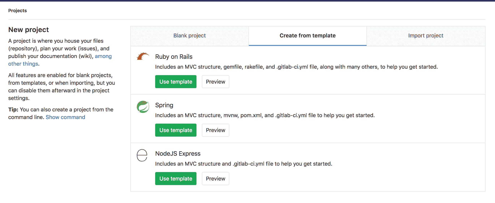

# Deploy a Spring Boot application to Cloud Foundry with GitLab CI/CD

> 原文：[https://s0docs0gitlab0com.icopy.site/ee/ci/examples/deploy_spring_boot_to_cloud_foundry/](https://s0docs0gitlab0com.icopy.site/ee/ci/examples/deploy_spring_boot_to_cloud_foundry/)

*   [Introduction](#introduction)
*   [Requirements](#requirements)
*   [Create your project](#create-your-project)
*   [Configure the deployment to Cloud Foundry](#configure-the-deployment-to-cloud-foundry)
*   [Configure GitLab CI/CD to deploy your application](#configure-gitlab-cicd-to-deploy-your-application)

# Deploy a Spring Boot application to Cloud Foundry with GitLab CI/CD[](#deploy-a-spring-boot-application-to-cloud-foundry-with-gitlab-cicd "Permalink")

## Introduction[](#introduction "Permalink")

在本文中，我们将演示如何使用[连续部署](https://about.gitlab.com/blog/2016/08/05/continuous-integration-delivery-and-deployment-with-gitlab/#continuous-deployment)方法通过 GitLab CI / CD 将[Spring Boot](https://projects.spring.io/spring-boot/)应用程序部署到[Cloud Foundry（CF）](https://www.cloudfoundry.org/) .

该项目的所有代码都可以在该[GitLab 存储库中](https://gitlab.com/gitlab-examples/spring-gitlab-cf-deploy-demo)找到.

如果您有兴趣使用 GitLab CI / CD 将 Spring Boot 应用程序部署到 Kubernetes，请通读博客文章[GitLab CI 和 Kubernetes 持续交付 Spring Boot 应用程序](https://about.gitlab.com/blog/2016/12/14/continuous-delivery-of-a-spring-boot-application-with-gitlab-ci-and-kubernetes/) .

## Requirements[](#requirements "Permalink")

本教程假定您熟悉 Java，GitLab，Cloud Foundry 和 GitLab CI / CD.

要继续进行，您将需要：

*   [Pivotal Web 服务（PWS）](https://run.pivotal.io/)或任何其他 Cloud Foundry（CF）实例上的帐户.
*   在 GitLab 上的帐户.

**注意：**如果您没有部署到 PWS，则需要将以下所有命令中的`api.run.pivotal.io` URL 替换为 CF 实例的[API URL](https://docs.cloudfoundry.org/running/cf-api-endpoint.html) .

## Create your project[](#create-your-project "Permalink")

要创建您的 Spring Boot 应用程序，可以在创建新项目时在 GitLab 中使用 Spring 模板：

[](img/create_from_template.png)

## Configure the deployment to Cloud Foundry[](#configure-the-deployment-to-cloud-foundry "Permalink")

要部署到 Cloud Foundry，我们需要添加`manifest.yml`文件. 这是我们将用于部署应用程序的 CF CLI 的配置. 我们将在项目的根目录中创建以下内容：

```
---
applications:
  - name: gitlab-hello-world
    random-route: true
    memory: 1G
    path: target/demo-0.0.1-SNAPSHOT.jar 
```

## Configure GitLab CI/CD to deploy your application[](#configure-gitlab-cicd-to-deploy-your-application "Permalink")

现在，我们需要将 GitLab CI / CD 配置文件（ [`.gitlab-ci.yml`](../../yaml/README.html) ）添加到项目的根目录. 这就是 GitLab 找出每当将代码推送到我们的存储库时需要运行哪些命令的方式. 我们将以下`.gitlab-ci.yml`文件添加到存储库的根目录中，GitLab 将自动检测该文件，并在推送代码后运行定义的步骤：

```
image: java:8

stages:
  - build
  - deploy

before_script:
  - chmod +x mvnw

build:
  stage: build
  script: ./mvnw package
  artifacts:
    paths:
      - target/demo-0.0.1-SNAPSHOT.jar

production:
  stage: deploy
  script:
    - curl --location "https://cli.run.pivotal.io/stable?release=linux64-binary&source=github" | tar zx
    - ./cf login -u $CF_USERNAME -p $CF_PASSWORD -a api.run.pivotal.io
    - ./cf push
  only:
    - master 
```

我们使用了`java:8` [Docker 映像](../../docker/using_docker_images.html)来构建我们的应用程序，因为它在[Docker Hub](https://hub.docker.com/)上提供了最新的 Java 8 JDK. 我们还添加了[`only`子句，](../../yaml/README.html#onlyexcept-basic)以确保仅当我们推送到 master 分支[`only`](../../yaml/README.html#onlyexcept-basic)进行部署.

现在，由于`.gitlab-ci.yml`定义的步骤需要凭据才能登录到 CF，因此您需要将 CF 凭据作为[环境变量添加](../../variables/README.html#predefined-environment-variables)到 GitLab CI / CD 上. 要设置环境变量，请导航至项目的**"设置">" CI / CD"，**然后展开" **变量"** . 将变量命名为`CF_USERNAME`和`CF_PASSWORD`并将其设置为正确的值.

[](img/cloud_foundry_variables.png)

设置完成后，每次推送到存储库默认分支时，GitLab CI / CD 都会将您的应用程序部署到 CF. 要查看构建日志或观看构建的实时运行，请导航至**CI / CD> Pipelines** .

**注意：**为安全性的最佳做法是为应用程序创建一个单独的部署用户，并将其凭据添加到 GitLab，而不使用开发人员的凭据.

要在 GitLab 中开始手动部署，请转到**CI / CD>管道，**然后单击**运行管道** . 应用程序完成部署后，它将在`production`作业的日志中显示应用程序的 URL，例如：

```
requested state: started
instances: 1/1
usage: 1G x 1 instances
urls: gitlab-hello-world-undissembling-hotchpot.cfapps.io
last uploaded: Mon Nov 6 10:02:25 UTC 2017
stack: cflinuxfs2
buildpack: client-certificate-mapper=1.2.0_RELEASE container-security-provider=1.8.0_RELEASE java-buildpack=v4.5-offline-https://github.com/cloudfoundry/java-buildpack.git#ffeefb9 java-main java-opts jvmkill-agent=1.10.0_RELEASE open-jdk-like-jre=1.8.0_1...

     state     since                    cpu      memory         disk           details
#0   running   2017-11-06 09:03:22 PM   120.4%   291.9M of 1G   137.6M of 1G 
```

然后，您可以访问已部署的应用程序（对于本示例，为`https://gitlab-hello-world-undissembling-hotchpot.cfapps.io/` ），您应该看到"春天在这里！" 信息.