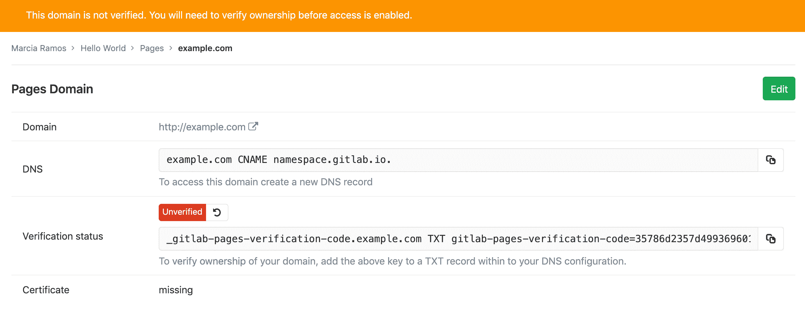
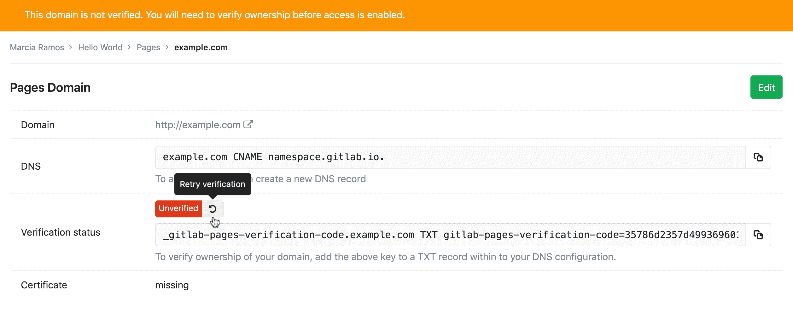

# Custom domains and SSL/TLS Certificates

> 原文：[https://s0docs0gitlab0com.icopy.site/ee/user/project/pages/custom_domains_ssl_tls_certification/](https://s0docs0gitlab0com.icopy.site/ee/user/project/pages/custom_domains_ssl_tls_certification/)

*   [Set up Pages with a custom domain](#set-up-pages-with-a-custom-domain)
    *   [Requirements](#requirements)
    *   [Steps](#steps)
        *   [1\. Add a custom domain to Pages](#1-add-a-custom-domain-to-pages)
        *   [2\. Get the verification code](#2-get-the-verification-code)
        *   [3\. Set up DNS records for Pages](#3-set-up-dns-records-for-pages)
            *   [For root domains](#for-root-domains)
            *   [For subdomains](#for-subdomains)
            *   [For both root and subdomains](#for-both-root-and-subdomains)
        *   [4\. Verify the domain’s ownership](#4-verify-the-domains-ownership)
            *   [Troubleshooting Pages domain verification](#troubleshooting-pages-domain-verification)
    *   [Adding more domain aliases](#adding-more-domain-aliases)
    *   [Redirecting `www.domain.com` to `domain.com` with Cloudflare](#redirecting-wwwdomaincom-to-domaincom-with-cloudflare)
*   [Adding an SSL/TLS certificate to Pages](#adding-an-ssltls-certificate-to-pages)
    *   [Requirements](#requirements-1)
    *   [Steps](#steps-1)
*   [Force HTTPS for GitLab Pages websites](#force-https-for-gitlab-pages-websites)

# Custom domains and SSL/TLS Certificates[](#custom-domains-and-ssltls-certificates "Permalink")

使用自定义域设置 GitLab 页面，并向其中添加 SSL / TLS 证书，是 GitLab 页面的可选功能.

要将一个或多个自定义域名用于您的 Pages 网站，您可以：

*   添加[自定义**根域**或**子域**](#set-up-pages-with-a-custom-domain) .
*   Add [SSL/TLS certification](#adding-an-ssltls-certificate-to-pages).

## Set up Pages with a custom domain[](#set-up-pages-with-a-custom-domain "Permalink")

要使用自定义域名设置页面，请阅读以下要求和步骤.

### Requirements[](#requirements "Permalink")

*   在默认的 Pages 域（ `*.gitlab.io` ，对于 GitLab.com）下运行的 GitLab Pages 网站已启动并正在运行.
*   自定义域名`example.com`或子`subdomain.example.com` .
*   访问您域的服务器控制面板以设置 DNS 记录：
    *   将您的域指向 GitLab Pages 服务器的 DNS A 或 CNAME 记录.
    *   DNS TXT 记录以验证您的域的所有权.

### Steps[](#steps "Permalink")

请按照以下步骤将您的自定义域添加到 Pages. 另请参阅本文档，以获取[有关 DNS 记录](dns_concepts.html)的[概述](dns_concepts.html) .

#### 1\. Add a custom domain to Pages[](#1-add-a-custom-domain-to-pages "Permalink")

导航到项目的" **设置">"页面"** ，然后单击" **+新域"**将自定义域添加到 GitLab 页面. 您可以选择是否：

*   Add an [SSL/TLS certificate](#adding-an-ssltls-certificate-to-pages).
*   保留为空白（以后可以添加）.

Click **建立新网域**.

[](img/add_certificate_to_pages.png)

#### 2\. Get the verification code[](#2-get-the-verification-code "Permalink")

将新域添加到 Pages 后，系统将提示您输入验证码. 从 GitLab 复制值，并将其作为下一步的 TXT 记录粘贴到您域的控制面板中.

[](img/get_domain_verification_code_v12_0.png)

#### 3\. Set up DNS records for Pages[](#3-set-up-dns-records-for-pages "Permalink")

阅读本文档以[获取 Pages 的 DNS 记录概述](dns_concepts.html) . 如果您熟悉此主题，请根据您要与 Pages 网站一起使用的域类型，按照以下说明进行操作：

*   [For root domains](#for-root-domains), `example.com`.
*   [For subdomains](#for-subdomains), `subdomain.example.com`.
*   [For both](#for-both-root-and-subdomains).

**注意：**您可以[在自管实例上配置 IPv6](../../../../administration/pages/index.html#advanced-configuration) ，但是 GitLab.com 上的 Pages 当前未配置 IPv6\. 有关详细信息，请关注[此问题](https://gitlab.com/gitlab-org/gitlab/-/issues/214718) .

##### For root domains[](#for-root-domains "Permalink")

根域（ `example.com` ）要求：

*   指向您的域指向 Pages 服务器的[DNS A 记录](dns_concepts.html#a-record) .
*   [TXT 记录](dns_concepts.html#txt-record)以验证您的域的所有权.

| From | DNS 记录 | To |
| --- | --- | --- |
| `example.com` | A | `35.185.44.232` |
| `_gitlab-pages-verification-code.example.com` | TXT | `gitlab-pages-verification-code=00112233445566778899aabbccddeeff` |

对于 GitLab.com 上的项目，此 IP 为`35.185.44.232` . 对于位于其他 GitLab 实例（CE 或 EE）中的项目，请联系您的系统管理员以询问此信息（该 IP 地址是实例上运行的 Pages 服务器）.

[](img/dns_add_new_a_record_example_updated_2018.png)

**注意：**请注意，如果**仅**将根域用于 GitLab Pages 网站，并且域注册商支持此功能，则可以添加 DNS 顶点`CNAME`记录而不是`A`记录. 这样做的主要优点是，当 GitLab.com 上的 GitLab Pages IP 出于任何原因更改时，您无需更新`A`记录. 可能会有一些例外，但是**不建议使用此方法，**因为如果您为根域设置[`MX`记录](dns_concepts.html#mx-record) ，则**该方法**很可能不起作用.

##### For subdomains[](#for-subdomains "Permalink")

子域（ `subdomain.example.com` ）要求：

*   将您的子域指向 Pages 服务器的 DNS [CNAME 记录](dns_concepts.html#cname-record)记录.
*   DNS [TXT 记录](dns_concepts.html#txt-record)以验证您的域的所有权.

| From | DNS 记录 | To |
| --- | --- | --- |
| `subdomain.example.com` | CNAME | `namespace.gitlab.io` |
| `_gitlab-pages-verification-code.subdomain.example.com` | TXT | `gitlab-pages-verification-code=00112233445566778899aabbccddeeff` |

请注意，无论是用户网站还是项目网站， `CNAME`都应指向您的 Pages 域（ `namespace.gitlab.io` ），而不包含任何`/project-name` .

[](img/dns_cname_record_example.png)

##### For both root and subdomains[](#for-both-root-and-subdomains "Permalink")

在某些情况下，您需要将子域和根域都指向同一个网站，例如`example.com`和`www.example.com` .

他们要求：

*   域的 DNS A 记录.
*   子域的 DNS CNAME 记录.
*   每个 DNS TXT 记录.

| From | DNS 记录 | To |
| --- | --- | --- |
| `example.com` | A | `35.185.44.232` |
| `_gitlab-pages-verification-code.example.com` | TXT | `gitlab-pages-verification-code=00112233445566778899aabbccddeeff` |
| `www.example.com` | CNAME | `namespace.gitlab.io` |
| `_gitlab-pages-verification-code.www.example.com` | TXT | `gitlab-pages-verification-code=00112233445566778899aabbccddeeff` |

如果您使用的是 CloudFlare，请选中[使用 Cloudflare 将`www.domain.com`重定向到`domain.com`](#redirecting-wwwdomaincom-to-domaincom-with-cloudflare) .

> **Notes**:
> 
> *   如果要将`domain.com`指向 GitLab Pages 网站，请**不要**使用 CNAME 记录. 请改用`A`记录.
> *   **不要**在默认的 Pages 域之后添加任何特殊字符. 例如，不要将`subdomain.domain.com`指向或`namespace.gitlab.io/` . 但是，某些域托管服务提供商可能会请求结尾点（ `namespace.gitlab.io.` ）.
> *   GitLab.com 上的 GitLab Pages IP 在 2017 年[进行了更改](https://about.gitlab.com/releases/2017/03/06/we-are-changing-the-ip-of-gitlab-pages-on-gitlab-com/) .
> *   GitLab.com [上的](https://about.gitlab.com/blog/2018/07/19/gcp-move-update/#gitlab-pages-and-custom-domains) GitLab Pages IP `35.185.44.232` 2018 年的 52.167.214.135 [更改](https://about.gitlab.com/blog/2018/07/19/gcp-move-update/#gitlab-pages-and-custom-domains)为`52.167.214.135` .

#### 4\. Verify the domain’s ownership[](#4-verify-the-domains-ownership "Permalink")

添加所有 DNS 记录后：

1.  返回项目的**设置>页面** .
2.  找到您的域名，然后单击" **详细信息"** .
3.  点击**重试验证**按钮以激活您的新域.

[](img/retry_domain_verification_v12_0.png)

一旦您的域名启用，您的网站就会通过您的域名可用.

**注意：**考虑到启用了域验证的 GitLab 实例，如果该域不能在 7 天之内得到验证，它将被从 GitLab 项目中删除.

> **Notes:**
> 
> *   **GitLab.com 用户必须进行**域验证； 对于 GitLab 自管实例，您的 GitLab 管理员可以选择[禁用自定义域验证](../../../../administration/pages/index.html#custom-domain-verification) .
> *   [DNS 传播可能需要一些时间（最多 24 小时）](https://www.inmotionhosting.com/support/domain-names/dns-nameserver-changes/domain-names-dns-changes/) ，尽管通常只需几分钟即可完成. 否则，验证将失败，并且尝试访问您的域的尝试将以 404 响应.
> *   验证您的域后，请保留验证记录：您的域将定期重新验证，如果删除该记录，则可能会被禁用.

##### Troubleshooting Pages domain verification[](#troubleshooting-pages-domain-verification "Permalink")

要手动验证您已正确配置了域验证`TXT` DNS 条目，可以在终端中运行以下命令：

```
dig _gitlab-pages-verification-code.<YOUR-PAGES-DOMAIN> TXT 
```

期望输出：

```
;; ANSWER SECTION:
_gitlab-pages-verification-code.<YOUR-PAGES-DOMAIN>. 300 IN TXT "gitlab-pages-verification-code=<YOUR-VERIFICATION-CODE>" 
```

### Adding more domain aliases[](#adding-more-domain-aliases "Permalink")

You can add more than one alias (custom domains and subdomains) to the same project. An alias can be understood as having many doors leading to the same room.

您为网站设置的所有别名都将在" **设置">"页面"**上列出. 在该页面上，您可以查看，添加和删除它们.

### Redirecting `www.domain.com` to `domain.com` with Cloudflare[](#redirecting-wwwdomaincom-to-domaincom-with-cloudflare "Permalink")

如果您使用 Cloudflare，则可以将`www`重定向到`domain.com`而无需同时将`www.domain.com`和`domain.com`添加到 GitLab.

为此，您可以使用与 CNAME 记录关联的 Cloudflare 的页面规则将`www.domain.com`重定向到`domain.com` . 您可以使用以下设置：

1.  在 Cloudflare 中，创建一个 DNS `A`记录，将`domain.com`指向`35.185.44.232` .
2.  在 GitLab 中，将域添加到 GitLab 页面中并获取验证码.
3.  在 Cloudflare 中，创建 DNS `TXT`记录以验证您的域.
4.  在 GitLab 中，验证您的域.
5.  在 Cloudflare 中，创建将`www`指向`domain.com`的 DNS `CNAME`记录.
6.  在 Cloudflare 中，添加将`www.domain.com`指向`domain.com`的页面规则：
    *   导航到您域的信息中心，然后点击顶部导航栏中的**页面规则** .
    *   单击**创建页面规则** .
    *   输入域名`www.domain.com` ，然后点击**+添加设置** .
    *   从下拉菜单中，选择**转发 URL** ，然后选择状态代码**301-永久重定向** .
    *   输入目标网址`https://domain.com` .

## Adding an SSL/TLS certificate to Pages[](#adding-an-ssltls-certificate-to-pages "Permalink")

阅读本文档以获取[有关 SSL / TLS 认证](ssl_tls_concepts.html)的[概述](ssl_tls_concepts.html) .

要使用 GitLab 页面保护您的自定义域，您可以选择：

*   使用[Let's Encrypt 与 GitLab Pages 的集成](lets_encrypt_integration.html) ，该[集成](lets_encrypt_integration.html)会自动获取和续订您 Pages 域的 SSL 证书.
*   遵循以下步骤，将 SSL / TLS 证书手动添加到 GitLab Pages 网站.

### Requirements[](#requirements-1 "Permalink")

*   可通过自定义域访问 GitLab Pages 网站并正在运行.
*   **PEM 证书** ：它是由 CA 生成的证书，需要将其添加到字段**Certificate（PEM）中** .
*   **[中间证书](https://en.wikipedia.org/wiki/Intermediate_certificate_authority)** ：（也称为"根证书"），它是标识 CA 的加密密钥链的一部分. 通常，它与 PEM 证书结合在一起，但是在某些情况下，您需要手动添加它们. [CloudFlare 证书](https://about.gitlab.com/blog/2017/02/07/setting-up-gitlab-pages-with-cloudflare-certificates/)就是其中一种.
*   **私钥** ，这是一个加密密钥，可根据您的域验证您的 PEM.

### Steps[](#steps-1 "Permalink")

*   要在添加新域时添加证书，请转至项目的**"设置">"页面">"新域"** ，添加域名和证书.
*   要将证书添加到先前添加的域中，请转到项目的**"设置">"页面"** ，找到您的域名，单击" **详细信息"**和" **编辑"**以添加证书.

[](img/add_certificate_to_pages.png)

1.  将 PEM 证书添加到其相应的字段.
2.  如果您的证书缺少中间证书，请复制并粘贴根证书（通常可从您的 CA 网站获得），然后将其粘贴到[与 PEM 证书相同的字段中](https://about.gitlab.com/blog/2017/02/07/setting-up-gitlab-pages-with-cloudflare-certificates/) ，只需在它们之间跳过一行即可.
3.  复制您的私钥并将其粘贴到最后一个字段中.

**注意：** **请勿**在常规文本编辑器中打开证书或加密密钥. 始终使用代码编辑器（例如 Sublime Text，Atom，Dreamweaver，括号等）.

## Force HTTPS for GitLab Pages websites[](#force-https-for-gitlab-pages-websites "Permalink")

在 GitLab 10.7 中[引入](https://gitlab.com/gitlab-org/gitlab-foss/-/issues/28857) .

为了使您的网站访问者更加安全，您可以选择对 GitLab 页面强制使用 HTTPS. 这样，所有通过 HTTP 访问您的网站的尝试都会通过 301 自动重定向到 HTTPS.

它既可以与 GitLab 的默认域一起使用，也可以与您的自定义域一起使用（只要您为其设置了有效的证书）.

要启用此设置：

1.  导航到项目的**"设置">"页面"** .
2.  选中" **强制 HTTPS** "复选框**（需要有效的证书）** .

**注意：**如果在 GitLab 页面前面使用 CloudFlare CDN，请确保将 SSL 连接设置设置为`full`而不是`flexible` . 有关更多详细信息，请参阅[CloudFlare CDN 指导](https://support.cloudflare.com/hc/en-us/articles/200170416-End-to-end-HTTPS-with-Cloudflare-Part-3-SSL-options#h_4e0d1a7c-eb71-4204-9e22-9d3ef9ef7fef) .