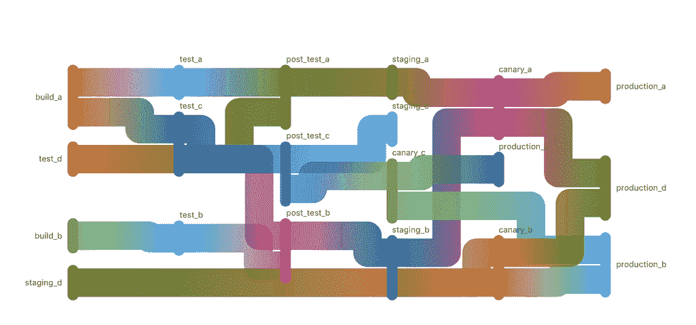
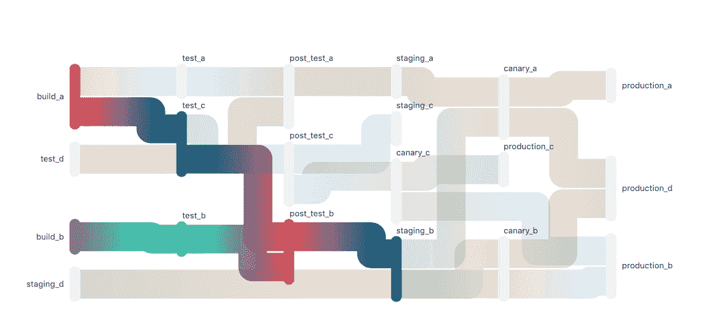

# Directed Acyclic Graph

> 原文：[https://s0docs0gitlab0com.icopy.site/ee/ci/directed_acyclic_graph/](https://s0docs0gitlab0com.icopy.site/ee/ci/directed_acyclic_graph/)

*   [Use cases](#use-cases)
*   [Usage](#usage)
*   [Limitations](#limitations)
*   [DAG Visualization](#dag-visualization)
    *   [Enable or disable DAG Visualization](#enable-or-disable-dag-visualization-core-only)

# Directed Acyclic Graph[](#directed-acyclic-graph "Permalink")

版本历史

*   在 GitLab 12.2 中[引入](https://gitlab.com/gitlab-org/gitlab-foss/-/issues/47063) .
*   在 GitLab 12.10 中[已删除功能标记](https://gitlab.com/gitlab-org/gitlab/-/issues/206902) .

可以在 CI / CD 管道的上下文中使用有[向无环图，](https://www.techopedia.com/definition/5739/directed-acyclic-graph-dag)以建立作业之间的关系，从而以最快的方式执行，而不管如何设置阶段.

例如，您可能拥有特定的工具或单独的网站，这些网站是作为主项目的一部分而构建的. 使用 DAG，您可以指定这些作业之间的关系，然后 GitLab 将尽快执行作业，而不是等待每个阶段完成.

与其他针对 CI / CD 的 DAG 解决方案不同，GitLab 不需要您选择其中一个. 您可以在单个管道中实现 DAG 和传统的基于阶段的操作的混合组合. 配置非常简单，只需一个关键字即可为任何作业启用该功能.

考虑如下的 monorepo：

```
./service_a
./service_b
./service_c
./service_d 
```

它具有如下所示的管道：

| build | test | deploy |
| --- | --- | --- |
| build_a | test_a | deploy_a |
| build_b | test_b | deploy_b |
| build_c | test_c | deploy_c |
| build_d | test_d | deploy_d |

使用 DAG，您可以将`_a`作业与`_b`作业彼此关联，即使服务`a`构建时间很长，服务`b`也不会等待它，并且会尽快完成. 在这个非常相同的管道中， `_c`和`_d`可以单独放置，并且可以像任何普通的 GitLab 管道一样以分段的顺序一起运行.

## Use cases[](#use-cases "Permalink")

DAG 可以帮助解决 CI / CD 管道中作业之间的几种不同类型的关系. 最典型的情况是，当作业需要展开或展开和/或合并回去时（钻石相关性），这可以解决. 当您处理多平台构建或复杂的依赖关系网时，例如在操作系统构建或可独立部署但相关的微服务的复杂部署图中，可能会发生这种情况.

此外，DAG 可以帮助提高管道的总体速度，并有助于提供快速反馈. 通过创建不会相互阻塞的依赖关系，您的管道将尽可能快地运行，而不管管道的阶段如何，从而确保开发人员可以尽快获得输出（包括错误）.

## Usage[](#usage "Permalink")

使用[`needs:`关键字](../yaml/README.html#needs)定义作业之间的关系.

请注意， `needs:`也可与[parallel](../yaml/README.html#parallel)关键字一起使用，从而为管道内的[并行化](../yaml/README.html#parallel)提供了强大的选项.

## Limitations[](#limitations "Permalink")

有向无环图是一个复杂的功能，从最初的 MVC 开始，您可能需要解决某些用例. 想要查询更多的信息：

*   [`needs` requirements and limitations](../yaml/README.html#requirements-and-limitations).
*   相关的史诗[跟踪计划的改进](https://gitlab.com/groups/gitlab-org/-/epics/1716) .

## DAG Visualization[](#dag-visualization "Permalink")

版本历史

*   在 GitLab 13.1 中作为[Beta 功能](https://about.gitlab.com/handbook/product/#beta) [引入](https://gitlab.com/gitlab-org/gitlab/-/issues/215517) .
*   它部署在功能标记后面，默认情况下处于禁用状态.
*   [默认情况下](https://gitlab.com/gitlab-org/gitlab/-/merge_requests/36802)在 13.2 中[启用](https://gitlab.com/gitlab-org/gitlab/-/merge_requests/36802) .
*   在 GitLab.com 上启用了它.
*   对于 GitLab 自我管理的实例，GitLab 管理员可以选择[禁用它](#enable-or-disable-dag-visualization-core-only) .

通过 DAG 可视化，可以更轻松地可视化 DAG 中依赖作业之间的关系. 此图将显示管道中需要或其他作业需要的所有作业. 没有关系的作业不会显示在该视图中.

[](img/dag_graph_example_v13_1.png)

单击节点将突出显示其依赖的所有作业路径.

[](img/dag_graph_example_clicked_v13_1.png)

### Enable or disable DAG Visualization[](#enable-or-disable-dag-visualization-core-only "Permalink")

DAG 可视化正在开发中，但已作为 Beta 功能提供，因此用户可以检查其限制和用途.

它部署在**默认情况下启用**的功能标志的后面. [有权访问 GitLab Rails 控制台的 GitLab 管理员](../../administration/feature_flags.html)可以选择为您的实例禁用它：

```
# Instance-wide
Feature.disable(:dag_pipeline_tab)
# or by project
Feature.disable(:dag_pipeline_tab, Project.find(<project id>)) 
```