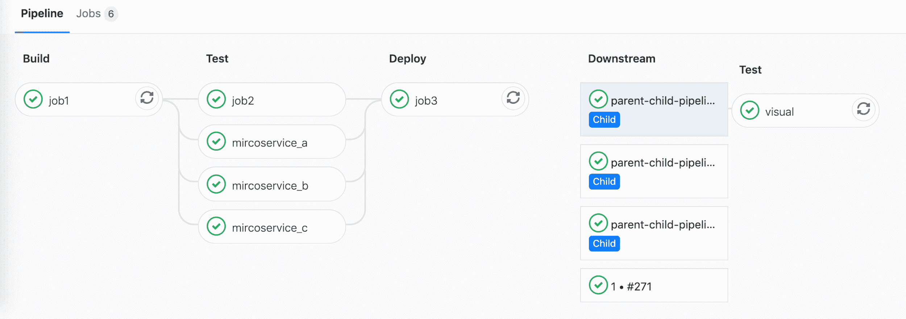

# Parent-child pipelines

> 原文：[https://s0docs0gitlab0com.icopy.site/ee/ci/parent_child_pipelines.html](https://s0docs0gitlab0com.icopy.site/ee/ci/parent_child_pipelines.html)

*   [Examples](#examples)
*   [Merge Request child pipelines](#merge-request-child-pipelines)
*   [Dynamic child pipelines](#dynamic-child-pipelines)
*   [Limitations](#limitations)

# Parent-child pipelines[](#parent-child-pipelines "Permalink")

在 GitLab 12.7 中[引入](https://gitlab.com/gitlab-org/gitlab/-/issues/16094) .

随着管道变得越来越复杂，一些相关的问题开始出现：

*   分阶段的结构（其中一个阶段的所有步骤必须在下一阶段的第一个作业开始之前完成）会导致任意等待，从而使事情变慢.
*   单个全局管道的配置变得非常漫长和复杂，使其难以管理.
*   使用[`include`](yaml/README.html#include)导入会增加配置的复杂性，并可能在无意间复制作业的情况下发生名称空间冲突.
*   如此多的工作和阶段可以使流水线用户体验变得笨拙.

此外，有时管道的行为需要更动态. 选择启动（或不启动）子管道的功能是一项强大的功能，尤其是在动态生成 YAML 的情况下.

[](img/parent_pipeline_graph_expanded_v12_6.png)

与[多项目管道](multi_project_pipelines.html)类似，管道可以触发一组同时运行的子管道，但是在同一项目中：

*   子管道仍按阶段顺序执行其每个作业，但可以自由地继续执行各个阶段，而不必等待父管道中无关的作业完成.
*   该配置分为较小的子管道配置，这些子管道配置更易于理解. 这减少了理解整体配置的认知负担.
*   导入在子管道级别进行，从而减少了发生冲突的可能性.
*   每个管道只有相关的步骤，因此更容易理解正在发生的事情.

子管道可与其他 GitLab CI / CD 功能配合使用：

*   [`only: changes`](yaml/README.html#onlychangesexceptchanges)仅在某些文件更改时才触发管道. 例如，这对于 monorepos 很有用.
*   由于`.gitlab-ci.yml`的父管道和子管道都像普通管道一样运行，因此它们可以具有自己的行为和与触发器相关的顺序.

所有这些都将与[`include:`](yaml/README.html#include)功能一起使用，因此您可以组成子管道配置.

有关概述，请参见[父子管道功能演示](https://youtu.be/n8KpBSqZNbk) .

## Examples[](#examples "Permalink")

最简单的情况是使用本地 YAML 文件定义管道配置来[触发子管道](yaml/README.html#trigger) . 在这种情况下，父管道将触发子管道，并继续运行而无需等待：

```
microservice_a:
  trigger:
    include: path/to/microservice_a.yml 
```

组成子管道时可以包含多个文件：

```
microservice_a:
  trigger:
    include:
      - local: path/to/microservice_a.yml
      - template: SAST.gitlab-ci.yml 
```

**注意：** `trigger:include:`可接受的最大条目数为三.

类似于[多项目管道](multi_project_pipelines.html#mirroring-status-from-triggered-pipeline) ，我们可以在完成时将父管道设置为依赖于子管道的状​​态：

```
microservice_a:
  trigger:
    include:
      - local: path/to/microservice_a.yml
      - template: SAST.gitlab-ci.yml
    strategy: depend 
```

## Merge Request child pipelines[](#merge-request-child-pipelines "Permalink")

要将子管道触发为[合并请求管道，](merge_request_pipelines/index.html)我们需要：

*   将触发器作业设置为在合并请求上运行：

```
# parent .gitlab-ci.yml
microservice_a:
  trigger:
    include: path/to/microservice_a.yml
  rules:
    - if: $CI_MERGE_REQUEST_ID 
```

*   通过以下任一方式配置子管道：

    *   设置子管道中的所有作业以在合并请求的上下文中进行评估：

        ```
        # child path/to/microservice_a.yml
        workflow:
          rules:
            - if: $CI_MERGE_REQUEST_ID

        job1:
          script: ...

        job2:
          script: ... 
        ```

    *   Alternatively, setting the rule per job. For example, to create only `job1` in the context of merge request pipelines:

        ```
        # child path/to/microservice_a.yml
        job1:
          script: ...
          rules:
            - if: $CI_MERGE_REQUEST_ID

        job2:
          script: ... 
        ```

## Dynamic child pipelines[](#dynamic-child-pipelines "Permalink")

在 GitLab 12.9 中[引入](https://gitlab.com/gitlab-org/gitlab/-/issues/35632) .

您可以定义一个作业，该作业运行您自己的脚本来生成 YAML 文件，而不是从静态 YAML 文件运行子管道，然后将其[用于触发子管道](yaml/README.html#trigger-child-pipeline-with-generated-configuration-file) .

该技术在生成针对更改内容的流水线或构建目标和体系结构矩阵方面可能非常强大.

有关概述，请参阅[使用动态生成的配置创建子管道](https://youtu.be/nMdfus2JWHM) .

在 GitLab 12.9 中，在某些情况下可能无法创建子管道，从而导致父管道失败. 这[在 GitLab 12.10 中](https://gitlab.com/gitlab-org/gitlab/-/issues/209070)已[解决](https://gitlab.com/gitlab-org/gitlab/-/issues/209070) .

## Limitations[](#limitations "Permalink")

父管道可以触发许多子管道，但是子管道不能触发其他子管道. 请参阅[相关问题，](https://gitlab.com/gitlab-org/gitlab/-/issues/29651)以获取有关未来可能改进的讨论.