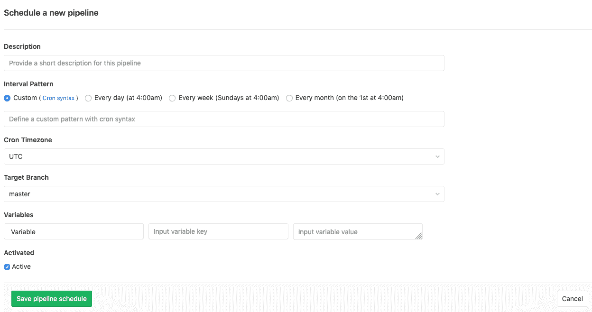

# Pipeline schedules

> 原文：[https://s0docs0gitlab0com.icopy.site/ee/ci/pipelines/schedules.html](https://s0docs0gitlab0com.icopy.site/ee/ci/pipelines/schedules.html)

*   [Prerequisites](#prerequisites)
*   [Configuring pipeline schedules](#configuring-pipeline-schedules)
    *   [Using variables](#using-variables)
    *   [Using only and except](#using-only-and-except)
    *   [Advanced configuration](#advanced-configuration)
*   [Working with scheduled pipelines](#working-with-scheduled-pipelines)
    *   [Running manually](#running-manually)
    *   [Taking ownership](#taking-ownership)

# Pipeline schedules[](#pipeline-schedules "Permalink")

版本历史

*   在 GitLab 9.1 中作为[触发计划](https://gitlab.com/gitlab-org/gitlab-foss/-/merge_requests/10533)引入.
*   在 GitLab 9.2 中[重命名为 Pipeline Schedule](https://gitlab.com/gitlab-org/gitlab-foss/-/merge_requests/10853) .

**注意：** Cron 表示法由[Fugit](https://github.com/floraison/fugit)解析.

管道通常是在满足某些条件的情况下运行的. 例如，将分支推送到存储库时.

管道计划可以用于以特定间隔运行[管道](index.html) . 例如：

*   每个月的 22 号都有特定的分支机构.
*   每天一次.

除了使用 GitLab UI 外，还可以使用[Pipeline schedules API](../../api/pipeline_schedules.html)维护[管道时间表](../../api/pipeline_schedules.html) .

## Prerequisites[](#prerequisites "Permalink")

为了成功创建计划的管道：

*   计划所有者必须具有合并到目标分支的[权限](../../user/permissions.html) .
*   管道配置必须有效.

否则，不会创建管道.

## Configuring pipeline schedules[](#configuring-pipeline-schedules "Permalink")

计划项目的管道：

1.  导航到项目的**CI / CD>计划**页面.
2.  单击**新建计划**按钮.
3.  填写**计划表中的新管道**表单.
4.  单击**保存管道计划**按钮.

[](img/pipeline_schedules_new_form.png)

**注意：**管道执行[时间取决于](#advanced-configuration) Sidekiq 自己的时间表.

在" **计划**索引"页面中，您可以看到计划运行的管道的列表. 下次运行由安装了 GitLab 的服务器自动计算.

[](img/pipeline_schedules_list.png)

### Using variables[](#using-variables "Permalink")

在 GitLab 9.4 中[引入](https://gitlab.com/gitlab-org/gitlab-foss/-/merge_requests/12328) .

您可以传递任意数量的任意变量，它们将在 GitLab CI / CD 中可用，以便可以在您的[`.gitlab-ci.yml`文件中使用](../../ci/yaml/README.html) .

[](img/pipeline_schedule_variables.png)

### Using only and except[](#using-only-and-except "Permalink")

要配置仅在计划了管道（或相反）时才可以执行作业，您只能使用[且](../yaml/README.html#onlyexcept-basic)不能使用配置关键字.

For example:

```
job:on-schedule:
  only:
    - schedules
  script:
    - make world

job:
  except:
    - schedules
  script:
    - make build 
```

### Advanced configuration[](#advanced-configuration "Permalink")

管道不会完全按计划执行，因为计划由 Sidekiq 处理，Sidekiq 根据其间隔运行.

例如，如果满足以下条件，则每天只会创建两个管道：

*   您设置时间表以每分钟（ `* * * * *` ）创建一条管道.
*   Sidekiq 工作者每天在 00:00 和 12:00（ `0 */12 * * *` ）运行.

更改 Sidekiq 工作人员的频率：

1.  在实例的`gitlab.rb`文件中编辑`gitlab_rails['pipeline_schedule_worker_cron']`值.
2.  [重新配置 GitLab，](../../administration/restart_gitlab.html#omnibus-gitlab-reconfigure)以使更改生效.

对于 GitLab.com，请参阅[专用设置页面](../../user/gitlab_com/index.html#gitlab-cicd) .

## Working with scheduled pipelines[](#working-with-scheduled-pipelines "Permalink")

配置完成后，GitLab 将支持许多用于计划管道的功能.

### Running manually[](#running-manually "Permalink")

在 GitLab 10.4 中[引入](https://gitlab.com/gitlab-org/gitlab-foss/-/merge_requests/15700) .

要手动触发管道计划，请单击"播放"按钮：

[](img/pipeline_schedule_play.png)

这将安排一个后台作业来运行管道计划. 一条简短消息将提供指向 CI / CD 管道索引页面的链接.

**注意：**为避免滥用，限制了用户每分钟触发一次管道的速率.

### Taking ownership[](#taking-ownership "Permalink")

管道以拥有日程表的用户身份执行. 这影响管道可以访问哪些项目和其他资源.

如果用户不拥有管道，则可以通过单击" **获取所有权"**按钮**获取所有权** . 下次计划管道时，将使用您的凭据.

[](img/pipeline_schedules_ownership.png)

如果管道计划的所有者没有能力在目标分支上创建管道，则该计划将停止创建新管道.

例如，如果发生这种情况：

*   所有者被阻止或从项目中删除.
*   目标分支或标签受保护.

在这种情况下，具有足够特权的人必须拥有日程表的所有权.