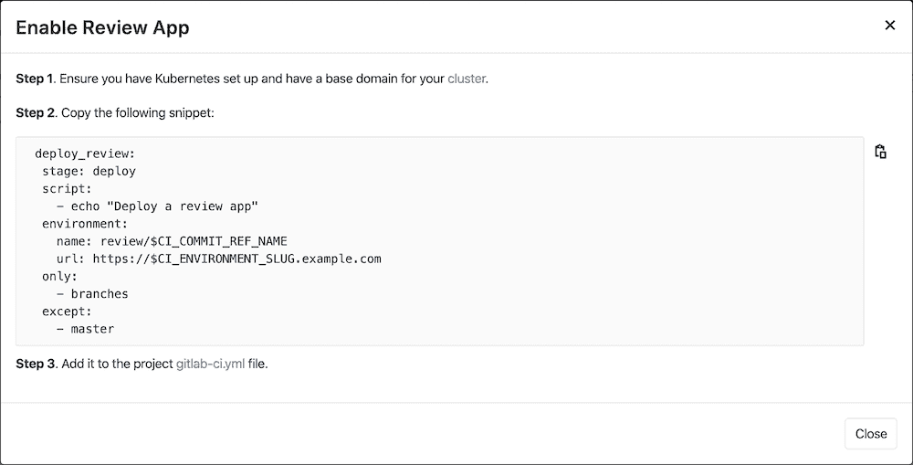
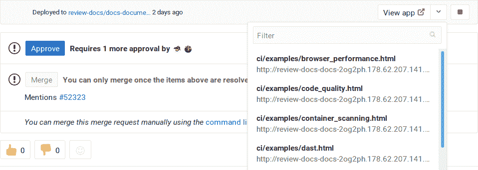
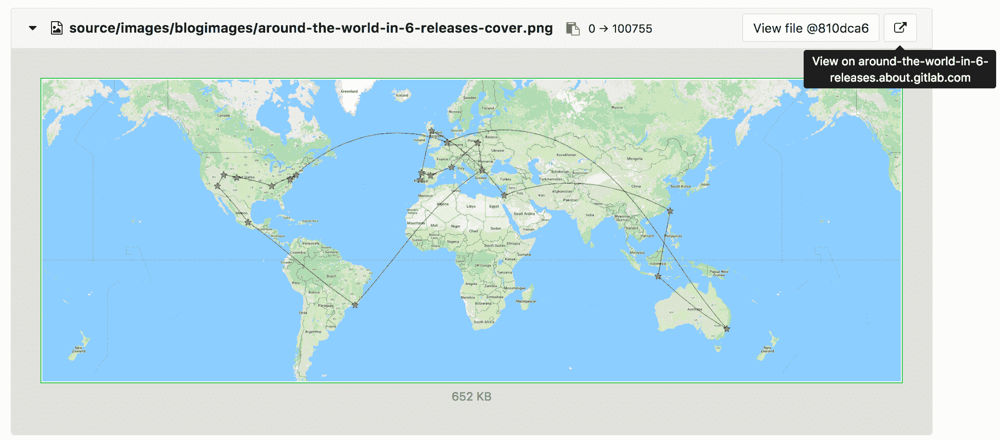
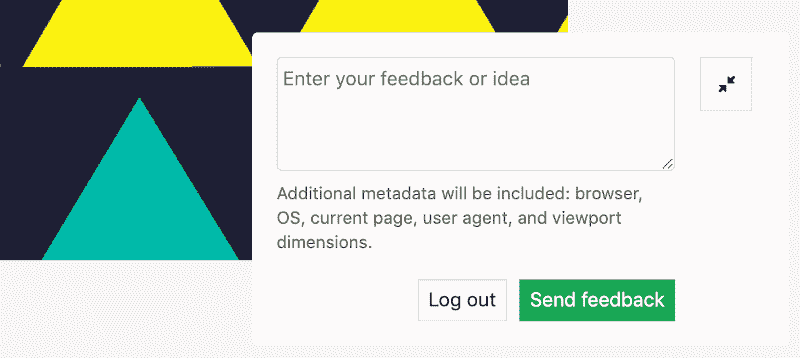

# Review Apps

> 原文：[https://s0docs0gitlab0com.icopy.site/ee/ci/review_apps/](https://s0docs0gitlab0com.icopy.site/ee/ci/review_apps/)

*   [Introduction](#introduction)
*   [How Review Apps work](#how-review-apps-work)
*   [Configuring Review Apps](#configuring-review-apps)
    *   [Enable Review Apps button](#enable-review-apps-button)
*   [Review Apps auto-stop](#review-apps-auto-stop)
*   [Review Apps examples](#review-apps-examples)
*   [Route Maps](#route-maps)
    *   [Route Maps example](#route-maps-example)
*   [Visual Reviews](#visual-reviews-starter)
    *   [Configuring Visual Reviews](#configuring-visual-reviews)
    *   [Determining merge request ID](#determining-merge-request-id)
    *   [Visual Reviews in private or internal projects](#visual-reviews-in-private-or-internal-projects)
    *   [Using Visual Reviews](#using-visual-reviews)
*   [Limitations](#limitations)

# Review Apps[](#review-apps "Permalink")

版本历史

*   在 GitLab 8.12 中[引入](https://gitlab.com/gitlab-org/gitlab-foss/-/issues/21971) . 在 GitLab 8.13 和 8.14 中进行了进一步添加.
*   受到[Heroku 的 Review Apps 的](https://devcenter.heroku.com/articles/github-integration-review-apps)启发，该[应用程序](https://devcenter.heroku.com/articles/github-integration-review-apps)本身也受到[Fourchette 的](https://github.com/rainforestapp/fourchette)启发.

Review Apps 是一种协作工具，可消除提供展示产品更改环境的艰苦工作.

## Introduction[](#introduction "Permalink")

查看应用程序：

*   通过为合并请求扩展动态环境，提供功能分支中所做更改的自动实时预览.
*   允许设计人员和产品经理查看您的更改，而无需检出分支机构并在沙盒环境中运行您的更改.
*   与[GitLab DevOps LifeCycle](../../README.html#the-entire-devops-lifecycle)完全集成.
*   允许您将更改部署到任何地方.

[](img/continuous-delivery-review-apps.svg)

在上面的示例中：

*   每次将提交推送到`topic branch`时，都会构建一个 Review App.
*   审阅者在通过第三次审阅之前未通过两次审阅.
*   审核通过后， `topic branch`将合并到`master` `topic branch`中，并在该`topic branch`中进行部署.
*   在阶段中获得批准后，已合并到`master`中的更改将部署到生产中.

## How Review Apps work[](#how-review-apps-work "Permalink")

Review App 是分支与[环境](../environments/index.html)的映射. 通过与分支相关的[合并请求](../../user/project/merge_requests.html)上的链接，可以访问 Review App.

以下是动态设置环境的合并请求的示例.

[](img/review_apps_preview_in_mr.png)

在此示例中，分支为：

*   成功建立.
*   通过单击" **查看应用程序"**按钮可以到达的动态环境中进行部署.

将 Review Apps 添加到您的工作流后，您将遵循分支的 Git 流. 那是：

1.  推送一个分支，让 Runner 根据动态环境作业的`script`定义部署 Review App.
2.  等待 Runner 构建和部署您的 Web 应用程序.
3.  单击合并请求中与分支相关的链接，以实时查看更改.

## Configuring Review Apps[](#configuring-review-apps "Permalink")

Review Apps 建立在[动态环境上](../environments/index.html#configuring-dynamic-environments) ，可让您为每个分支动态创建一个新环境.

配置 Review Apps 的过程如下：

1.  设置基础结构以托管和部署 Review Apps（请查看下面的[示例](#review-apps-examples) ）.
2.  [安装](https://s0docs0gitlab0com.icopy.site/runner/install/)并[配置](https://s0docs0gitlab0com.icopy.site/runner/commands/) Runner 以进行部署.
3.  在`.gitlab-ci.yml`中设置一个作业，该作业使用[预定义的 CI 环境变量](../variables/README.html) `${CI_COMMIT_REF_NAME}`创建动态环境并将其限制为仅在分支上运行. 或者，您可以通过为项目[启用审阅应用程序](#enable-review-apps-button)来获得此工作的 YML 模板.
4.  （可选）设置一个作业，以[手动停止](../environments/index.html#stopping-an-environment) Review Apps.

### Enable Review Apps button[](#enable-review-apps-button "Permalink")

在 GitLab 12.8 中[引入](https://gitlab.com/gitlab-org/gitlab/-/issues/118844) .

为项目配置 Review Apps 时，如上所述，您需要向`.gitlab-ci.yml`添加新作业. 为此，如果您正在使用 Kubernetes，则可以单击**Enable Review Apps**按钮，GitLab 会提示您一个模板代码块，您可以将该模板代码块复制并粘贴到`.gitlab-ci.yml`作为起点. 为此：

1.  转到要为其创建 Review App 作业的项目.
2.  从左侧导航栏中，转到**运营** > **环境** .
3.  单击**启用审阅应用程序**按钮. 如果您对该项目具有开发人员或更高[权限，则](../../user/permissions.html)可以使用它.
4.  复制提供的代码段并将其粘贴到您的`.gitlab-ci.yml`文件中：

    [](img/enable_review_app_v12_8.png)

5.  可以根据自己的需要随意调整此模板.

## Review Apps auto-stop[](#review-apps-auto-stop "Permalink")

了解如何在给定的时间段后将[Review Apps 环境配置为过期并自动停止](../environments/index.html#environments-auto-stop) .

## Review Apps examples[](#review-apps-examples "Permalink")

以下是演示 Review App 配置的示例项目：

*   [NGINX](https://gitlab.com/gitlab-examples/review-apps-nginx).
*   [OpenShift](https://gitlab.com/gitlab-examples/review-apps-openshift).

评论应用的其他示例：

*   [Cloud Native Development with GitLab](https://www.youtube.com/watch?v=jfIyQEwrocw).
*   [Review Apps for Android](https://about.gitlab.com/blog/2020/05/06/how-to-create-review-apps-for-android-with-gitlab-fastlane-and-appetize-dot-io/).

## Route Maps[](#route-maps "Permalink")

Introduced in GitLab 8.17\. In GitLab 11.5, the file links are available in the merge request widget.

借助路线图，您可以直接从源文件进入为 Review Apps 定义的[环境中的](../environments/index.html)公共页面.

设置完成后，合并请求小部件中的审阅应用程序链接可以直接将您带到更改的页面，从而使预览建议的修改变得更加轻松快捷.

配置路由图涉及到告诉 GitLab 使用路由图如何将存储库中文件的路径映射到网站上的页面路径. 设置后，GitLab 将**在" ..."**按钮**上**显示" **视图"** ，这将带您进入直接从合并请求更改的页面.

要设置路线图，请在资源库中的`.gitlab/route-map.yml`添加一个文件，其中包含一个 YAML 数组，该数组将`source`路径（资源库中）映射到`public`路径（网站上）.

### Route Maps example[](#route-maps-example "Permalink")

以下是[Middleman](https://middlemanapp.com)路线图的示例， [Middleman](https://middlemanapp.com)是用于构建[GitLab 网站](https://about.gitlab.com)的静态站点生成器（SSG），是从其[在 GitLab.com 上的项目](https://gitlab.com/gitlab-com/www-gitlab-com)部署的：

```
# Team data
- source: 'data/team.yml' # data/team.yml
  public: 'team/' # team/

# Blogposts
- source: /source\/posts\/([0-9]{4})-([0-9]{2})-([0-9]{2})-(.+?)\..*/ # source/posts/2017-01-30-around-the-world-in-6-releases.html.md.erb
  public: '\1/\2/\3/\4/' # 2017/01/30/around-the-world-in-6-releases/

# HTML files
- source: /source\/(.+?\.html).*/ # source/index.html.haml
  public: '\1' # index.html

# Other files
- source: /source\/(.*)/ # source/images/blogimages/around-the-world-in-6-releases-cover.png
  public: '\1' # images/blogimages/around-the-world-in-6-releases-cover.png 
```

映射定义为根 YAML 数组中的条目，并以`-`前缀标识. 在一个条目中，有一个带有两个键的哈希映射：

*   `source`
    *   完全匹配的字符串，以`'`开头和结尾.
    *   正则表达式，以`/`开头和结尾，用于模式匹配：
        *   正则表达式需要匹配整个源路径-隐含`^`和`$`锚.
        *   可以包括由`()`表示的捕获组，这些捕获组可以在`public`路径中引用.
        *   斜杠（ `/` ）可以但不必转为`\/` .
        *   文字句号（ `.` ）应转为`\.` .
*   `public` ，一个以`'`开头和结尾的字符串.
    *   可以包含`\N`表达式，从`source`正则表达式开始，以其出现的顺序引用捕获组，从`\1`开始.

通过找到与之匹配的第一个`source`表达式，然后返回相应的`public`路径，并用`()`捕获组的值替换`\N`表达式，来确定源路径的`public`路径.

在上面的示例中，按照定义顺序对映射进行求值的事实用于确保`source/index.html.haml`将匹配`/source\/(.+?\.html).*/`而不是`/source\/(.*)/` ，并将导致`index.html`的公共路径，而不是`index.html.haml` .

设置路由映射后，它将在以下位置生效：

*   在合并请求小部件中. 该：
    *   **"查看应用程序"**按钮将带您进入`.gitlab-ci.yml`设置的环境 URL.
    *   下拉菜单将列出路线图中的前 5 个匹配项，但如果有 5 个以上可用项，则可以对其进行过滤.

        [](img/view_on_mr_widget.png)

*   在差异中进行合并请求，比较或提交.

    [](img/view_on_env_mr.png)

*   在 Blob 文件视图中.

    [](img/view_on_env_blob.png)

## Visual Reviews[](#visual-reviews-starter "Permalink")

[Introduced](https://gitlab.com/gitlab-org/gitlab/-/issues/10761) in GitLab Starter 12.0.

使用视觉评论，您可以向您的评论应用程序提供反馈表单，以便评论者可以将评论直接从应用程序发布回产生评论应用程序的合并请求.

### Configuring Visual Reviews[](#configuring-visual-reviews "Permalink")

确保启用了`anonymous_visual_review_feedback`功能标志. 管理员可以使用 Rails 控制台启用，如下所示：

```
Feature.enable(:anonymous_visual_review_feedback) 
```

反馈表单是通过您添加到 Review App 中页面的脚本提供的. 如果您拥有该项目的[开发人员权限](../../user/permissions.html) ，则可以通过单击合并请求的" **管道"**部分中的" **查看"**按钮来访问它. 如果在项目中配置了[路线图，](#route-maps)则表格模式还将显示更改页面的下拉列表.

[](img/review_button.png)

提供的脚本应添加到应用程序的`<head>`中，并由一些项目和合并请求特定的值组成. 看起来是这样的：

```
<script data-project-id='11790219'
  data-merge-request-id='1'
  data-mr-url='https://gitlab.example.com'
  data-project-path='sarah/review-app-tester'
  data-require-auth='true'
  id='review-app-toolbar-script'
  src='https://gitlab.example.com/assets/webpack/visual_review_toolbar.js'>
</script> 
```

理想情况下，创建每个审阅应用程序时，应在运行时使用[环境变量](../variables/predefined_variables.html)替换这些值：

*   `data-project-id`是项目 ID，可通过`CI_PROJECT_ID`变量找到.
*   `data-merge-request-id`是合并请求 ID，可以通过`CI_MERGE_REQUEST_IID`变量找到它. `CI_MERGE_REQUEST_IID`仅当[`only: [merge_requests]`](../merge_request_pipelines/index.html)被使用并且在创建合并请求.
*   `data-mr-url`是 GitLab 实例的 URL，并且对于所有评论应用程序都是相同的.
*   `data-project-path`是项目的路径，可以通过`CI_PROJECT_PATH`找到.
*   `data-require-auth`对于公共项目是可选的，但对于[私有和内部](#visual-reviews-in-private-or-internal-projects)项目则是必需[的](#visual-reviews-in-private-or-internal-projects) . 如果将其设置为`true` ，则将要求用户输入其[个人访问令牌，](../../user/profile/personal_access_tokens.html)而不是其名称和电子邮件.
*   `id`始终是`review-app-toolbar-script` ，您无需更改它.
*   `src`是审阅工具栏脚本的源代码，该脚本位于相应的 GitLab 实例中，并且对于所有审阅应用程序都是相同的.

例如，在 Ruby 应用程序中，您需要具有以下脚本：

```
<script data-project-id="ENV['CI_PROJECT_ID']"
  data-merge-request-id="ENV['CI_MERGE_REQUEST_IID']"
  data-mr-url='https://gitlab.example.com'
  data-project-path="ENV['CI_PROJECT_PATH']"
  id='review-app-toolbar-script'
  src='https://gitlab.example.com/assets/webpack/visual_review_toolbar.js'>
</script> 
```

然后，当通过 GitLab CI / CD 部署您的应用程序时，这些变量应替换为其实际值.

### Determining merge request ID[](#determining-merge-request-id "Permalink")

视觉审核工具从`script` HTML 标签中包含的`data-merge-request-id`数据属性中检索合并请求 ID，该`script` HTML 标签用于将视觉审核工具添加到您的审核应用中.

确定合并请求以链接到可视评论应用程序的 ID 后，您可以通过以下任一方式提供 ID：

*   通过应用程序的数据属性`data-merge-request-id`在 script 标签中对其进行硬编码.
*   在应用程序的构建过程中动态添加`data-merge-request-id`值.
*   通过应用中的视觉查看表单手动提供.

### Visual Reviews in private or internal projects[](#visual-reviews-in-private-or-internal-projects "Permalink")

在 GitLab 12.10 中[引入](https://gitlab.com/gitlab-org/gitlab/-/issues/42750#note_317271120) .

要对私有项目和内部项目启用可视化审阅，请将[`data-require-auth`变量设置](#configuring-visual-reviews)为`true` . 启用后，用户必须输入具有`api`范围的[个人访问令牌](../../user/profile/personal_access_tokens.html) ，然后才能提交反馈.

### Using Visual Reviews[](#using-visual-reviews "Permalink")

在为"评论"应用程序[启用](#configuring-visual-reviews) "视觉评论"后，"视觉评论"反馈表单将覆盖在应用程序页面的右下角.

[](img/toolbar_feeback_form.png)

要使用反馈表：

1.  对视觉评论发表评论. 您可以使用合并请求注释中所有可用的[Markdown 注释](../../user/markdown.html) .
2.  如果`data-require-auth`为`true` ，则必须输入[个人访问令牌](../../user/profile/personal_access_tokens.html) . 否则，您必须输入您的姓名，以及可选的电子邮件地址.
3.  最后，点击**发送反馈** .

在视觉检查框中做出评论并提交评论后，评论将自动出现在相应的合并请求中.

## Limitations[](#limitations "Permalink")

Review App 限制与[环境限制](../environments/index.html#limitations)相同.