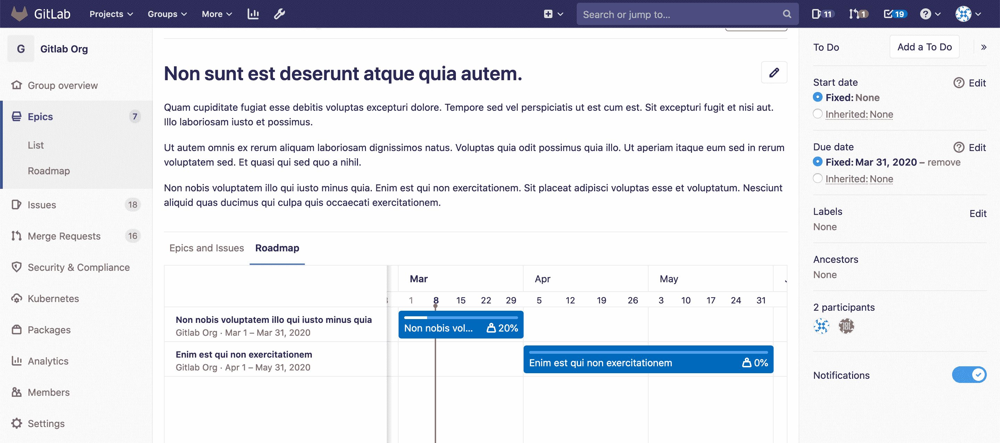
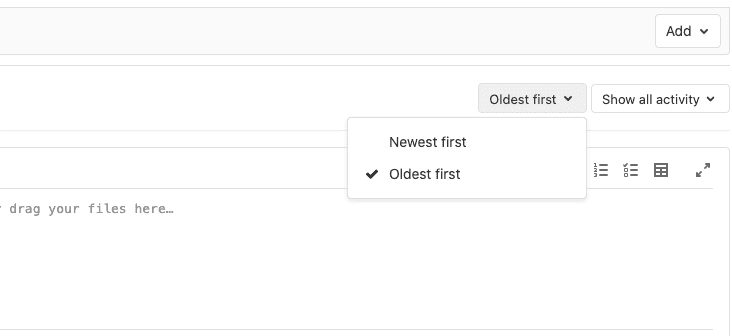

# Epics

> 原文：[https://s0docs0gitlab0com.icopy.site/ee/user/group/epics/](https://s0docs0gitlab0com.icopy.site/ee/user/group/epics/)

*   [Use cases](#use-cases)
*   [Manage epics](#manage-epics)
*   [Relationships between epics and issues](#relationships-between-epics-and-issues)
*   [Issue health status in Epic tree](#issue-health-status-in-epic-tree-ultimate)
    *   [Disable Issue health status in Epic tree](#disable-issue-health-status-in-epic-tree)
*   [Multi-level child epics](#multi-level-child-epics-ultimate)
*   [Start date and due date](#start-date-and-due-date)
    *   [From milestones](#from-milestones)
    *   [Inherited](#inherited)
*   [Roadmap in epics](#roadmap-in-epics)
*   [Permissions](#permissions)
*   [Thread](#thread)
*   [Comment or start a thread](#comment-or-start-a-thread)
    *   [Activity sort order](#activity-sort-order)
*   [Award emoji](#award-emoji)
*   [Notifications](#notifications)

# Epics

版本历史

*   在[GitLab Ultimate](https://about.gitlab.com/pricing/) 10.2 中引入.
*   单级史诗在 12.8 [中移至](https://gitlab.com/gitlab-org/gitlab/-/issues/37081) [GitLab Premium](https://about.gitlab.com/pricing/) .

Epics 通过跟踪跨项目和里程碑共享主题的问题组，使您可以更有效，更轻松地管理项目组合.

## Use cases

*   假设您的团队正在研究一项大型功能，其中涉及在一个[小组](../index.html)内不同项目中创建的不同问题的多个讨论. 借助 Epics，您可以跟踪所有有助于该单一功能的相关活动.
*   跟踪何时针对该组问题开始工作，以及何时结束目标工作.
*   深入讨论和协作功能思想和范围.

## Manage epics

要了解您可以使用史诗功能，请参阅[管理史诗](manage_epics.html) . 可能的动作包括：

*   [Create an epic](manage_epics.html#create-an-epic)
*   [Bulk-edit epics](../bulk_editing/index.html#bulk-edit-epics)
*   [Delete an epic](manage_epics.html#delete-an-epic)
*   [Close an epic](manage_epics.html#close-an-epic)
*   [Reopen a closed epic](manage_epics.html#reopen-a-closed-epic)
*   [Go to an epic from an issue](manage_epics.html#go-to-an-epic-from-an-issue)
*   [Search for an epic from epics list page](manage_epics.html#search-for-an-epic-from-epics-list-page)
*   [Make an epic confidential](manage_epics.html#make-an-epic-confidential)
*   [Manage issues assigned to an epic](manage_epics.html#manage-issues-assigned-to-an-epic)
*   [Manage multi-level child epics](manage_epics.html#manage-multi-level-child-epics-ultimate)

## Relationships between epics and issues

史诗与问题之间的可能关系是：

*   史诗是一个或多个问题的父代.
*   史诗是一个或多个子史诗的父代. 有关详细信息，请参见[多级子史诗](#multi-level-child-epics-ultimate) .

图 TD Parent_epic-> Issue1 Parent_epic-> Child_epic Child_epic-> Issue2

请参阅[管理分配给史诗](manage_epics.html#manage-issues-assigned-to-an-epic)的问题以获取将事件添加到史诗，重新排序问题，在史诗之间移动问题或将问题升级到史诗的步骤.

## Issue health status in Epic tree

[Introduced](https://gitlab.com/gitlab-org/gitlab/-/issues/199184) in [GitLab Ultimate](https://about.gitlab.com/pricing/) 12.10.

您可以通过在问题上设置红色，琥珀色或绿色的[健康状态](../../project/issues/index.html#health-status-ultimate)来报告并快速响应单个问题和史诗的[健康](../../project/issues/index.html#health-status-ultimate) ，该状态将显示在史诗树上.

### Disable Issue health status in Epic tree

此功能带有默认情况下启用的功能标志. 有关禁用它的步骤，请参阅[禁用问题运行状况](../../project/issues/index.html#disable-issue-health-status) .

## Multi-level child epics

在 GitLab Ultimate 11.7 中[引入](https://gitlab.com/gitlab-org/gitlab/-/issues/8333) .

属于父史诗组的一个组或子组的任何史诗都可以添加. 新的儿童史诗出现在" **史诗和问题"**选项卡中史诗列表的顶部.

当您添加已链接到父级史诗的史诗时，到其当前父级的链接将被删除.

An epic can have multiple child epics up to the maximum depth of five.

请参阅[管理多级子级史诗](manage_epics.html#manage-multi-level-child-epics-ultimate) ，以了解创建，移动，重新排序或删除子[级史诗](manage_epics.html#manage-multi-level-child-epics-ultimate)的步骤.

## Start date and due date

要设置史诗的**开始日期**和**截止日期** ，请选择以下选项之一：

*   **固定** ：输入固定值.
*   **从里程碑** ：从当前分配给史诗问题的里程碑继承动态值. 请注意，GitLab 12.5 用**Inherited**替换了此选项.
*   **继承** ：从史诗的问题，子史诗和里程碑继承动态值（在 GitLab 12.5 中[引入](https://gitlab.com/gitlab-org/gitlab/-/issues/7332) ，以代替**From 里程碑** ）.

### From milestones

> 在 GitLab 12.5 中由**Inherited** [取代](https://gitlab.com/gitlab-org/gitlab/-/issues/7332) .

如果您选择" **从里程碑**开始"作为开始日期，则 GitLab 会自动将日期设置为当前分配给添加到史诗中的问题的所有里程碑中最早的开始日期. 同样，如果您选择" **从里程碑** "作为截止日期，则 GitLab 会将其设置为当前分配给这些问题的所有里程碑中的最新截止日期.

这些是动态日期，如果发生以下任何情况，将重新计算这些日期：

*   将里程碑重新分配给这些问题.
*   里程碑日期更改.
*   从史诗中添加或删除问题.

### Inherited

在 GitLab 12.5 中[引入](https://gitlab.com/gitlab-org/gitlab/-/issues/7332)以替换**From 里程碑** .

如果选择：

*   GitLab **继承**了开始日期，它将扫描所有子史诗和分配给该史诗的问题，并将开始日期设置为与找到的最早开始日期或里程碑相匹配.
*   GitLab **继承**了截止日期，它将设置截止日期以匹配在其子史诗和问题中发现的最新截止日期或里程碑.

这些是动态日期，如果发生以下任何情况，则重新计算：

*   儿童史诗的日期发生了变化.
*   将里程碑重新分配给问题.
*   里程碑的日期会更改.
*   问题被添加到史诗中或从史诗中删除.

由于史诗的日期可以从其子级继承日期，因此开始日期和到期日期从底部传播到顶部. 如果最低级别的子级史诗的开始日期发生更改（成为其父级史诗最早的开始日期），则父级史诗的开始日期将反映该更改，并将向上传播到顶部的史诗级.

## Roadmap in epics

[Introduced](https://gitlab.com/gitlab-org/gitlab/-/issues/7327) in [GitLab Ultimate](https://about.gitlab.com/pricing/) 11.10.

如果你的史诗包含一个或多个[孩子史诗](#multi-level-child-epics-ultimate)其中有一个[开始或到期日](#start-date-and-due-date) ，一个[路线图，](../roadmap/index.html)孩子史诗的观点是父史诗中列出.

## Permissions

如果您有权查看史诗，并且有权查看已添加到该史诗的问题，则可以在史诗问题列表中查看该问题.

如果您有权编辑史诗并且有权编辑问题，则可以将问题添加到史诗中或从史诗中删除.

请注意，对于给定的组，所有项目的可见性必须与该组相同，或限制较少. 这意味着，如果您有权访问某个小组的史诗，那么您已经可以访问该小组的项目.

您也可以查阅[组权限表](../../permissions.html#group-members-permissions) .

## Thread

*   评论：通过在该史诗中的评论中发布评论来协作. 这些文本字段也完全支持[GitLab Flavored Markdown](../../markdown.html#gitlab-flavored-markdown-gfm) .

## Comment or start a thread

写下评论后，您可以：

*   点击**评论** ，您的评论将被发布.
*   单击" **开始主题"** ，您将在该史诗般的讨论中开始一个主题.

### Activity sort order

[Introduced](https://https://gitlab.com/gitlab-org/gitlab/-/issues/214364) in [GitLab Premium](https://about.gitlab.com/pricing/) 13.2.

您可以颠倒默认顺序，并与按顶部的最新项目排序的活动供稿进行交互. 您的首选项通过本地存储保存，并自动应用于您查看的每个问题.

要更改活动排序顺序，请单击**最旧的第一个**下拉菜单，然后选择最旧或最新的项目以首先显示.

## Award emoji

您可以为该史诗或其评论[授予表情符号](../../award_emojis.html) .

## Notifications

您可以[打开通知](../../profile/notifications.html)以[通知](../../profile/notifications.html)史诗事件.