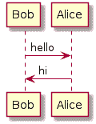

# PlantUML & GitLab

> 原文：[https://s0docs0gitlab0com.icopy.site/ee/administration/integration/plantuml.html](https://s0docs0gitlab0com.icopy.site/ee/administration/integration/plantuml.html)

*   [PlantUML Server](#plantuml-server)
    *   [Docker](#docker)
    *   [Debian/Ubuntu](#debianubuntu)
    *   [Making local PlantUML accessible using custom GitLab setup](#making-local-plantuml-accessible-using-custom-gitlab-setup)
    *   [Security](#security)
*   [GitLab](#gitlab)
*   [Creating Diagrams](#creating-diagrams)

# PlantUML & GitLab[](#plantuml--gitlab "Permalink")

在 GitLab 8.16 中[引入](https://gitlab.com/gitlab-org/gitlab-foss/-/merge_requests/8537) .

在 GitLab 中启用并配置[PlantUML](https://plantuml.com)集成后，我们便能够在片段，Wiki 和存储库中创建的 AsciiDoc 和 Markdown 文档中创建简单的图表.

## PlantUML Server[](#plantuml-server "Permalink")

在 GitLab 中启用 PlantUML 之前； 您需要设置自己的 PlantUML 服务器以生成图表.

### Docker[](#docker "Permalink")

使用 Docker，您可以仅运行如下容器：

```
docker run -d --name plantuml -p 8080:8080 plantuml/plantuml-server:tomcat 
```

**PlantUML URL**将是运行容器的服务器的主机名.

在 Docker 中运行 GitLab 时，它将需要有权访问 PlantUML 容器. 最简单的方法是使用[Docker Compose](https://s0docs0docker0com.icopy.site/compose/) .

一个简单`docker-compose.yml`文件将是：

```
version: "3"
services:
  gitlab:
    image: 'gitlab/gitlab-ce:12.2.5-ce.0'
    environment:
      GITLAB_OMNIBUS_CONFIG: |
        nginx['custom_gitlab_server_config'] = "location /-/plantuml/ { \n    proxy_cache off; \n    proxy_pass  http://plantuml:8080/; \n}\n"

  plantuml:
    image: 'plantuml/plantuml-server:tomcat'
    container_name: plantuml 
```

在这种情况下，可以通过 URL `http://plantuml:8080/`访问 GitLab 的`http://plantuml:8080/` .

### Debian/Ubuntu[](#debianubuntu "Permalink")

在使用 Tomcat 的 Debian / Ubuntu 发行版中，安装和配置自己的 PlantUML 服务器非常容易.

首先，您需要从源代码创建一个`plantuml.war`文件：

```
sudo apt-get install graphviz openjdk-8-jdk git-core maven
git clone https://github.com/plantuml/plantuml-server.git
cd plantuml-server
mvn package 
```

上面的命令序列将生成可以使用 Tomcat 部署的 WAR 文件：

```
sudo apt-get install tomcat8
sudo cp target/plantuml.war /var/lib/tomcat8/webapps/plantuml.war
sudo chown tomcat8:tomcat8 /var/lib/tomcat8/webapps/plantuml.war
sudo service tomcat8 restart 
```

Tomcat 服务重新启动后，PlantUML 服务将准备就绪，并在端口 8080 上侦听请求：

```
http://localhost:8080/plantuml 
```

您可以通过编辑`/etc/tomcat8/server.xml`文件来更改这些默认值.

请注意，默认 URL 与使用基于 Docker 的映像时不同，后者在 URL 的根目录中提供服务，而没有相对路径. 相应地调整以下配置.

### Making local PlantUML accessible using custom GitLab setup[](#making-local-plantuml-accessible-using-custom-gitlab-setup "Permalink")

PlantUML 服务器在您的服务器上本地运行，因此无法从外部访问. 因此，有必要捕获外部 PlantUML 调用并将其重定向到本地服务器.

想法是将每次调用`https://gitlab.example.com/-/plantuml/`重定向到本地 PlantUML 服务器`http://plantuml:8080/`或`http://localhost:8080/plantuml/` ，具体取决于您的建立.

要启用重定向，请在`/etc/gitlab/gitlab.rb`添加以下行：

```
# Docker deployment
nginx['custom_gitlab_server_config'] = "location /-/plantuml/ { \n proxy_cache off; \n proxy_pass  http://plantuml:8080/; \n}\n"

# Built from source
nginx['custom_gitlab_server_config'] = "location /-/plantuml { \n rewrite ^/-/(plantuml.*) /$1 break;\n proxy_cache off; \n proxy_pass http://localhost:8080/plantuml; \n}\n" 
```

要激活更改，请运行以下命令：

```
sudo gitlab-ctl reconfigure 
```

### Security[](#security "Permalink")

PlantUML 具有允许获取网络资源的功能.

```
@startuml
start
    ' ...
    !include http://localhost/
stop;
@enduml 
```

**如果您自行托管 PlantUML 服务器，则应放置网络控件以隔离它.**

## GitLab[](#gitlab "Permalink")

您需要从"管理"区域下的"设置"启用 PlantUML 集成. 为此，请使用管理员帐户登录并执行以下操作：

*   在 GitLab 中，转到**管理区域>设置>集成** .
*   展开**PlantUML**部分.
*   Check **启用 PlantUML** checkbox.
*   Set the PlantUML instance as `https://gitlab.example.com/-/plantuml/`.

**注意：**如果使用的是运行 v1.2020.9 及更高版本的 PlantUML 服务器（例如[plantuml.com](https://plantuml.com) ），请设置`PLANTUML_ENCODING`环境变量以启用`deflate`压缩. 在 Omnibus 上，可以在`/etc/gitlab.rb`进行设置：

```
gitlab_rails['env'] = { 'PLANTUML_ENCODING' => 'deflate' } 
```

从 GitLab 13.1 和更高版本开始，PlantUML 集成现在[需要 URL 中的标头前缀](https://github.com/plantuml/plantuml/issues/117#issuecomment-6235450160)来区分不同的编码类型.

## Creating Diagrams[](#creating-diagrams "Permalink")

启用并配置 PlantUML 集成后，我们可以开始使用分隔的块向我们的 AsciiDoc 代码片段，Wiki 和存储库添加图表：

*   **Markdown**

    ```
    ```plantuml Bob -> Alice : hello
    Alice -> Bob : hi
    ``` 
    ```

*   **AsciiDoc**

    ```
    [plantuml, format="png", id="myDiagram", width="200px"]
    ----
    Bob->Alice : hello
    Alice -> Bob : hi
    ---- 
    ```

*   **reStructuredText**

    ```
    .. plantuml::
       :caption: Caption with **bold** and *italic*

       Bob -> Alice: hello
       Alice -> Bob: hi 
    ```

    您也可以使用`uml::`指令与[`sphinxcontrib-plantuml`](https://s0pypi0org.icopy.site/project/sphinxcontrib-plantuml/)兼容，但是请注意，我们目前仅支持`caption`选项.

上面的块将被转换为 HTML 图像标签，其源指向 PlantUML 实例. 如果已正确配置 PlantUML 服务器，则应呈现一个不错的图而不是块：



在块内，您可以通过 PlantUML 添加任何受支持的图，例如[Sequence](https://plantuml.com/sequence-diagram) ， [Use Case](https://plantuml.com/use-case-diagram) ， [Class](https://plantuml.com/class-diagram) ， [Activity](https://plantuml.com/activity-diagram-legacy) ， [Component](https://plantuml.com/component-diagram) ， [State](https://plantuml.com/state-diagram)和[Object](https://plantuml.com/object-diagram)图. 您不需要使用 PlantUML 图定界符`@startuml` / `@enduml`因为它们已被 AsciiDoc `plantuml`块替换.

可以将一些参数添加到 AsciiDoc 块定义中：

*   `format` ：可以是`png`或`svg` . 请注意，并非所有浏览器都支持`svg` ，因此请谨慎使用. 默认值为`png` .
*   `id` ：添加到图 HTML 标记的 CSS ID.
*   `width` ：宽度属性添加到图像标签.
*   `height` ：高度属性添加到图像标签.

Markdown 不支持任何参数，并且将始终使用 PNG 格式.