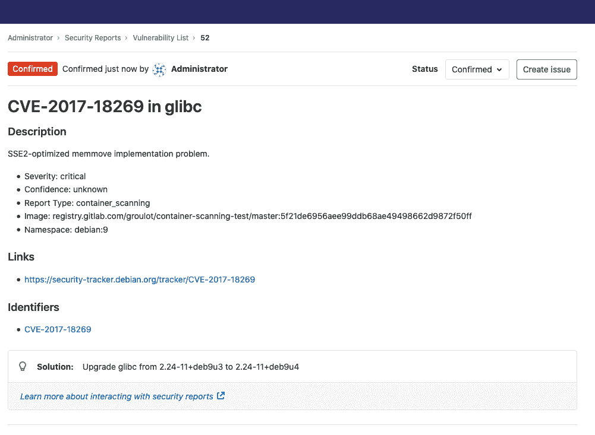
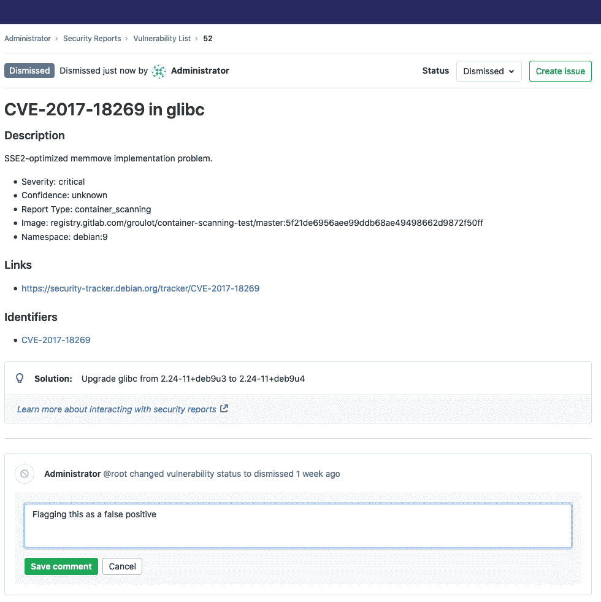
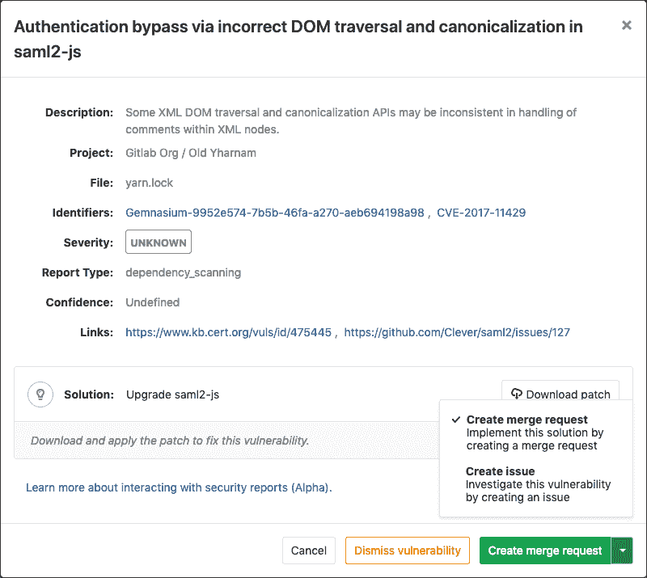
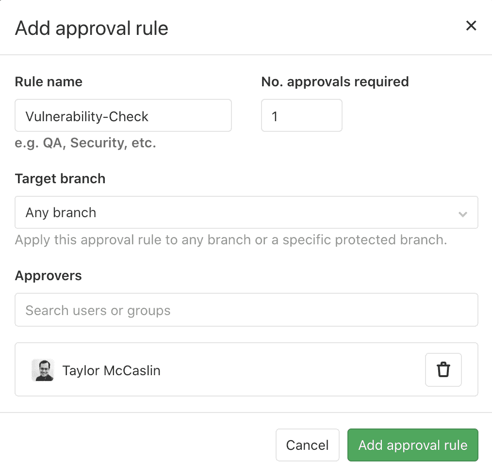

# GitLab Secure

> 原文：[https://s0docs0gitlab0com.icopy.site/ee/user/application_security/](https://s0docs0gitlab0com.icopy.site/ee/user/application_security/)

*   [Quick start](#quick-start)
    *   [Override the default registry base address](#override-the-default-registry-base-address)
*   [Security scanning tools](#security-scanning-tools)
*   [Security Scanning with Auto DevOps](#security-scanning-with-auto-devops)
*   [Maintenance and update of the vulnerabilities database](#maintenance-and-update-of-the-vulnerabilities-database)
*   [Interacting with the vulnerabilities](#interacting-with-the-vulnerabilities)
    *   [View details of a DAST vulnerability](#view-details-of-a-dast-vulnerability)
        *   [Hide sensitive information in headers](#hide-sensitive-information-in-headers)
    *   [Dismissing a vulnerability](#dismissing-a-vulnerability)
        *   [Adding a dismissal reason](#adding-a-dismissal-reason)
        *   [Dismissing multiple vulnerabilities](#dismissing-multiple-vulnerabilities)
    *   [Creating an issue for a vulnerability](#creating-an-issue-for-a-vulnerability)
    *   [Solutions for vulnerabilities (auto-remediation)](#solutions-for-vulnerabilities-auto-remediation)
        *   [Manually applying the suggested patch](#manually-applying-the-suggested-patch)
        *   [Creating a merge request from a vulnerability](#creating-a-merge-request-from-a-vulnerability)
*   [Security approvals in merge requests](#security-approvals-in-merge-requests)
    *   [Enabling Security Approvals within a project](#enabling-security-approvals-within-a-project)
*   [Enabling License Approvals within a project](#enabling-license-approvals-within-a-project)
*   [Working in an offline environment](#working-in-an-offline-environment)
*   [Using private Maven repos](#using-private-maven-repos)
*   [Outdated security reports](#outdated-security-reports)
    *   [Source branch is behind the target branch](#source-branch-is-behind-the-target-branch)
    *   [Target branch security report is out of date](#target-branch-security-report-is-out-of-date)
*   [Troubleshooting](#troubleshooting)
    *   [Getting error message `sast job: stage parameter should be [some stage name here]`](#getting-error-message-sast-job-stage-parameter-should-be-some-stage-name-here)
    *   [Getting error message `sast job: config key may not be used with 'rules': only/except`](#getting-error-message-sast-job-config-key-may-not-be-used-with-rules-onlyexcept)
        *   [Transitioning your `only/except` syntax to `rules`](#transitioning-your-onlyexcept-syntax-to-rules)
        *   [Pin your templates to the deprecated versions](#pin-your-templates-to-the-deprecated-versions)

# GitLab Secure[](#gitlab-secure-ultimate "Permalink")

GitLab 可以检查您的应用程序是否存在安全漏洞，这些漏洞可能导致未经授权的访问，数据泄漏，服务拒绝等. GitLab 在合并请求中报告漏洞，因此您可以在合并之前修复它们. [安全仪表板](security_dashboard/index.html)提供了在项目，管道和组中检测到的漏洞的高级视图. " [威胁监视"](threat_monitoring/index.html)页面提供了应用程序环境的运行时安全性度量. 使用提供的信息，您可以立即开始风险分析和补救.

有关 GitLab 的应用程序安全性的概述，请参阅[Security Deep Dive](https://www.youtube.com/watch?v=k4vEJnGYy84) .

## Quick start[](#quick-start "Permalink")

通过将以下内容添加到`.gitlab-ci.yml` ，可以快速开始进行依赖项扫描，许可证扫描，静态应用程序安全测试（SAST）和秘密检测.

```
include:
  - template: Dependency-Scanning.gitlab-ci.yml
  - template: License-Scanning.gitlab-ci.yml
  - template: SAST.gitlab-ci.yml
  - template: Secret-Detection.gitlab-ci.yml 
```

要添加动态应用程序安全测试（DAST）扫描，请将以下内容添加到`.gitlab-ci.yml` ，并将`https://staging.example.com`替换为登台服务器的网址：

```
include:
  - template: DAST.gitlab-ci.yml

variables:
  DAST_WEBSITE: https://staging.example.com 
```

为确保 DAST 扫描程序*在*将应用程序部署到登台服务器*之后*运行，请查阅[DAST 完整文档](dast/index.html) .

要添加容器扫描，请遵循[容器扫描文档中](container_scanning/index.html#requirements)列出的步骤.

要进一步配置任何其他扫描仪，请参阅每个扫描仪的文档.

### Override the default registry base address[](#override-the-default-registry-base-address "Permalink")

默认情况下，GitLab 安全扫描程序使用`registry.gitlab.com/gitlab-org/security-products/analyzers`作为 Docker 映像的基址. 您可以通过将变量`SECURE_ANALYZERS_PREFIX`设置到另一个位置来全局覆盖此位置. 请注意，这会同时影响所有扫描仪.

## Security scanning tools[](#security-scanning-tools "Permalink")

GitLab 使用以下工具来扫描和报告项目中发现的已知漏洞.

| 安全扫描工具 | Description |
| --- | --- |
| [Container Scanning](container_scanning/index.html) | 扫描 Docker 容器中的已知漏洞. |
| [Dependency List](dependency_list/index.html) | 查看项目的依存关系及其已知漏洞. |
| [Dependency Scanning](dependency_scanning/index.html) | 分析您的依赖项是否存在已知漏洞. |
| [Dynamic Application Security Testing (DAST)](dast/index.html) | 分析运行中的 Web 应用程序是否存在已知漏洞. |
| [Secret Detection](secret_detection/index.html) | 分析 Git 历史记录以了解泄露的机密. |
| [Security Dashboard](security_dashboard/index.html) | 查看所有项目和组中的漏洞. |
| [Static Application Security Testing (SAST)](sast/index.html) | Analyze source code for known vulnerabilities. |

## Security Scanning with Auto DevOps[](#security-scanning-with-auto-devops "Permalink")

启用[自动 DevOps 时](../../topics/autodevops/) ，将使用默认设置配置所有 GitLab 安全扫描工具.

*   [Auto SAST](../../topics/autodevops/stages.html#auto-sast-ultimate)
*   [Auto Secret Detection](../../topics/autodevops/stages.html#auto-secret-detection-ultimate)
*   [Auto DAST](../../topics/autodevops/stages.html#auto-dast-ultimate)
*   [Auto Dependency Scanning](../../topics/autodevops/stages.html#auto-dependency-scanning-ultimate)
*   [Auto License Compliance](../../topics/autodevops/stages.html#auto-license-compliance-ultimate)
*   [Auto Container Scanning](../../topics/autodevops/stages.html#auto-container-scanning-ultimate)

虽然您无法直接自定义 Auto DevOps，但可以[在项目的`.gitlab-ci.yml`文件中包括 Auto DevOps 模板](../../topics/autodevops/customize.html#customizing-gitlab-ciyml) .

## Maintenance and update of the vulnerabilities database[](#maintenance-and-update-of-the-vulnerabilities-database "Permalink")

扫描工具和漏洞数据库会定期更新.

| 安全扫描工具 | 漏洞数据库更新 |
| --- | --- |
| [Container Scanning](container_scanning/index.html) | 使用`clair` . 通过运行[`latest` Docker image 标签](https://gitlab.com/gitlab-org/gitlab/blob/438a0a56dc0882f22bdd82e700554525f552d91b/lib/gitlab/ci/templates/Security/Container-Scanning.gitlab-ci.yml#L37) ，每个作业都使用最新的`clair-db`版本. [根据作者的说法，](https://github.com/arminc/clair-local-scan#clair-server-or-local) `clair-db`数据库[每天进行更新](https://github.com/arminc/clair-local-scan#clair-server-or-local) . |
| [Dependency Scanning](dependency_scanning/index.html) | 依赖于`bundler-audit` （对于 Ruby gems）， `retire.js` （对于 NPM 软件包）和`gemnasium` （GitLab 自己的所有库工具）. `bundler-audit`和`retire.js`从 GitHub 存储库中获取漏洞数据，因此添加到`ruby-advisory-db`和`retire.js`立即可用. 如果有新版本，工具本身每月更新一次. [Gemnasium 数据库](https://gitlab.com/gitlab-org/security-products/gemnasium-db)至少每周更新一次. 请参阅我们[当前从发布 CVE 到更新我们产品的时间度量](https://about.gitlab.com/handbook/engineering/development/performance-indicators/#cve-issue-to-update) . |
| [Dynamic Application Security Testing (DAST)](dast/index.html) | 扫描引擎会定期更新. 请参阅[基础工具`zaproxy`](https://gitlab.com/gitlab-org/security-products/dast/blob/master/Dockerfile#L1)的[版本](https://gitlab.com/gitlab-org/security-products/dast/blob/master/Dockerfile#L1) . 扫描规则在扫描运行时下载. |
| [Static Application Security Testing (SAST)](sast/index.html) | Relies exclusively on [the tools GitLab wraps](sast/index.html#supported-languages-and-frameworks). The underlying analyzers are updated at least once per month if a relevant update is available. The vulnerabilities database is updated by the upstream tools. |

当前，您不必更新 GitLab 即可从最新的漏洞定义中受益. 安全工具作为 Docker 映像发布. 供应商的职位定义使他们能够使用根据[语义版本控制的](https://semver.org/)主要发行标签. 工具的每个新版本都会覆盖这些标签. Docker 映像已更新为与以前的 GitLab 版本匹配，因此用户无需执行任何操作即可自动获取最新版本的扫描工具. 但是，这种方法存在一些已知问题，并且有[解决这些问题](https://gitlab.com/gitlab-org/gitlab/-/issues/9725)的[计划](https://gitlab.com/gitlab-org/gitlab/-/issues/9725) .

## Interacting with the vulnerabilities[](#interacting-with-the-vulnerabilities "Permalink")

在[GitLab Ultimate](https://about.gitlab.com/pricing/) 10.8 中引入.

合并请求报告或" [安全仪表板"](security_dashboard/index.html)中的每个安全漏洞都是可操作的. 单击一个条目以查看具有多个选项的详细信息：

*   消除[漏洞](#dismissing-a-vulnerability) ：消除漏洞可在删除线中设置样式.
*   [创建问题](#creating-an-issue-for-a-vulnerability) ：创建一个新问题，其标题和说明已预先填充了漏洞报告中的信息. 默认情况下，此类问题是[机密的](../project/issues/confidential_issues.html) .
*   [解决方案](#solutions-for-vulnerabilities-auto-remediation) ：对于某些漏洞，提供了有关如何修复该漏洞的解决方案.

[](img/interacting_with_vulnerability_v13_0.png)

### View details of a DAST vulnerability[](#view-details-of-a-dast-vulnerability "Permalink")

DAST 检测到的漏洞在实时 Web 应用程序中发生. 纠正这些类型的漏洞需要特定的信息. DAST 提供了调查和纠正根本原因所需的信息.

要查看 DAST 漏洞的详细信息，请执行以下操作：

1.  要查看检测到的所有漏洞：

    *   在一个项目中，转到该项目的 **安全和合规性**页面.
    *   仅在合并请求中，转到合并请求的" **安全性"**选项卡.
2.  单击漏洞的描述. 提供以下详细信息：

    | Field | Description |
    | --- | --- |
    | Description | Description of the vulnerability. |
    | Project | 检测到漏洞的名称空间和项目. |
    | Method | 用于检测漏洞的 HTTP 方法. |
    | URL | 检测到漏洞的 URL. |
    | 请求标题 | 请求的标题. |
    | 回应状态 | 从应用程序收到的响应状态. |
    | 响应标题 | 从应用程序收到的响应的标头. |
    | Evidence | 数据证据证明该漏洞. 通常是请求或响应的摘要，可以用来帮助验证发现是否为漏洞. |
    | Identifiers | 漏洞的标识符. |
    | Severity | 漏洞的严重性. |
    | 扫描仪类型 | 漏洞报告的类型. |
    | Links | 链接到检测到的漏洞的更多详细信息. |
    | Solution | 推荐的漏洞解决方案的详细信息（可选）. |

#### Hide sensitive information in headers[](#hide-sensitive-information-in-headers "Permalink")

HTTP 请求和响应标头可能包含敏感信息，包括 cookie 和授权凭证. 默认情况下，特定标头的内容在 DAST 漏洞报告中被屏蔽. 您可以指定要屏蔽的所有标题的列表. 有关详细信息，请参阅[隐藏敏感信息](dast/index.html#hide-sensitive-information) .

### Dismissing a vulnerability[](#dismissing-a-vulnerability "Permalink")

要消除漏洞，必须将其状态设置为"消除". 请按照以下步骤操作：

1.  在"安全仪表板"中选择漏洞.
2.  从右上方的**状态**选择器菜单中选择"已**关闭"** .

您可以通过从同一菜单中选择其他状态来撤消此操作.

#### Adding a dismissal reason[](#adding-a-dismissal-reason "Permalink")

在[GitLab Ultimate](https://about.gitlab.com/pricing/) 12.0 中引入.

消除漏洞时，提供这样做的理由通常很有帮助. 将漏洞的状态设置为"已撤消"后，将出现一个文本框，供您添加有关撤消的评论. 添加后，您可以对其进行编辑或删除. 随着时间的推移，这使您可以添加和更新漏洞的上下文.

[](img/adding_a_dismissal_reason_v13_0.png)

#### Dismissing multiple vulnerabilities[](#dismissing-multiple-vulnerabilities "Permalink")

在[GitLab Ultimate](https://about.gitlab.com/pricing/) 12.9 中引入.

您可以提供多个可选原因，一次消除多个漏洞. 选中列表中每个漏洞旁边的复选框，将选择该单个漏洞. 或者，您可以通过选择表标题中的复选框来选择列表中的所有漏洞. 取消选中标题中的复选框将取消选择列表中的所有漏洞. 选择了某些漏洞后，表格顶部会显示一个菜单，您可以通过该菜单选择解雇原因. 按下"关闭选定的漏洞"按钮将立即消除所有选定的漏洞，并说明您选择的原因.

[](img/multi_select_v12_9.png)

### Creating an issue for a vulnerability[](#creating-an-issue-for-a-vulnerability "Permalink")

您可以通过从漏洞模式中选择" **创建问题"**按钮，或使用组安全性仪表板中漏洞行右侧的"操作"按钮来创建漏洞问题.

这在漏洞来自的项目中创建了一个[机密问题](../project/issues/confidential_issues.html) ，并使用从漏洞报告中获取的一些有用信息对其进行了预填充. 创建问题后，您将重定向到该问题，以便您可以对其进行编辑，分配或评论.

返回组安全性仪表板后，该漏洞现在在名称旁边具有一个关联的问题.

[](img/issue.png)

### Solutions for vulnerabilities (auto-remediation)[](#solutions-for-vulnerabilities-auto-remediation "Permalink")

[Introduced](https://gitlab.com/gitlab-org/gitlab/-/issues/5656) in [GitLab Ultimate](https://about.gitlab.com/pricing/) 11.7.

可以通过应用 GitLab 自动生成的解决方案来修复某些漏洞. 支持以下扫描仪：

*   [依赖项扫描](dependency_scanning/index.html) ：自动补丁创建仅适用于使用`yarn`管理的 Node.js 项目.
*   [Container Scanning](container_scanning/index.html)

#### Manually applying the suggested patch[](#manually-applying-the-suggested-patch "Permalink")

可以通过应用由 GitLab 自动生成的补丁来修复某些漏洞. 要应用此修复程序：

1.  单击漏洞.
2.  下载并查看补丁文件`remediation.patch` .
3.  确保本地项目的签出提交与生成补丁的提交相同.
4.  Run `git apply remediation.patch`.
5.  验证并将更改提交到您的分支.

[](img/vulnerability_solution.png)

#### Creating a merge request from a vulnerability[](#creating-a-merge-request-from-a-vulnerability "Permalink")

[Introduced](https://gitlab.com/gitlab-org/gitlab/-/issues/9224) in [GitLab Ultimate](https://about.gitlab.com/pricing/) 11.9.

在某些情况下，GitLab 允许您创建一个合并请求以自动修复漏洞. 具有[解决方案的](#solutions-for-vulnerabilities-auto-remediation)任何漏洞都可以创建合并请求以自动解决问题.

如果可以使用此操作，则漏洞模式将包含" **创建合并请求"**按钮. 单击此按钮创建合并请求，以将解决方案应用于源分支.

[](img/create_issue_with_list_hover.png)

## Security approvals in merge requests[](#security-approvals-in-merge-requests "Permalink")

[Introduced](https://gitlab.com/gitlab-org/gitlab/-/issues/9928) in [GitLab Ultimate](https://about.gitlab.com/pricing/) 12.2.

可以将合并请求批准配置为在合并请求引入以下安全问题之一时，需要安全团队成员的批准：

*   一个安全漏洞
*   违反软件许可证规定

安全漏洞阈值定义为`high` ， `critical`或`unknown`严重性. `Vulnerability-Check`批准者组必须批准包含漏洞的合并请求.

当 GitLab 可以评估漏洞的严重性时，等级可以是以下之一：

*   `unknown`
*   `low`
*   `medium`
*   `high`
*   `critical`

`unknown`等级表明基础扫描仪不包含或没有提供严重等级.

### Enabling Security Approvals within a project[](#enabling-security-approvals-within-a-project "Permalink")

要启用安全批准，必须使用区分大小写的名称`Vulnerability-Check`创建[项目批准规则](../project/merge_requests/merge_request_approvals.html#adding--editing-a-default-approval-rule) . 该批准组必须设置为所需的批准数量大于零. 您必须具有维护者或所有者[权限](../permissions.html#project-members-permissions)才能管理批准规则.

1.  导航到您项目的 **设置>常规，**然后展开**合并请求批准** .
2.  单击**添加批准规则** ，或单击**编辑** .
    *   将**规则名称**添加或更改为`Vulnerability-Check` （区分大小写）.

[](img/vulnerability-check_v13_0.png)

将这个组添加到您的项目后，将为所有合并请求启用批准规则.

任何代码更改都会导致重置所需的批准.

当安全报告：

*   包含`high` ， `critical`或`unknown`严重性的新漏洞，无论被解雇如何.
*   在管道执行期间未生成.

在安全报告中，批准是可选的：

*   不包含任何新漏洞.
*   仅包含严重程度`low`或`medium`新漏洞.

## Enabling License Approvals within a project[](#enabling-license-approvals-within-a-project "Permalink")

[Introduced](https://gitlab.com/gitlab-org/gitlab/-/issues/13067) in [GitLab Ultimate](https://about.gitlab.com/pricing/) 12.3.

`License-Check`是一个批准规则，您可以启用它来允许个人或组批准包含`denied`许可证的合并请求.

您可以启用`License-Check`的两种方式之一：

*   使用区分大小写的名称`License-Check`创建[项目批准规则](../project/merge_requests/merge_request_approvals.html#multiple-approval-rules-premium) .
*   在[项目策略部分中为许可合规](../compliance/license_compliance/index.html#policies)创建批准组. 您必须将此批准组的所需批准数量设置为大于零. 在项目中启用该组后，将为所有合并请求启用批准规则.

任何代码更改都会导致重置所需的批准.

许可证报告如下时，需要批准：

*   包含包含被`denied`的软件许可证的依赖项.
*   在管道执行期间未生成.

许可证报告如下时，批准是可选的：

*   不包含任何违反软件许可证的行为.
*   仅包含`allowed`或未知的新许可证.

## Working in an offline environment[](#working-in-an-offline-environment "Permalink")

当未连接到 Internet 时，有时会在脱机，受限连接，局域网（LAN），Intranet 或"气隙"环境中运行大多数 GitLab 安全扫描程序.

阅读如何[在离线环境中操作安全扫描仪](offline_deployments/index.html) .

## Using private Maven repos[](#using-private-maven-repos "Permalink")

如果您有需要登录凭据的私有 Apache Maven 存储库，则可以使用`MAVEN_CLI_OPTS`环境变量来传递用户名和密码. 您可以在项目的设置下进行设置，以免凭据在`.gitlab-ci.yml` .

如果用户名是`myuser`并且密码非常`verysecret`则可以在项目的设置下[设置以下变量](../../ci/variables/README.html#create-a-custom-variable-in-the-ui) ：

| Type | Key | Value |
| --- | --- | --- |
| Variable | `MAVEN_CLI_OPTS` | `--settings mysettings.xml -Drepository.password=verysecret -Drepository.user=myuser` |

```
<!-- mysettings.xml -->
<settings>
    ...
    <servers>
        <server>
            <id>private_server</id>
            <username>${private.username}</username>
            <password>${private.password}</password>
        </server>
    </servers>
</settings> 
```

## Outdated security reports[](#outdated-security-reports "Permalink")

在 GitLab 12.7 中[引入](https://gitlab.com/gitlab-org/gitlab/-/issues/4913) .

当为合并请求生成的安全报告过时时，合并请求会在安全小部件中显示警告消息，并提示您采取适当的措施.

这可能在两种情况下发生：

1.  Your [source branch is behind the target branch](#source-branch-is-behind-the-target-branch).
2.  The [target branch security report is out of date](#target-branch-security-report-is-out-of-date).

### Source branch is behind the target branch[](#source-branch-is-behind-the-target-branch "Permalink")

这意味着目标分支和源分支之间的最新公共祖先提交不是目标分支上的最新提交. 到目前为止，这是最常见的情况.

在这种情况下，您必须重新设置基础或合并以合并来自目标分支的更改.

[](img/outdated_report_branch_v12_9.png)

### Target branch security report is out of date[](#target-branch-security-report-is-out-of-date "Permalink")

发生这种情况的原因有很多，包括工作失败或新的咨询. 当合并请求显示安全报告已过期时，必须在目标分支上运行新管道. 您可以按照提供的超链接运行新管道来快速完成此操作.

[](img/outdated_report_pipeline_v12_9.png)

## Troubleshooting[](#troubleshooting "Permalink")

### Getting error message `sast job: stage parameter should be [some stage name here]`[](#getting-error-message-sast-job-stage-parameter-should-be-some-stage-name-here "Permalink")

当[包括](../../ci/yaml/README.html#includetemplate)诸如[`SAST.gitlab-ci.yml`](https://gitlab.com/gitlab-org/gitlab/blob/master/lib/gitlab/ci/templates/Security/SAST.gitlab-ci.yml)的`.gitlab-ci.yml`模板时，根据您的 GitLab CI / CD 配置，可能会发生以下错误：

```
Found errors in your .gitlab-ci.yml:

* sast job: stage parameter should be unit-tests 
```

如果未在`.gitlab-ci.yml`声明包含作业的阶段（名为`test` ），则会出现此错误. 要解决此问题，您可以：

*   在`.gitlab-ci.yml`添加一个`test`阶段.
*   更改包含的安全作业的默认阶段. 例如，使用 SpotBugs（SAST）：

    ```
    include:
      template: SAST.gitlab-ci.yml

    spotbugs-sast:
      stage: unit-tests 
    ```

[了解有关覆盖 SAST 作业的更多信息](sast/index.html#overriding-sast-jobs) . 所有安全扫描工具都定义了它们的阶段，因此，所有这些工具都可能发生此错误.

### Getting error message `sast job: config key may not be used with 'rules': only/except`[](#getting-error-message-sast-job-config-key-may-not-be-used-with-rules-onlyexcept "Permalink")

当[包括](../../ci/yaml/README.html#includetemplate)诸如[`SAST.gitlab-ci.yml`](https://gitlab.com/gitlab-org/gitlab/blob/master/lib/gitlab/ci/templates/Security/SAST.gitlab-ci.yml)的`.gitlab-ci.yml`模板时，根据您的 GitLab CI / CD 配置，可能会发生以下错误：

```
Found errors in your .gitlab-ci.yml:

    jobs:sast config key may not be used with `rules`: only/except 
```

当[`only`使用已弃用的或`except`语法`except`](../../ci/yaml/README.html#onlyexcept-basic) [覆盖](sast/index.html#overriding-sast-jobs)了包含作业的`rules`配置时，将出现此错误[.](../../ci/yaml/README.html#onlyexcept-basic) 若要解决此问题，您必须：

*   [Transition your `only/except` syntax to `rules`](#transitioning-your-onlyexcept-syntax-to-rules).
*   (Temporarily) [Pin your templates to the deprecated versions](#pin-your-templates-to-the-deprecated-versions)

[Learn more on overriding SAST jobs](sast/index.html#overriding-sast-jobs).

#### Transitioning your `only/except` syntax to `rules`[](#transitioning-your-onlyexcept-syntax-to-rules "Permalink")

覆盖模板以控制作业执行时， [`only`或`except`](../../ci/yaml/README.html#onlyexcept-basic)先前实例不再兼容，必须转换为[`rules`语法](../../ci/yaml/README.html#rules) .

如果您的替代旨在将作业限制为仅在`master`运行，则先前的语法类似于：

```
include:
  - template: SAST.gitlab-ci.yml

# Ensure that the scanning is only executed on master or merge requests
spotbugs-sast:
  only:
    refs:
      - master
      - merge_requests 
```

要将上面的配置转换为新的`rules`语法，重写将如下编写：

```
include:
  - template: SAST.gitlab-ci.yml

# Ensure that the scanning is only executed on master or merge requests
spotbugs-sast:
  rules:
    - if: $CI_COMMIT_BRANCH == "master"
    - if: $CI_MERGE_REQUEST_ID 
```

如果您的覆盖旨在限制作业仅在分支而不是标签上运行，则其外观类似于：

```
include:
  - template: SAST.gitlab-ci.yml

# Ensure that the scanning is not executed on tags
spotbugs-sast:
  except:
    - tags 
```

为了过渡到新的`rules`语法，重写将被重写为：

```
include:
  - template: SAST.gitlab-ci.yml

# Ensure that the scanning is not executed on tags
spotbugs-sast:
  rules:
    - if: $CI_COMMIT_TAG == null 
```

[Learn more on the usage of `rules`](../../ci/yaml/README.html#rules).

#### Pin your templates to the deprecated versions[](#pin-your-templates-to-the-deprecated-versions "Permalink")

为了确保获得最新支持，我们**强烈**建议您迁移到[`rules`](../../ci/yaml/README.html#rules) .

如果您无法立即更新 CI 配置，则有几种解决方法，其中涉及固定到以前的模板版本，例如：

```
 include:
    remote: 'https://gitlab.com/gitlab-org/gitlab/-/raw/12-10-stable-ee/lib/gitlab/ci/templates/Security/SAST.gitlab-ci.yml' 
```

此外，我们提供了一个专用项目，其中包含版本控制的旧版模板. 这对于脱机设置或希望使用[Auto DevOps 的](../../topics/autodevops/index.html)任何人很有用.

[旧版模板项目](https://gitlab.com/gitlab-org/auto-devops-v12-10)中提供了说明.