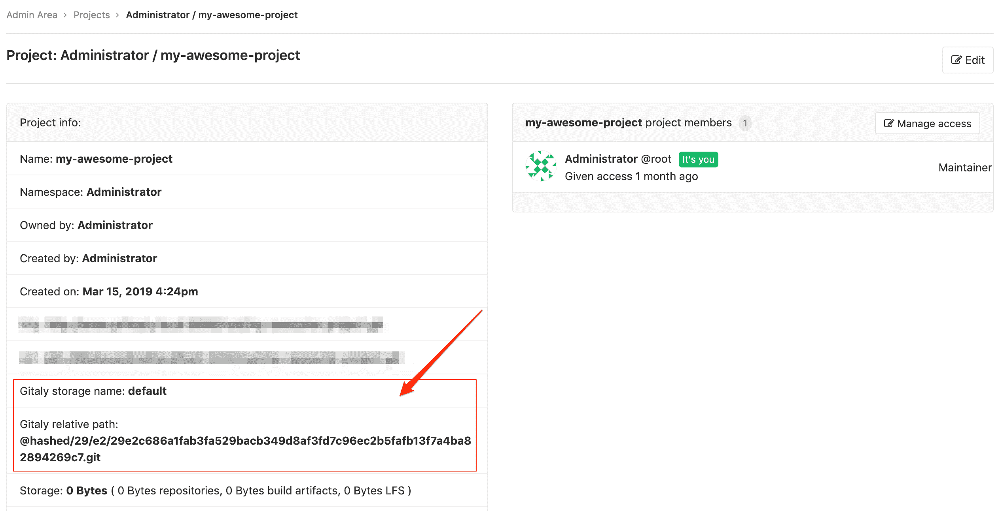

# Automatic background verification

> 原文：[https://s0docs0gitlab0com.icopy.site/ee/administration/geo/disaster_recovery/background_verification.html](https://s0docs0gitlab0com.icopy.site/ee/administration/geo/disaster_recovery/background_verification.html)

*   [Disabling or enabling the automatic background verification](#disabling-or-enabling-the-automatic-background-verification)
*   [Repository verification](#repository-verification)
*   [Using checksums to compare Geo nodes](#using-checksums-to-compare-geo-nodes)
*   [Repository re-verification](#repository-re-verification)
*   [Reset verification for projects where verification has failed](#reset-verification-for-projects-where-verification-has-failed)
*   [Reconcile differences with checksum mismatches](#reconcile-differences-with-checksum-mismatches)
*   [Current limitations](#current-limitations)

# Automatic background verification[](#automatic-background-verification-premium-only "Permalink")

**注意：**在 GitLab EE 10.6 中添加了存储库和 Wiki 的自动背景验证，但默认情况下仅在 GitLab EE 11.1 上启用了该功能. 您可以按照[以下说明](#disabling-or-enabling-the-automatic-background-verification)手动禁用或启用此功能.

自动背景验证可确保传输的数据与计算出的校验和匹配. 如果**主**节点上数据的校验和与**辅助**节点上数据的校验和匹配，则数据传输成功. 在计划的故障转移之后，根据损坏的程度，任何损坏的数据都可能**丢失** .

如果在**主**节点上验证失败，则表明 Geo 正在复制损坏的对象. 您可以从备份中还原它，也可以从**主**节点中将其删除以解决问题.

如果验证在**主**节点上成功，但在**辅助**节点上失败，则表明在复制过程中对象已损坏. Geo 积极尝试纠正验证失败，将存储库标记为有退避期重新同步. 如果您想重置这些失败的验证，则应遵循[以下说明](background_verification.html#reset-verification-for-projects-where-verification-has-failed) .

如果验证明显落后于复制，请考虑在安排计划的故障转移之前给节点更多时间.

## Disabling or enabling the automatic background verification[](#disabling-or-enabling-the-automatic-background-verification "Permalink")

在**主**节点上的 Rails 控制台中运行以下命令：

```
gitlab-rails console 
```

要检查是否启用了自动背景验证：

```
Gitlab::Geo.repository_verification_enabled? 
```

要禁用自动背景验证：

```
Feature.disable('geo_repository_verification') 
```

要启用自动背景验证：

```
Feature.enable('geo_repository_verification') 
```

## Repository verification[](#repository-verification "Permalink")

导航到 **管理区>** 在**主**节点上的**地理**仪表板，并展开该节点的" **验证信息"**选项卡以查看存储库和 Wiki 的自动校验和状态. 成功以绿色显示，待处理的工作以灰色显示，失败以红色显示.

[](img/verification-status-primary.png)

导航到 **管理区>** **辅助**节点上的**地理**仪表板，并展开该节点的" **验证信息"**选项卡，以查看存储库和 Wiki 的自动验证状态. 与校验和一样，成功显示为绿色，待处理工作显示为灰色，失败显示为红色.

[](img/verification-status-secondary.png)

## Using checksums to compare Geo nodes[](#using-checksums-to-compare-geo-nodes "Permalink")

要检查 Geo **辅助**节点的运行状况，我们在 Git 引用及其值的列表上使用校验和. 校验和包括`HEAD` ， `heads` ， `tags` ， `notes`和特定于 GitLab 的引用，以确保真正的一致性. 如果两个节点具有相同的校验和，则它们肯定拥有相同的引用. 我们在每次更新后为每个节点计算校验和，以确保它们都同步.

## Repository re-verification[](#repository-re-verification "Permalink")

在 GitLab 企业版 11.6 中[引入](https://gitlab.com/gitlab-org/gitlab/-/merge_requests/8550) . 在[GitLab Premium 中](https://about.gitlab.com/pricing/)可用.

由于错误或临时基础架构故障，Git 存储库可能会发生意外更改，而不会被标记为要进行验证. Geo 会不断重新验证存储库以确保数据的完整性. 尽管可以设置短至 1 天的间隔，但默认和建议的重新验证间隔是 7 天. 较短的时间间隔可以降低风险，但会增加负载，反之亦然.

导航到 **管理区>** 在**主**节点上**的地理**信息中心，并单击**编辑**按钮为所述**主**节点来定制最小重新验证间隔：

[](img/reverification-interval.png)

默认情况下，自动后台重新验证处于启用状态，但是如果需要，您可以将其禁用. 在**主**节点上的 Rails 控制台中运行以下命令：

```
gitlab-rails console 
```

要禁用自动后台重新验证：

```
Feature.disable('geo_repository_reverification') 
```

要启用自动后台重新验证：

```
Feature.enable('geo_repository_reverification') 
```

## Reset verification for projects where verification has failed[](#reset-verification-for-projects-where-verification-has-failed "Permalink")

Geo 积极尝试纠正验证失败，将存储库标记为有退避期重新同步. 如果要手动重置它们，此 Rake 任务会将项目标记为验证失败或校验和不匹配的项目重新同步而没有退避期：

对于存储库：

```
sudo gitlab-rake geo:verification:repository:reset 
```

对于 Wiki：

```
sudo gitlab-rake geo:verification:wiki:reset 
```

## Reconcile differences with checksum mismatches[](#reconcile-differences-with-checksum-mismatches "Permalink")

如果**主**节点和**辅助**节点的校验和验证不匹配，则原因可能不明显. 要查找校验和不匹配的原因：

1.  导航到 **管理区>** 在**主**节点上的" **概述">"项目"**仪表板中，找到要检查校验和差异的项目，然后单击" **编辑"**按钮： [](img/checksum-differences-admin-projects.png)

2.  在项目管理页面上，获取**Gitaly 存储名称**和**Gitaly 相对路径** ： [](img/checksum-differences-admin-project-page.png)

3.  导航到**主**节点和**辅助**节点上的项目的存储库目录（路径通常是`/var/opt/gitlab/git-data/repositories` ）. 请注意，如果`git_data_dirs`是自定义的，请确保检查服务器上的目录布局.

    ```
    cd /var/opt/gitlab/git-data/repositories 
    ```

4.  在**主**节点上运行以下命令，将输出重定向到文件：

    ```
    git show-ref --head | grep -E "HEAD|(refs/(heads|tags|keep-around|merge-requests|environments|notes)/)" > primary-node-refs 
    ```

5.  在**辅助**节点上运行以下命令，将输出重定向到文件：

    ```
    git show-ref --head | grep -E "HEAD|(refs/(heads|tags|keep-around|merge-requests|environments|notes)/)" > secondary-node-refs 
    ```

6.  复制同一系统上先前步骤中的文件，并在内容之间进行区分：

    ```
    diff primary-node-refs secondary-node-refs 
    ```

## Current limitations[](#current-limitations "Permalink")

自动后台验证不包括附件，LFS 对象，作业工件以及文件存储中的用户上传. 您可以跟踪进度，以将其包括在" [地理位置"中：验证所有复制的数据](https://gitlab.com/groups/gitlab-org/-/epics/1430) .

现在，您可以通过在两个节点上遵循[以下说明](../../raketasks/check.html)并比较它们之间的输出来手动验证其完整性.

在 GitLab EE 12.1 中，Geo 会在传输后计算辅助节点上的附件，LFS 对象和已归档跟踪的校验和，并将其与存储的校验和进行比较，如果不匹配则拒绝传输. 请注意，如果在 GitLab EE 12.1 之前已经同步了这些数据，Geo 当前不支持自动验证这些数据的方法.

对象存储中的数据**未经验证** ，因为对象存储负责确保数据的完整性.