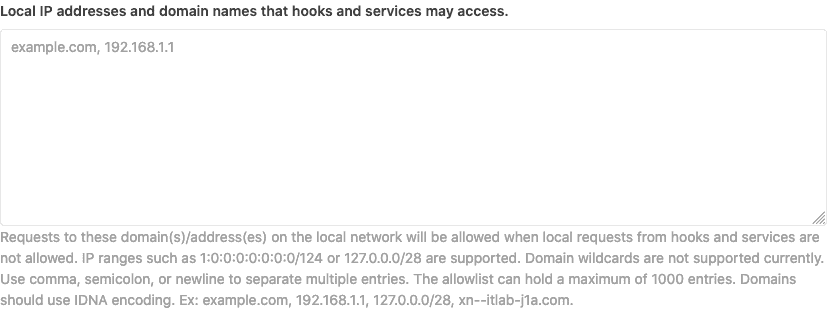

# Webhooks and insecure internal web services

> 原文：[https://s0docs0gitlab0com.icopy.site/ee/security/webhooks.html](https://s0docs0gitlab0com.icopy.site/ee/security/webhooks.html)

*   [Allowlist for local requests](#allowlist-for-local-requests)

# Webhooks and insecure internal web services[](#webhooks-and-insecure-internal-web-services "Permalink")

**注意：**在 GitLab.com 上[，](../user/gitlab_com/index.html#maximum-number-of-webhooks)每个项目的[最大](../user/gitlab_com/index.html#maximum-number-of-webhooks) Webhooks [数量](../user/gitlab_com/index.html#maximum-number-of-webhooks)是有限的.

如果您在 GitLab 服务器上或其本地网络中运行了非 GitLab Web 服务，则可能容易受到 Webhooks 的利用.

使用[Webhooks](../user/project/integrations/webhooks.html) ，您以及您的项目维护者和所有者可以设置 URL，以便在项目中发生特定更改时触发该 URL. 通常，这些请求将发送到专门为此目的设置的外部 Web 服务，该服务以某种适当的方式处理该请求及其附加数据.

但是，当 Webhook 设置的 URL 不是指向外部服务而是指向内部服务时，事情变得很麻烦，当触发 Webhook 和发送 POST 请求时，这可能会做完全不希望的事情.

Webhook 请求由 GitLab 服务器本身发出，并且每个钩子使用一个（可选）秘密令牌进行授权（而不是用户或特定于仓库的令牌）. 结果，它们可能比托管 Webhook 的服务器（可能包括 GitLab 服务器或 API 本身，例如`http://localhost:123` ）上运行的所有对象具有更广泛的访问权限. 根据所调用的 Webhook，这也可能导致对该 Webhook 服务器的本地网络（例如， `http://192.168.1.12:345` : `http://192.168.1.12:345` : `http://192.168.1.12:345` ）内的其他服务器的网络访问，即使这些服务受到其他保护并且无法从外界访问.

如果 Web 服务不需要身份验证，则可以通过使 GitLab 服务器向诸如`http://localhost:123/some-resource/delete`类的端点发出 POST 请求，来使用 Webhooks 触发破坏性命令.

为了防止发生这种类型的攻击，从 GitLab 10.6 开始，默认情况下将禁止对当前 GitLab 实例服务器地址和/或专用网络中的所有 Webhook 请求. 这意味着，所有的请求作出`127.0.0.1` ， `::1`和`0.0.0.0` ，以及 IPv4 的`10.0.0.0/8` ， `172.16.0.0/12` ， `192.168.0.0/16`和 IPv6 站点本地（ `ffc0::/10` ）地址将不被允许.

通过在**管理区域>设置** （ `/admin/application_settings/network` ）内*"出站请求"*部分中启用选项*"允许从 Web 挂钩和服务到本地网络的请求"，*可以覆盖此行为：

[](img/outbound_requests_section_v12_2.png)

**注意：由于** *系统挂钩*是由管理员设置的，因此默认情况下启用它们来向本地网络发出请求. 但是，可以通过禁用" **允许从系统挂钩向本地网络发送请求"**选项来关闭此功能.

## Allowlist for local requests[](#allowlist-for-local-requests "Permalink")

[Introduced](https://gitlab.com/gitlab-org/gitlab-foss/-/issues/44496) in GitLab 12.2

通过将某些域和 IP 地址添加到允许*列表中，*即使不允许本地请求，也可以允许某些域和 IP 地址可供*系统挂钩*和*Web* *挂钩*访问. 导航到**管理区域>设置>网络** （ `/admin/application_settings/network` ）并展开**出站请求** ：

[](img/allowlist_v13_0.png)

允许的条目可以用分号，逗号或空格（包括换行符）分隔，并且可以采用不同的格式，例如主机名，IP 地址和/或 IP 范围. 支持 IPv6\. 包含 Unicode 字符的主机名应使用 IDNA 编码.

允许列表最多可容纳 1000 个条目. 每个条目最多可以包含 255 个字符.

您可以通过在允许列表条目中指定特定端口来允许它. 例如`127.0.0.1:8080`将仅允许连接到`127.0.0.1`上的端口 8080\. 如果未提及任何端口，则允许该 IP /域上的所有端口. IP 范围将允许该范围内所有 IP 上的所有端口.

Example:

```
example.com;gitlab.example.com
127.0.0.1,1:0:0:0:0:0:0:1
127.0.0.0/8 1:0:0:0:0:0:0:0/124
[1:0:0:0:0:0:0:1]:8080
127.0.0.1:8080
example.com:8080 
```

**注意：**当前不支持通配符（ `*.example.com` ）.