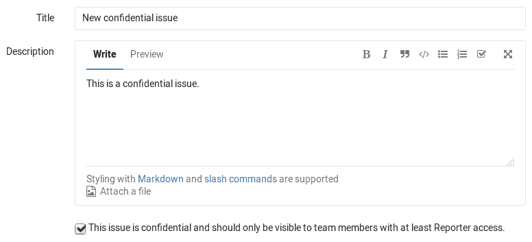
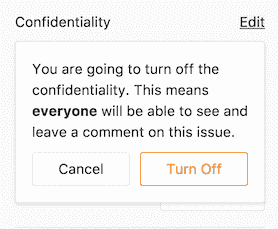
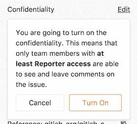
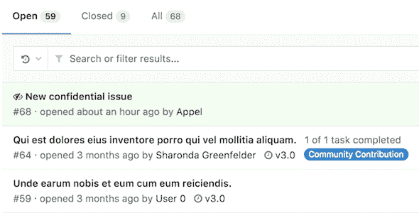
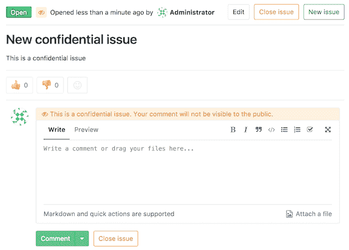
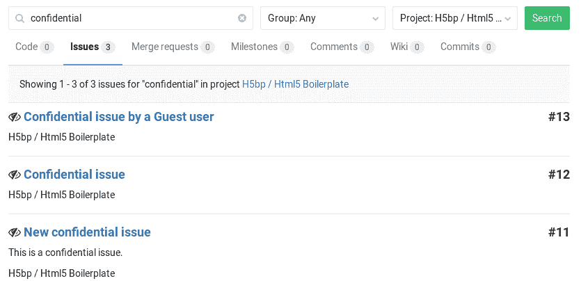
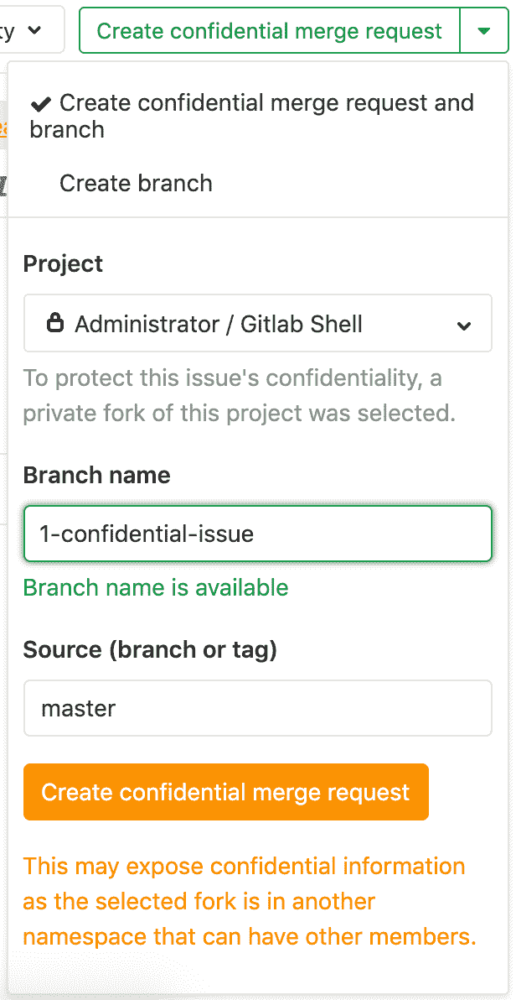
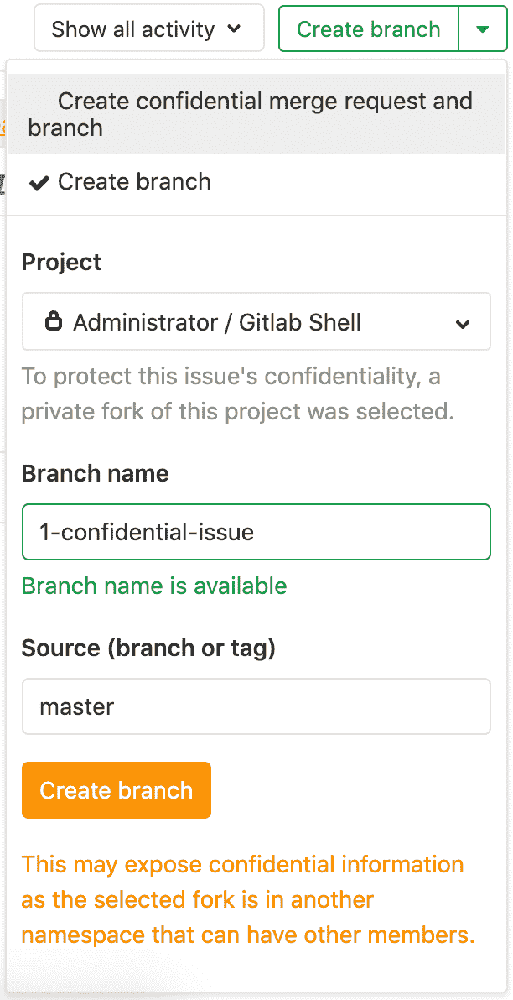

# Confidential issues

> 原文：[https://s0docs0gitlab0com.icopy.site/ee/user/project/issues/confidential_issues.html](https://s0docs0gitlab0com.icopy.site/ee/user/project/issues/confidential_issues.html)

*   [Making an issue confidential](#making-an-issue-confidential)
*   [Modifying issue confidentiality](#modifying-issue-confidentiality)
*   [Indications of a confidential issue](#indications-of-a-confidential-issue)
*   [Permissions and access to confidential issues](#permissions-and-access-to-confidential-issues)
*   [Merge Requests for Confidential Issues](#merge-requests-for-confidential-issues)
    *   [How it works](#how-it-works)

# Confidential issues

在 GitLab 8.6 中[引入](https://gitlab.com/gitlab-org/gitlab-foss/-/merge_requests/3282) .

机密性问题是仅对具有[足够权限](#permissions-and-access-to-confidential-issues)的项目成员可见的问题. 开源项目和公司都可以使用机密问题来使安全漏洞不公开或防止意外泄漏.

## Making an issue confidential

您可以在创建问题或编辑现有问题的过程中将其保密.

创建新问题时，可以在文本区域下方的复选框中将问题标记为机密. 选中该框，然后点击" **提交问题"**按钮以创建问题. 对于现有问题，请对其进行编辑，选中机密复选框，然后点击**保存更改** .

## Modifying issue confidentiality

有两种方法可以更改问题的机密性.

第一种方法是编辑问题并标记/取消标记机密复选框. 保存问题后，它将更改问题的机密性.

第二种方法是在边栏中找到"保密性"部分，然后单击" **编辑"** . 应该会出现一个弹出窗口，并为您提供打开或关闭机密性的选项.

| 关闭机密性 | Turn on confidentiality |
| --- | --- |
|  |  |

系统注释在问题注释中指出了从常规到机密（反之亦然）的每项更改.

## Indications of a confidential issue

> **注意：**如果您没有[足够的权限](#permissions-and-access-to-confidential-issues) ，您将根本看不到机密问题.

有几件事在视觉上将机密问题与常规问题分开. 在问题索引页面视图中，您可以在标记为机密的问题旁边看到斜线图标.

* * *

同样，在问题内部，您可以在问题编号旁边看到斜线图标，但在注释区域中也有一个指示符，表明您正在评论的问题是机密的.

侧边栏上还有一个指示保密性的指示器.

| 机密问题 | 非机密问题 |
| --- | --- |
|  |  |

## Permissions and access to confidential issues

对于机密问题，有两种级别的访问权限. 一般规则是，机密问题仅对具有[Reporter 访问权限](../../permissions.html#project-members-permissions)的项目成员可见. 但是，来宾用户也可以创建机密问题，但只能查看他们自己创建的问题.

对于非特权用户，机密问题也隐藏在搜索结果中. 例如，这是具有"维护者"和"访客"访问权限的用户分别在项目的搜索结果中看到的内容.

| 维护者访问 | 来宾访问 |
| --- | --- |
|  |  |

## Merge Requests for Confidential Issues

在 GitLab 12.1 中[引入](https://gitlab.com/gitlab-org/gitlab-foss/-/issues/58583) .

为了帮助防止机密信息在解决机密问题的过程中从公共项目中泄露，可以通过创建私有派生的合并请求来解决机密问题.

创建的合并请求将针对私有派生的默认分支，而不是公共上游项目的默认分支. 这样可以防止合并请求，分支和提交进入公共存储库，以及过早地泄露机密信息. 当准备好将机密提交公开时，可以通过打开从私有派生到公共上游项目的合并请求来完成.

**最佳实践：**如果您在原始上游的同一组或子组中创建了一个长期的私有派生，则具有开发者成员身份的公共项目的所有用户在私有项目中也将具有相同的权限. 这样，所有有权查看机密问题的开发人员都将拥有简化的工作流程来解决这些问题.

### How it works

关于机密问题，" **创建机密合并请求"**按钮可用. 单击它会打开一个下拉列表，您可以在其中选择**创建机密合并请求和分支**或**创建分支** ：

| 创建机密合并请求 | 创建分支 |
| --- | --- |
|  |  |

**项目**下拉列表包括用户所属的私有派生列表，至少是开发人员，并且合并请求已启用.

每当" **分支名称"**和" **源（分支或标记）"**字段更改时，将检查目标或源分支的可用性. 两个分支都应在所选的私有派生中可用.

通过单击**创建机密合并请求**按钮，GitLab 将在私有分支中创建分支和合并请求. 当选择**Create branch 时** ，GitLab 将仅创建分支.

在私有分支中创建分支后，开发人员现在可以将代码推送到该分支以解决机密问题.